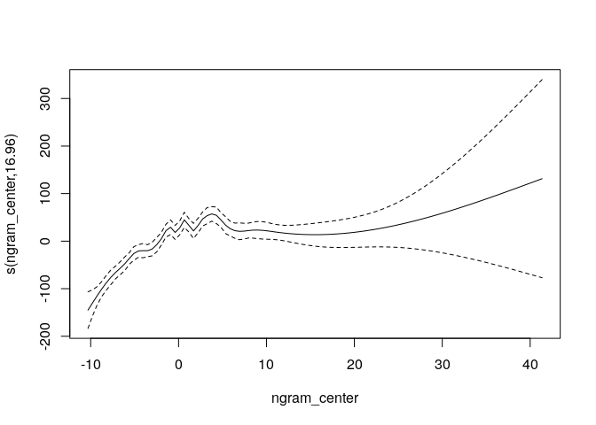
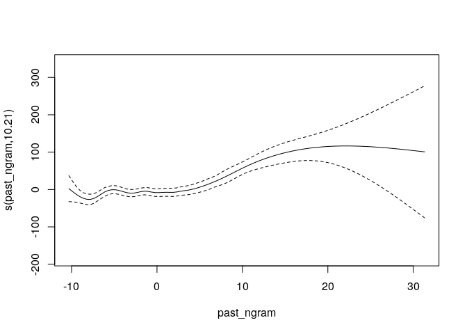
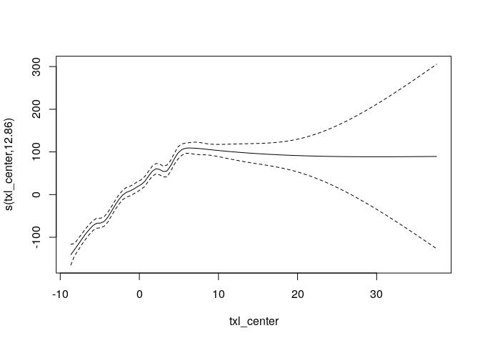
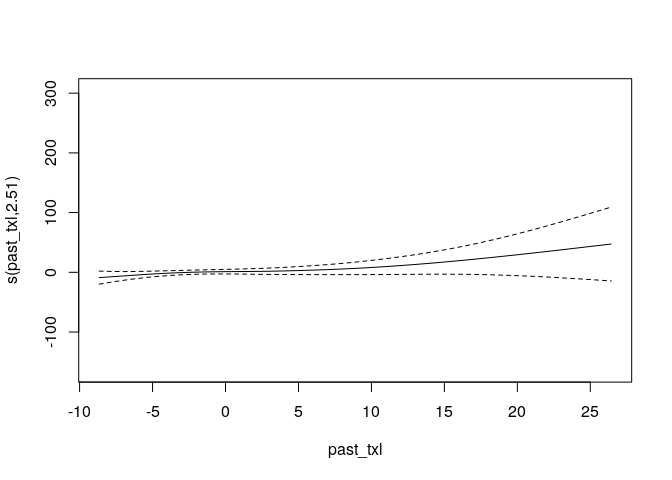
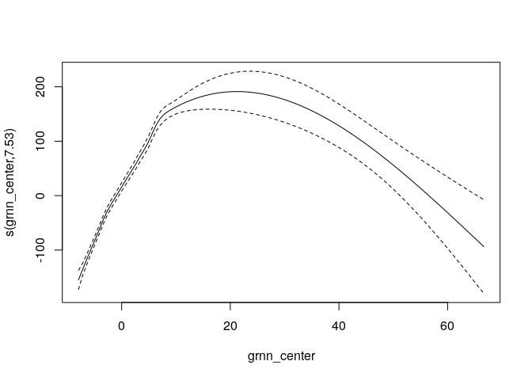
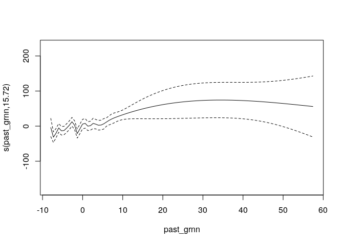
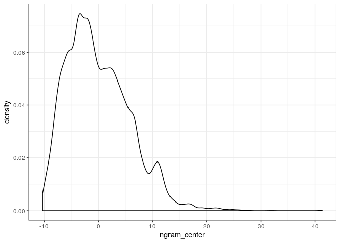
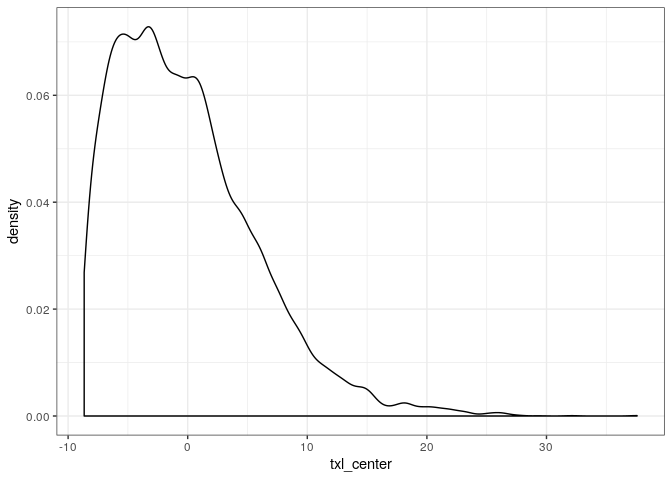
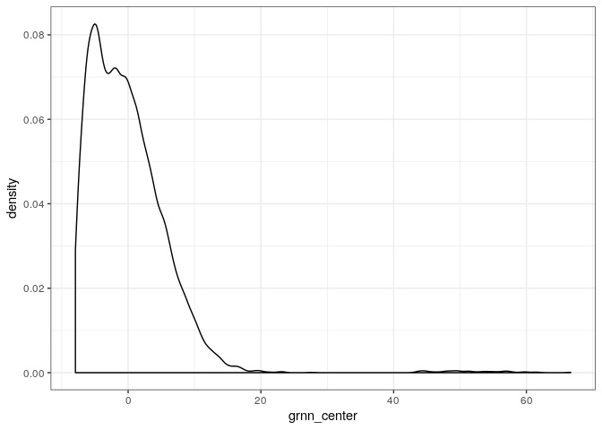

Natural Stories LM analysis
================

# Overview

100 participants read naturalistic stories from the natural stories
corpus. Each participant read 1 story.

We exclude

  - participants who do not report English as a native language (95
    remaining)
  - participants who do not get 80% of the words correct (63 remaining)
  - practice items (64714 words remaining)
  - words that were wrong or were within two after a mistake (58388
    words remaining)
  - the first word of every sentence (didn’t have a real distractor, RT
    is measured slightly differently) (55458 words remaining)
  - words with RTs \<100 or \>5000 (\<100 we think is likely a recording
    error, or at least not reading the words at all, \>5000 is likely
    getting distracted) (55384 words remaining)

Within the filtered data, each story was read between 3 and 8 times, for
an average of 6.3.

We use as predictors:

Definition: “stripped word” refers to the word after start and end
punctuation (commas, periods, quotes, parens, etc) have been removed.

  - length in characters of stripped word
  - unigram frequency of stripped word. Frequencies for words are
    calculated using word\_tokenize on the gulordava train data and
    counting up instances. (This tends to tokenize off punctuation, but
    is capitalization sensitive). Frequencies are represented as log2 of
    the expected occurances in 1 billion words.

Surprisals are measured in bits TODO: double check with Jenn about these
being in bits, model specs/cites\!

  - ngram (5-gram KN smoothed)
  - GRNN
  - Transformer-XL

All predictors are centered at 0, but they are not rescaled, so they are
still interpretable.

Centering differences:

  - txl -8.66
  - ngram -10.32
  - grnn -7.94
  - freq -18.75
  - length -4.49

<!-- end list -->

    ## Parsed with column specification:
    ## cols(
    ##   Story_Num = col_double(),
    ##   Sentence_Num = col_double(),
    ##   Sentence = col_character()
    ## )

    ## Joining, by = c("Story_Num", "Sentence_Num")

# Rough pass with lmer

Given past experience, lmer probably will choke on the full heirarchical
effects structure, but we can do a first pass with lm anyway as a test.

I’m copying model formula from the syntax gym paper, so frequency and
length interact but surprisal doesn’t, and both current and past word
predictors are considered.

    ## 
    ## Call:
    ## lm(formula = rt ~ ngram_center + freq_center * length_center + 
    ##     past_ngram + past_freq * past_length, data = labelled)
    ## 
    ## Residuals:
    ##    Min     1Q Median     3Q    Max 
    ## -938.9 -215.5  -84.7  100.9 4031.3 
    ## 
    ## Coefficients:
    ##                           Estimate Std. Error t value Pr(>|t|)    
    ## (Intercept)               721.0507    24.3655  29.593  < 2e-16 ***
    ## ngram_center                3.7816     0.5049   7.490 7.01e-14 ***
    ## freq_center                -7.0664     0.8688  -8.134 4.27e-16 ***
    ## length_center              29.1386     1.3252  21.989  < 2e-16 ***
    ## past_ngram                  4.3027     0.5598   7.687 1.54e-14 ***
    ## past_freq                   8.4268     1.2296   6.853 7.31e-12 ***
    ## past_length                17.4758     4.6215   3.781 0.000156 ***
    ## freq_center:length_center   0.5695     0.2718   2.095 0.036156 *  
    ## past_freq:past_length      -0.8590     0.2746  -3.129 0.001756 ** 
    ## ---
    ## Signif. codes:  0 '***' 0.001 '**' 0.01 '*' 0.05 '.' 0.1 ' ' 1
    ## 
    ## Residual standard error: 372.7 on 44257 degrees of freedom
    ##   (8344 observations deleted due to missingness)
    ## Multiple R-squared:  0.06859,    Adjusted R-squared:  0.06842 
    ## F-statistic: 407.4 on 8 and 44257 DF,  p-value: < 2.2e-16

    ## 
    ## Call:
    ## lm(formula = rt ~ txl_center + freq_center * length_center + 
    ##     past_txl + past_freq * past_length, data = labelled)
    ## 
    ## Residuals:
    ##    Min     1Q Median     3Q    Max 
    ## -999.8 -217.7  -84.2  103.1 4050.6 
    ## 
    ## Coefficients:
    ##                            Estimate Std. Error t value Pr(>|t|)    
    ## (Intercept)               800.64316   21.04195  38.050  < 2e-16 ***
    ## txl_center                 11.74822    0.46755  25.127  < 2e-16 ***
    ## freq_center                -2.16679    0.70907  -3.056  0.00225 ** 
    ## length_center              29.12069    1.27138  22.905  < 2e-16 ***
    ## past_txl                    1.03520    0.47816   2.165  0.03040 *  
    ## past_freq                   4.69564    1.05363   4.457 8.34e-06 ***
    ## past_length                19.72123    3.74973   5.259 1.45e-07 ***
    ## freq_center:length_center   0.01885    0.22659   0.083  0.93370    
    ## past_freq:past_length      -0.99075    0.22687  -4.367 1.26e-05 ***
    ## ---
    ## Signif. codes:  0 '***' 0.001 '**' 0.01 '*' 0.05 '.' 0.1 ' ' 1
    ## 
    ## Residual standard error: 379 on 48739 degrees of freedom
    ##   (3862 observations deleted due to missingness)
    ## Multiple R-squared:  0.08646,    Adjusted R-squared:  0.08631 
    ## F-statistic: 576.6 on 8 and 48739 DF,  p-value: < 2.2e-16

    ## 
    ## Call:
    ## lm(formula = rt ~ grnn_center + freq_center * length_center + 
    ##     past_grnn + past_freq * past_length, data = labelled)
    ## 
    ## Residuals:
    ##     Min      1Q  Median      3Q     Max 
    ## -1002.4  -217.4   -85.5   103.2  4033.1 
    ## 
    ## Coefficients:
    ##                           Estimate Std. Error t value Pr(>|t|)    
    ## (Intercept)               764.8556    20.7402  36.878  < 2e-16 ***
    ## grnn_center                 7.7203     0.3483  22.168  < 2e-16 ***
    ## freq_center                -5.4085     0.6586  -8.212 2.23e-16 ***
    ## length_center              29.1729     1.2730  22.917  < 2e-16 ***
    ## past_grnn                   3.0152     0.4174   7.223 5.15e-13 ***
    ## past_freq                   6.1359     1.0354   5.926 3.12e-09 ***
    ## past_length                19.4104     3.7528   5.172 2.32e-07 ***
    ## freq_center:length_center  -0.1233     0.2266  -0.544    0.586    
    ## past_freq:past_length      -0.9511     0.2270  -4.190 2.79e-05 ***
    ## ---
    ## Signif. codes:  0 '***' 0.001 '**' 0.01 '*' 0.05 '.' 0.1 ' ' 1
    ## 
    ## Residual standard error: 379.4 on 48739 degrees of freedom
    ##   (3862 observations deleted due to missingness)
    ## Multiple R-squared:  0.08472,    Adjusted R-squared:  0.08457 
    ## F-statistic: 563.9 on 8 and 48739 DF,  p-value: < 2.2e-16

<!--
# Now with heirarchy

Not yet run in most cases, will be computation-time consuming!

Questions:

 - should there be interaction terms
 - should there be previous word terms
 - how important is Word_ID intercept? (We have up to 8 observations per each of 10000ish)
 
 
We'll run these models again using brms with full mixed effects. 

The mixed effects are

- everything gets to vary by subject
- intercept  by Word_ID (where word_id is different for every token in the texts)

Priors:

- normal(1000,1000) for intercept -- we think RTs are about 1 second usually
- normal(0,500) for beta and sd -- we don't really know what effects are
- lkj(1) for correlations -- we don't have reason to think correlations might go any particular way -->

# GAMs

This is still using centered values, although we may want to switch back
to non-centered eventually (translate by about 8-10 for
surprisals).

<!-- --><!-- --><!-- --><!-- --><!-- --><!-- -->

Some of these seem surprising, especially in relation to the lm output.
One important check on the odd behavior for high surprisals is how
reliable these might be, so I checked what the density of surprisals is
and compared it with surprisals reported elsewhere (syntax gym reports
up to 15 bits, Smith and Levy down to 10^-6, which is around 20 bits).
Note that some of these high surprisals may come from adding together
surprisals from multi-token word with punctuation (like quotemarks).

So, we see a linear pattern of same-word surprisal and little effect of
previous word surprisal over the same interval (remember due to
centering, that’s looking at up to around 10 on these scales), but then
weird things happen after that, when there is little data and it might
be
unreliable.

<!-- --><!-- --><!-- -->
