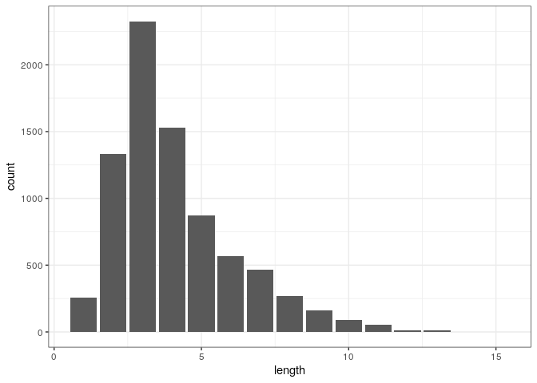
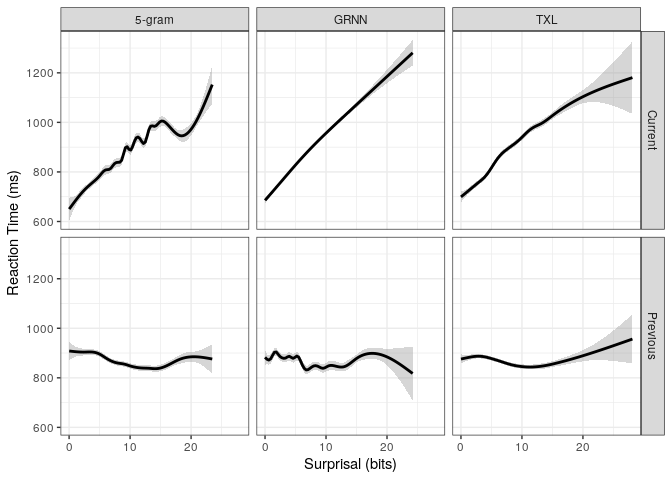
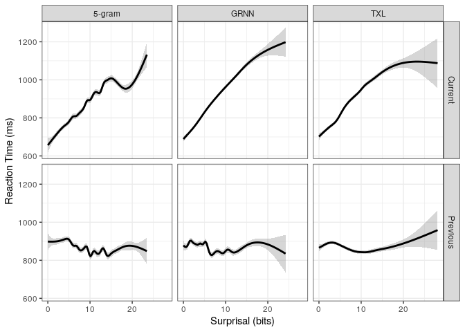

Natural Stories LM analysis
================

# Overview

100 participants read naturalistic stories from the natural stories
corpus. Each participant read 1 story.

We exclude

  - participants who do not report English as a native language (95
    remaining)
  - participants who do not get 80% of the words correct (63 remaining)
  - practice items (64714 words remaining)
  - words that were wrong or were within two after a mistake (58388
    words remaining)
  - the first word of every sentence (didn’t have a real distractor, RT
    is measured slightly differently) (55458 words remaining)
  - words with RTs \<100 or \>5000 (\<100 we think is likely a recording
    error, or at least not reading the words at all, \>5000 is likely
    getting distracted) (55384 words remaining)

Within the filtered data, each story was read between 3 and 8 times, for
an average of 6.3.

We also do the analyses on only the words before mistakes (per sentence)
(40809 words)

From the modelling side: (After attempts without doing this filtering)
we only include words which are single token and known words in each of
the models vocabularies. We also only include words with frequencies.
This is roughly equivalent to excluding words with punctuation.

We use as predictors:

  - length in characters of stripped word
  - unigram frequency of word. Frequencies for words are calculated
    using word\_tokenize on the gulordava train data and counting up
    instances. (This tends to tokenize off punctuation, but is
    capitalization sensitive). Frequencies are represented as log2 of
    the expected occurances in 1 billion words.

Surprisals are measured in bits.

  - ngram (5-gram KN smoothed)
  - GRNN
  - Transformer-XL

We sometimes center the predictors, but don’t rescale them. (We center
them for the brm models, but don’t center surprisal for the GAM model).

The model formula we use is rt ~ surp\* length + freq \* length +
past\_surp \* past\_length + past\_freq \* past\_length.

    ## Parsed with column specification:
    ## cols(
    ##   Story_Num = col_double(),
    ##   Sentence_Num = col_double(),
    ##   Sentence = col_character()
    ## )

    ## Joining, by = c("Story_Num", "Sentence_Num")

<!-- -->

## BRM models

We include a by-subject effect for everything, and a by\_word random
intercept (full mixed effects).

Priors:

  - normal(1000,1000) for intercept – we think RTs are about 1 second
    usually
  - normal(0,500) for beta and sd – we don’t really know what effects
    are
  - lkj(1) for correlations – we don’t have reason to think correlations
    might go any particular way

### On pre-error data only

    ## % latex table generated in R 3.6.3 by xtable 1.8-4 package
    ## % Thu Apr 30 12:14:08 2020
    ## \begin{table}[ht]
    ## \centering
    ## \begin{tabular}{lrlrrlrrlr}
    ##   \hline
    ## Term & E\_5-gram & CI\_5-gram & P\_5-gram & E\_GRNN & CI\_GRNN & P\_GRNN & E\_TXL & CI\_TXL & P\_TXL \\ 
    ##   \hline
    ## freq\_center & -2.9 & [-6.3, 0.5] & 0.10 & 2.9 & [-0.2, 6] & 0.06 & 0.4 & [-2.7, 3.5] & 0.79 \\ 
    ##   Intercept & 865.3 & [829.9, 902.9] & 0.00 & 871.1 & [837.9, 905.3] & 0.00 & 870.8 & [832.5, 907.8] & 0.00 \\ 
    ##   length\_center & 20.5 & [15.4, 25.6] & 0.00 & 18.5 & [13.3, 23.7] & 0.00 & 21.4 & [16.2, 26.6] & 0.00 \\ 
    ##   length\_center:freq\_center & -1.0 & [-2.5, 0.4] & 0.16 & -0.1 & [-1.2, 1] & 0.82 & 0.2 & [-0.9, 1.2] & 0.76 \\ 
    ##   past\_c\_freq & 2.6 & [-0.1, 5.4] & 0.06 & 1.9 & [-0.2, 4.2] & 0.08 & 1.2 & [-1.1, 3.6] & 0.30 \\ 
    ##   past\_c\_length & -4.8 & [-9, -0.1] & 0.04 & -6.6 & [-10.9, -2.1] & 0.00 & -5.2 & [-9.3, -0.7] & 0.03 \\ 
    ##   past\_c\_length:past\_c\_freq & -1.0 & [-2.3, 0.3] & 0.15 & -1.8 & [-2.9, -0.8] & 0.00 & -1.5 & [-2.6, -0.5] & 0.01 \\ 
    ##   past\_c\_surp & 1.6 & [-0.5, 3.6] & 0.14 & 2.7 & [0.8, 4.5] & 0.00 & 0.8 & [-0.9, 2.5] & 0.40 \\ 
    ##   past\_c\_surp:past\_c\_length & -0.2 & [-1.2, 0.8] & 0.72 & -0.9 & [-1.7, -0.2] & 0.01 & -0.6 & [-1.3, 0.2] & 0.13 \\ 
    ##   surp\_center & 11.7 & [9.3, 14.1] & 0.00 & 23.7 & [21, 26.5] & 0.00 & 18.5 & [16.1, 21.1] & 0.00 \\ 
    ##   surp\_center:length\_center & -2.0 & [-3, -1] & 0.00 & -1.8 & [-2.7, -0.9] & 0.00 & -1.4 & [-2.2, -0.6] & 0.00 \\ 
    ##    \hline
    ## \end{tabular}
    ## \end{table}

### On post-error as well

### Summaries

    ##  Family: gaussian 
    ##   Links: mu = identity; sigma = identity 
    ## Formula: rt ~ ngram_center * length_center + freq_center * length_center + past_c_ngram * past_c_length + past_c_freq * past_c_length + (ngram_center * length_center + freq_center * length_center + past_c_ngram * past_c_length + past_c_freq * past_c_length | subject) + (1 | Word_ID) 
    ##    Data: labelled_post_error (Number of observations: 36520) 
    ## Samples: 4 chains, each with iter = 2000; warmup = 1000; thin = 1;
    ##          total post-warmup samples = 4000
    ## 
    ## Group-Level Effects: 
    ## ~subject (Number of levels: 63) 
    ##                                                            Estimate Est.Error
    ## sd(Intercept)                                                143.35     12.40
    ## sd(ngram_center)                                               5.34      0.89
    ## sd(length_center)                                              9.69      1.99
    ## sd(freq_center)                                                7.36      1.29
    ## sd(past_c_ngram)                                               0.74      0.52
    ## sd(past_c_length)                                              2.55      1.59
    ## sd(past_c_freq)                                                1.90      0.95
    ## sd(ngram_center:length_center)                                 1.68      0.42
    ## sd(length_center:freq_center)                                  2.68      0.62
    ## sd(past_c_ngram:past_c_length)                                 0.45      0.28
    ## sd(past_c_length:past_c_freq)                                  0.53      0.36
    ## cor(Intercept,ngram_center)                                    0.57      0.12
    ## cor(Intercept,length_center)                                   0.23      0.15
    ## cor(ngram_center,length_center)                               -0.12      0.19
    ## cor(Intercept,freq_center)                                    -0.10      0.15
    ## cor(ngram_center,freq_center)                                  0.04      0.18
    ## cor(length_center,freq_center)                                -0.25      0.21
    ## cor(Intercept,past_c_ngram)                                   -0.04      0.27
    ## cor(ngram_center,past_c_ngram)                                -0.01      0.27
    ## cor(length_center,past_c_ngram)                               -0.15      0.28
    ## cor(freq_center,past_c_ngram)                                  0.14      0.29
    ## cor(Intercept,past_c_length)                                  -0.09      0.26
    ## cor(ngram_center,past_c_length)                               -0.04      0.27
    ## cor(length_center,past_c_length)                               0.14      0.27
    ## cor(freq_center,past_c_length)                                -0.01      0.27
    ## cor(past_c_ngram,past_c_length)                               -0.07      0.29
    ## cor(Intercept,past_c_freq)                                    -0.01      0.22
    ## cor(ngram_center,past_c_freq)                                  0.09      0.24
    ## cor(length_center,past_c_freq)                                -0.07      0.26
    ## cor(freq_center,past_c_freq)                                  -0.23      0.25
    ## cor(past_c_ngram,past_c_freq)                                  0.08      0.30
    ## cor(past_c_length,past_c_freq)                                 0.01      0.28
    ## cor(Intercept,ngram_center:length_center)                     -0.30      0.17
    ## cor(ngram_center,ngram_center:length_center)                  -0.35      0.19
    ## cor(length_center,ngram_center:length_center)                  0.22      0.20
    ## cor(freq_center,ngram_center:length_center)                   -0.15      0.20
    ## cor(past_c_ngram,ngram_center:length_center)                  -0.10      0.28
    ## cor(past_c_length,ngram_center:length_center)                  0.06      0.27
    ## cor(past_c_freq,ngram_center:length_center)                    0.06      0.25
    ## cor(Intercept,length_center:freq_center)                      -0.26      0.16
    ## cor(ngram_center,length_center:freq_center)                   -0.25      0.19
    ## cor(length_center,length_center:freq_center)                   0.14      0.20
    ## cor(freq_center,length_center:freq_center)                    -0.09      0.19
    ## cor(past_c_ngram,length_center:freq_center)                   -0.06      0.27
    ## cor(past_c_length,length_center:freq_center)                  -0.02      0.26
    ## cor(past_c_freq,length_center:freq_center)                    -0.05      0.25
    ## cor(ngram_center:length_center,length_center:freq_center)      0.70      0.16
    ## cor(Intercept,past_c_ngram:past_c_length)                      0.12      0.26
    ## cor(ngram_center,past_c_ngram:past_c_length)                   0.15      0.27
    ## cor(length_center,past_c_ngram:past_c_length)                 -0.03      0.26
    ## cor(freq_center,past_c_ngram:past_c_length)                   -0.06      0.26
    ## cor(past_c_ngram,past_c_ngram:past_c_length)                  -0.03      0.29
    ## cor(past_c_length,past_c_ngram:past_c_length)                 -0.11      0.29
    ## cor(past_c_freq,past_c_ngram:past_c_length)                    0.18      0.29
    ## cor(ngram_center:length_center,past_c_ngram:past_c_length)    -0.02      0.27
    ## cor(length_center:freq_center,past_c_ngram:past_c_length)     -0.12      0.27
    ## cor(Intercept,past_c_length:past_c_freq)                      -0.14      0.26
    ## cor(ngram_center,past_c_length:past_c_freq)                   -0.11      0.27
    ## cor(length_center,past_c_length:past_c_freq)                   0.03      0.27
    ## cor(freq_center,past_c_length:past_c_freq)                     0.00      0.27
    ## cor(past_c_ngram,past_c_length:past_c_freq)                    0.01      0.29
    ## cor(past_c_length,past_c_length:past_c_freq)                   0.11      0.31
    ## cor(past_c_freq,past_c_length:past_c_freq)                    -0.08      0.28
    ## cor(ngram_center:length_center,past_c_length:past_c_freq)      0.05      0.27
    ## cor(length_center:freq_center,past_c_length:past_c_freq)       0.13      0.27
    ## cor(past_c_ngram:past_c_length,past_c_length:past_c_freq)      0.01      0.28
    ##                                                            l-95% CI u-95% CI
    ## sd(Intercept)                                                121.22   170.50
    ## sd(ngram_center)                                               3.74     7.22
    ## sd(length_center)                                              5.91    13.69
    ## sd(freq_center)                                                5.04     9.97
    ## sd(past_c_ngram)                                               0.04     1.94
    ## sd(past_c_length)                                              0.13     6.01
    ## sd(past_c_freq)                                                0.17     3.71
    ## sd(ngram_center:length_center)                                 0.81     2.49
    ## sd(length_center:freq_center)                                  1.41     3.86
    ## sd(past_c_ngram:past_c_length)                                 0.02     1.04
    ## sd(past_c_length:past_c_freq)                                  0.02     1.32
    ## cor(Intercept,ngram_center)                                    0.30     0.77
    ## cor(Intercept,length_center)                                  -0.08     0.52
    ## cor(ngram_center,length_center)                               -0.48     0.26
    ## cor(Intercept,freq_center)                                    -0.40     0.20
    ## cor(ngram_center,freq_center)                                 -0.33     0.40
    ## cor(length_center,freq_center)                                -0.63     0.15
    ## cor(Intercept,past_c_ngram)                                   -0.54     0.49
    ## cor(ngram_center,past_c_ngram)                                -0.53     0.50
    ## cor(length_center,past_c_ngram)                               -0.66     0.43
    ## cor(freq_center,past_c_ngram)                                 -0.46     0.66
    ## cor(Intercept,past_c_length)                                  -0.56     0.43
    ## cor(ngram_center,past_c_length)                               -0.56     0.49
    ## cor(length_center,past_c_length)                              -0.42     0.62
    ## cor(freq_center,past_c_length)                                -0.54     0.50
    ## cor(past_c_ngram,past_c_length)                               -0.60     0.49
    ## cor(Intercept,past_c_freq)                                    -0.45     0.42
    ## cor(ngram_center,past_c_freq)                                 -0.40     0.55
    ## cor(length_center,past_c_freq)                                -0.54     0.45
    ## cor(freq_center,past_c_freq)                                  -0.67     0.30
    ## cor(past_c_ngram,past_c_freq)                                 -0.51     0.63
    ## cor(past_c_length,past_c_freq)                                -0.52     0.54
    ## cor(Intercept,ngram_center:length_center)                     -0.60     0.04
    ## cor(ngram_center,ngram_center:length_center)                  -0.69     0.05
    ## cor(length_center,ngram_center:length_center)                 -0.19     0.58
    ## cor(freq_center,ngram_center:length_center)                   -0.53     0.26
    ## cor(past_c_ngram,ngram_center:length_center)                  -0.62     0.46
    ## cor(past_c_length,ngram_center:length_center)                 -0.47     0.57
    ## cor(past_c_freq,ngram_center:length_center)                   -0.45     0.53
    ## cor(Intercept,length_center:freq_center)                      -0.56     0.06
    ## cor(ngram_center,length_center:freq_center)                   -0.59     0.15
    ## cor(length_center,length_center:freq_center)                  -0.28     0.51
    ## cor(freq_center,length_center:freq_center)                    -0.46     0.28
    ## cor(past_c_ngram,length_center:freq_center)                   -0.57     0.46
    ## cor(past_c_length,length_center:freq_center)                  -0.52     0.49
    ## cor(past_c_freq,length_center:freq_center)                    -0.52     0.43
    ## cor(ngram_center:length_center,length_center:freq_center)      0.28     0.90
    ## cor(Intercept,past_c_ngram:past_c_length)                     -0.43     0.60
    ## cor(ngram_center,past_c_ngram:past_c_length)                  -0.42     0.63
    ## cor(length_center,past_c_ngram:past_c_length)                 -0.51     0.46
    ## cor(freq_center,past_c_ngram:past_c_length)                   -0.56     0.47
    ## cor(past_c_ngram,past_c_ngram:past_c_length)                  -0.59     0.53
    ## cor(past_c_length,past_c_ngram:past_c_length)                 -0.63     0.47
    ## cor(past_c_freq,past_c_ngram:past_c_length)                   -0.42     0.67
    ## cor(ngram_center:length_center,past_c_ngram:past_c_length)    -0.54     0.50
    ## cor(length_center:freq_center,past_c_ngram:past_c_length)     -0.60     0.44
    ## cor(Intercept,past_c_length:past_c_freq)                      -0.63     0.42
    ## cor(ngram_center,past_c_length:past_c_freq)                   -0.60     0.45
    ## cor(length_center,past_c_length:past_c_freq)                  -0.51     0.54
    ## cor(freq_center,past_c_length:past_c_freq)                    -0.52     0.52
    ## cor(past_c_ngram,past_c_length:past_c_freq)                   -0.55     0.56
    ## cor(past_c_length,past_c_length:past_c_freq)                  -0.49     0.66
    ## cor(past_c_freq,past_c_length:past_c_freq)                    -0.62     0.47
    ## cor(ngram_center:length_center,past_c_length:past_c_freq)     -0.49     0.57
    ## cor(length_center:freq_center,past_c_length:past_c_freq)      -0.44     0.63
    ## cor(past_c_ngram:past_c_length,past_c_length:past_c_freq)     -0.54     0.55
    ##                                                            Rhat Bulk_ESS
    ## sd(Intercept)                                              1.01      616
    ## sd(ngram_center)                                           1.00     1938
    ## sd(length_center)                                          1.00     2003
    ## sd(freq_center)                                            1.00      994
    ## sd(past_c_ngram)                                           1.00     2250
    ## sd(past_c_length)                                          1.00     1325
    ## sd(past_c_freq)                                            1.00      968
    ## sd(ngram_center:length_center)                             1.00     1246
    ## sd(length_center:freq_center)                              1.01      943
    ## sd(past_c_ngram:past_c_length)                             1.00     1307
    ## sd(past_c_length:past_c_freq)                              1.00     1373
    ## cor(Intercept,ngram_center)                                1.00     2832
    ## cor(Intercept,length_center)                               1.00     3503
    ## cor(ngram_center,length_center)                            1.00     1755
    ## cor(Intercept,freq_center)                                 1.00     2958
    ## cor(ngram_center,freq_center)                              1.01     1297
    ## cor(length_center,freq_center)                             1.00     1039
    ## cor(Intercept,past_c_ngram)                                1.00     5541
    ## cor(ngram_center,past_c_ngram)                             1.00     4848
    ## cor(length_center,past_c_ngram)                            1.00     3906
    ## cor(freq_center,past_c_ngram)                              1.00     3824
    ## cor(Intercept,past_c_length)                               1.00     4508
    ## cor(ngram_center,past_c_length)                            1.00     4041
    ## cor(length_center,past_c_length)                           1.00     3295
    ## cor(freq_center,past_c_length)                             1.00     3772
    ## cor(past_c_ngram,past_c_length)                            1.00     3176
    ## cor(Intercept,past_c_freq)                                 1.00     4664
    ## cor(ngram_center,past_c_freq)                              1.00     3083
    ## cor(length_center,past_c_freq)                             1.00     3101
    ## cor(freq_center,past_c_freq)                               1.00     3329
    ## cor(past_c_ngram,past_c_freq)                              1.00     2092
    ## cor(past_c_length,past_c_freq)                             1.00     2336
    ## cor(Intercept,ngram_center:length_center)                  1.00     3703
    ## cor(ngram_center,ngram_center:length_center)               1.00     2295
    ## cor(length_center,ngram_center:length_center)              1.00     2554
    ## cor(freq_center,ngram_center:length_center)                1.00     2621
    ## cor(past_c_ngram,ngram_center:length_center)               1.00     1861
    ## cor(past_c_length,ngram_center:length_center)              1.00     1737
    ## cor(past_c_freq,ngram_center:length_center)                1.00     2013
    ## cor(Intercept,length_center:freq_center)                   1.00     3356
    ## cor(ngram_center,length_center:freq_center)                1.00     2048
    ## cor(length_center,length_center:freq_center)               1.00     1929
    ## cor(freq_center,length_center:freq_center)                 1.00     2203
    ## cor(past_c_ngram,length_center:freq_center)                1.00     1284
    ## cor(past_c_length,length_center:freq_center)               1.00     1341
    ## cor(past_c_freq,length_center:freq_center)                 1.00     1718
    ## cor(ngram_center:length_center,length_center:freq_center)  1.00     1269
    ## cor(Intercept,past_c_ngram:past_c_length)                  1.00     4367
    ## cor(ngram_center,past_c_ngram:past_c_length)               1.00     3663
    ## cor(length_center,past_c_ngram:past_c_length)              1.00     3813
    ## cor(freq_center,past_c_ngram:past_c_length)                1.00     4199
    ## cor(past_c_ngram,past_c_ngram:past_c_length)               1.00     2456
    ## cor(past_c_length,past_c_ngram:past_c_length)              1.00     2523
    ## cor(past_c_freq,past_c_ngram:past_c_length)                1.00     2303
    ## cor(ngram_center:length_center,past_c_ngram:past_c_length) 1.00     3912
    ## cor(length_center:freq_center,past_c_ngram:past_c_length)  1.00     3904
    ## cor(Intercept,past_c_length:past_c_freq)                   1.00     4400
    ## cor(ngram_center,past_c_length:past_c_freq)                1.00     4198
    ## cor(length_center,past_c_length:past_c_freq)               1.00     4053
    ## cor(freq_center,past_c_length:past_c_freq)                 1.00     4596
    ## cor(past_c_ngram,past_c_length:past_c_freq)                1.00     2870
    ## cor(past_c_length,past_c_length:past_c_freq)               1.00     2423
    ## cor(past_c_freq,past_c_length:past_c_freq)                 1.00     2762
    ## cor(ngram_center:length_center,past_c_length:past_c_freq)  1.00     3965
    ## cor(length_center:freq_center,past_c_length:past_c_freq)   1.00     3557
    ## cor(past_c_ngram:past_c_length,past_c_length:past_c_freq)  1.00     3019
    ##                                                            Tail_ESS
    ## sd(Intercept)                                                  1132
    ## sd(ngram_center)                                               2512
    ## sd(length_center)                                              2494
    ## sd(freq_center)                                                1909
    ## sd(past_c_ngram)                                               2354
    ## sd(past_c_length)                                              1856
    ## sd(past_c_freq)                                                1228
    ## sd(ngram_center:length_center)                                 1368
    ## sd(length_center:freq_center)                                   736
    ## sd(past_c_ngram:past_c_length)                                 2089
    ## sd(past_c_length:past_c_freq)                                  1866
    ## cor(Intercept,ngram_center)                                    2784
    ## cor(Intercept,length_center)                                   3440
    ## cor(ngram_center,length_center)                                2662
    ## cor(Intercept,freq_center)                                     2829
    ## cor(ngram_center,freq_center)                                  1976
    ## cor(length_center,freq_center)                                 2164
    ## cor(Intercept,past_c_ngram)                                    3131
    ## cor(ngram_center,past_c_ngram)                                 3418
    ## cor(length_center,past_c_ngram)                                3253
    ## cor(freq_center,past_c_ngram)                                  2765
    ## cor(Intercept,past_c_length)                                   2858
    ## cor(ngram_center,past_c_length)                                3211
    ## cor(length_center,past_c_length)                               3102
    ## cor(freq_center,past_c_length)                                 3105
    ## cor(past_c_ngram,past_c_length)                                3327
    ## cor(Intercept,past_c_freq)                                     3139
    ## cor(ngram_center,past_c_freq)                                  2904
    ## cor(length_center,past_c_freq)                                 3031
    ## cor(freq_center,past_c_freq)                                   3124
    ## cor(past_c_ngram,past_c_freq)                                  2587
    ## cor(past_c_length,past_c_freq)                                 3001
    ## cor(Intercept,ngram_center:length_center)                      2891
    ## cor(ngram_center,ngram_center:length_center)                   2719
    ## cor(length_center,ngram_center:length_center)                  2970
    ## cor(freq_center,ngram_center:length_center)                    3263
    ## cor(past_c_ngram,ngram_center:length_center)                   2829
    ## cor(past_c_length,ngram_center:length_center)                  2745
    ## cor(past_c_freq,ngram_center:length_center)                    3329
    ## cor(Intercept,length_center:freq_center)                       2828
    ## cor(ngram_center,length_center:freq_center)                    2514
    ## cor(length_center,length_center:freq_center)                   2609
    ## cor(freq_center,length_center:freq_center)                     2749
    ## cor(past_c_ngram,length_center:freq_center)                    2297
    ## cor(past_c_length,length_center:freq_center)                   2331
    ## cor(past_c_freq,length_center:freq_center)                     2945
    ## cor(ngram_center:length_center,length_center:freq_center)      1611
    ## cor(Intercept,past_c_ngram:past_c_length)                      2326
    ## cor(ngram_center,past_c_ngram:past_c_length)                   2801
    ## cor(length_center,past_c_ngram:past_c_length)                  3384
    ## cor(freq_center,past_c_ngram:past_c_length)                    3138
    ## cor(past_c_ngram,past_c_ngram:past_c_length)                   3383
    ## cor(past_c_length,past_c_ngram:past_c_length)                  3280
    ## cor(past_c_freq,past_c_ngram:past_c_length)                    3288
    ## cor(ngram_center:length_center,past_c_ngram:past_c_length)     3203
    ## cor(length_center:freq_center,past_c_ngram:past_c_length)      3688
    ## cor(Intercept,past_c_length:past_c_freq)                       3040
    ## cor(ngram_center,past_c_length:past_c_freq)                    3073
    ## cor(length_center,past_c_length:past_c_freq)                   2838
    ## cor(freq_center,past_c_length:past_c_freq)                     3153
    ## cor(past_c_ngram,past_c_length:past_c_freq)                    3416
    ## cor(past_c_length,past_c_length:past_c_freq)                   2621
    ## cor(past_c_freq,past_c_length:past_c_freq)                     3015
    ## cor(ngram_center:length_center,past_c_length:past_c_freq)      3121
    ## cor(length_center:freq_center,past_c_length:past_c_freq)       3692
    ## cor(past_c_ngram:past_c_length,past_c_length:past_c_freq)      3604
    ## 
    ## ~Word_ID (Number of levels: 6446) 
    ##               Estimate Est.Error l-95% CI u-95% CI Rhat Bulk_ESS Tail_ESS
    ## sd(Intercept)   144.15      2.37   139.60   148.90 1.00     1488     2009
    ## 
    ## Population-Level Effects: 
    ##                            Estimate Est.Error l-95% CI u-95% CI Rhat Bulk_ESS
    ## Intercept                    871.23     18.79   833.97   910.00 1.02      345
    ## ngram_center                  11.70      1.16     9.45    13.97 1.00     1719
    ## length_center                 22.54      2.39    17.91    27.28 1.00     2402
    ## freq_center                   -2.91      1.56    -5.97     0.17 1.00     2056
    ## past_c_ngram                   0.69      0.95    -1.14     2.57 1.00     2080
    ## past_c_length                 -4.21      1.96    -8.10    -0.38 1.00     2291
    ## past_c_freq                    1.75      1.28    -0.82     4.19 1.00     2121
    ## ngram_center:length_center    -2.00      0.49    -2.98    -0.99 1.00     2110
    ## length_center:freq_center     -0.79      0.71    -2.24     0.62 1.00     2074
    ## past_c_ngram:past_c_length    -0.39      0.44    -1.26     0.49 1.00     2088
    ## past_c_length:past_c_freq     -1.24      0.61    -2.44    -0.04 1.00     2156
    ##                            Tail_ESS
    ## Intercept                       599
    ## ngram_center                   2702
    ## length_center                  2695
    ## freq_center                    2591
    ## past_c_ngram                   2899
    ## past_c_length                  2699
    ## past_c_freq                    2588
    ## ngram_center:length_center     2358
    ## length_center:freq_center      2709
    ## past_c_ngram:past_c_length     2472
    ## past_c_length:past_c_freq      2303
    ## 
    ## Family Specific Parameters: 
    ##       Estimate Est.Error l-95% CI u-95% CI Rhat Bulk_ESS Tail_ESS
    ## sigma   300.62      1.23   298.17   303.02 1.00     3589     2950
    ## 
    ## Samples were drawn using sampling(NUTS). For each parameter, Bulk_ESS
    ## and Tail_ESS are effective sample size measures, and Rhat is the potential
    ## scale reduction factor on split chains (at convergence, Rhat = 1).

    ##  Family: gaussian 
    ##   Links: mu = identity; sigma = identity 
    ## Formula: rt ~ ngram_center * length_center + freq_center * length_center + past_c_ngram * past_c_length + past_c_freq * past_c_length + (ngram_center * length_center + freq_center * length_center + past_c_ngram * past_c_length + past_c_freq * past_c_length | subject) + (1 | Word_ID) 
    ##    Data: labelled_pre_error (Number of observations: 26535) 
    ## Samples: 4 chains, each with iter = 2000; warmup = 1000; thin = 1;
    ##          total post-warmup samples = 4000
    ## 
    ## Group-Level Effects: 
    ## ~subject (Number of levels: 63) 
    ##                                                            Estimate Est.Error
    ## sd(Intercept)                                                140.00     13.02
    ## sd(ngram_center)                                               5.29      1.01
    ## sd(length_center)                                             10.75      2.38
    ## sd(freq_center)                                                8.47      1.46
    ## sd(past_c_ngram)                                               0.76      0.56
    ## sd(past_c_length)                                              3.99      2.02
    ## sd(past_c_freq)                                                1.26      0.87
    ## sd(ngram_center:length_center)                                 1.45      0.55
    ## sd(length_center:freq_center)                                  2.28      0.89
    ## sd(past_c_ngram:past_c_length)                                 0.38      0.28
    ## sd(past_c_length:past_c_freq)                                  0.82      0.48
    ## cor(Intercept,ngram_center)                                    0.57      0.13
    ## cor(Intercept,length_center)                                   0.07      0.17
    ## cor(ngram_center,length_center)                               -0.12      0.21
    ## cor(Intercept,freq_center)                                    -0.15      0.15
    ## cor(ngram_center,freq_center)                                  0.08      0.20
    ## cor(length_center,freq_center)                                -0.03      0.22
    ## cor(Intercept,past_c_ngram)                                    0.03      0.28
    ## cor(ngram_center,past_c_ngram)                                 0.02      0.28
    ## cor(length_center,past_c_ngram)                               -0.08      0.28
    ## cor(freq_center,past_c_ngram)                                  0.05      0.28
    ## cor(Intercept,past_c_length)                                  -0.19      0.24
    ## cor(ngram_center,past_c_length)                               -0.10      0.25
    ## cor(length_center,past_c_length)                               0.22      0.25
    ## cor(freq_center,past_c_length)                                 0.03      0.25
    ## cor(past_c_ngram,past_c_length)                               -0.07      0.29
    ## cor(Intercept,past_c_freq)                                     0.07      0.26
    ## cor(ngram_center,past_c_freq)                                  0.08      0.27
    ## cor(length_center,past_c_freq)                                 0.03      0.28
    ## cor(freq_center,past_c_freq)                                  -0.11      0.28
    ## cor(past_c_ngram,past_c_freq)                                  0.04      0.29
    ## cor(past_c_length,past_c_freq)                                 0.03      0.29
    ## cor(Intercept,ngram_center:length_center)                     -0.20      0.20
    ## cor(ngram_center,ngram_center:length_center)                  -0.19      0.22
    ## cor(length_center,ngram_center:length_center)                  0.32      0.23
    ## cor(freq_center,ngram_center:length_center)                    0.03      0.22
    ## cor(past_c_ngram,ngram_center:length_center)                  -0.09      0.28
    ## cor(past_c_length,ngram_center:length_center)                  0.20      0.26
    ## cor(past_c_freq,ngram_center:length_center)                    0.01      0.28
    ## cor(Intercept,length_center:freq_center)                      -0.30      0.18
    ## cor(ngram_center,length_center:freq_center)                   -0.22      0.22
    ## cor(length_center,length_center:freq_center)                   0.22      0.23
    ## cor(freq_center,length_center:freq_center)                     0.07      0.21
    ## cor(past_c_ngram,length_center:freq_center)                   -0.06      0.28
    ## cor(past_c_length,length_center:freq_center)                   0.07      0.26
    ## cor(past_c_freq,length_center:freq_center)                    -0.02      0.27
    ## cor(ngram_center:length_center,length_center:freq_center)      0.56      0.26
    ## cor(Intercept,past_c_ngram:past_c_length)                      0.11      0.28
    ## cor(ngram_center,past_c_ngram:past_c_length)                   0.16      0.29
    ## cor(length_center,past_c_ngram:past_c_length)                 -0.03      0.28
    ## cor(freq_center,past_c_ngram:past_c_length)                   -0.03      0.28
    ## cor(past_c_ngram,past_c_ngram:past_c_length)                  -0.02      0.29
    ## cor(past_c_length,past_c_ngram:past_c_length)                 -0.09      0.29
    ## cor(past_c_freq,past_c_ngram:past_c_length)                    0.05      0.29
    ## cor(ngram_center:length_center,past_c_ngram:past_c_length)    -0.08      0.28
    ## cor(length_center:freq_center,past_c_ngram:past_c_length)     -0.11      0.28
    ## cor(Intercept,past_c_length:past_c_freq)                      -0.23      0.24
    ## cor(ngram_center,past_c_length:past_c_freq)                   -0.21      0.26
    ## cor(length_center,past_c_length:past_c_freq)                   0.17      0.26
    ## cor(freq_center,past_c_length:past_c_freq)                    -0.06      0.26
    ## cor(past_c_ngram,past_c_length:past_c_freq)                   -0.03      0.28
    ## cor(past_c_length,past_c_length:past_c_freq)                   0.29      0.30
    ## cor(past_c_freq,past_c_length:past_c_freq)                    -0.04      0.28
    ## cor(ngram_center:length_center,past_c_length:past_c_freq)      0.19      0.27
    ## cor(length_center:freq_center,past_c_length:past_c_freq)       0.19      0.27
    ## cor(past_c_ngram:past_c_length,past_c_length:past_c_freq)      0.01      0.29
    ##                                                            l-95% CI u-95% CI
    ## sd(Intercept)                                                117.22   167.23
    ## sd(ngram_center)                                               3.35     7.32
    ## sd(length_center)                                              6.27    15.52
    ## sd(freq_center)                                                5.65    11.41
    ## sd(past_c_ngram)                                               0.03     2.09
    ## sd(past_c_length)                                              0.32     7.87
    ## sd(past_c_freq)                                                0.05     3.18
    ## sd(ngram_center:length_center)                                 0.32     2.51
    ## sd(length_center:freq_center)                                  0.43     3.95
    ## sd(past_c_ngram:past_c_length)                                 0.01     1.02
    ## sd(past_c_length:past_c_freq)                                  0.05     1.80
    ## cor(Intercept,ngram_center)                                    0.29     0.79
    ## cor(Intercept,length_center)                                  -0.26     0.40
    ## cor(ngram_center,length_center)                               -0.51     0.30
    ## cor(Intercept,freq_center)                                    -0.45     0.16
    ## cor(ngram_center,freq_center)                                 -0.33     0.44
    ## cor(length_center,freq_center)                                -0.45     0.38
    ## cor(Intercept,past_c_ngram)                                   -0.51     0.56
    ## cor(ngram_center,past_c_ngram)                                -0.51     0.55
    ## cor(length_center,past_c_ngram)                               -0.61     0.48
    ## cor(freq_center,past_c_ngram)                                 -0.50     0.58
    ## cor(Intercept,past_c_length)                                  -0.62     0.31
    ## cor(ngram_center,past_c_length)                               -0.58     0.42
    ## cor(length_center,past_c_length)                              -0.33     0.66
    ## cor(freq_center,past_c_length)                                -0.45     0.52
    ## cor(past_c_ngram,past_c_length)                               -0.61     0.51
    ## cor(Intercept,past_c_freq)                                    -0.46     0.57
    ## cor(ngram_center,past_c_freq)                                 -0.46     0.58
    ## cor(length_center,past_c_freq)                                -0.52     0.54
    ## cor(freq_center,past_c_freq)                                  -0.63     0.43
    ## cor(past_c_ngram,past_c_freq)                                 -0.52     0.59
    ## cor(past_c_length,past_c_freq)                                -0.53     0.56
    ## cor(Intercept,ngram_center:length_center)                     -0.56     0.23
    ## cor(ngram_center,ngram_center:length_center)                  -0.59     0.26
    ## cor(length_center,ngram_center:length_center)                 -0.16     0.71
    ## cor(freq_center,ngram_center:length_center)                   -0.40     0.45
    ## cor(past_c_ngram,ngram_center:length_center)                  -0.61     0.49
    ## cor(past_c_length,ngram_center:length_center)                 -0.36     0.65
    ## cor(past_c_freq,ngram_center:length_center)                   -0.53     0.54
    ## cor(Intercept,length_center:freq_center)                      -0.63     0.09
    ## cor(ngram_center,length_center:freq_center)                   -0.60     0.24
    ## cor(length_center,length_center:freq_center)                  -0.29     0.62
    ## cor(freq_center,length_center:freq_center)                    -0.36     0.47
    ## cor(past_c_ngram,length_center:freq_center)                   -0.59     0.50
    ## cor(past_c_length,length_center:freq_center)                  -0.44     0.56
    ## cor(past_c_freq,length_center:freq_center)                    -0.54     0.52
    ## cor(ngram_center:length_center,length_center:freq_center)     -0.11     0.89
    ## cor(Intercept,past_c_ngram:past_c_length)                     -0.46     0.61
    ## cor(ngram_center,past_c_ngram:past_c_length)                  -0.44     0.67
    ## cor(length_center,past_c_ngram:past_c_length)                 -0.56     0.51
    ## cor(freq_center,past_c_ngram:past_c_length)                   -0.55     0.51
    ## cor(past_c_ngram,past_c_ngram:past_c_length)                  -0.56     0.53
    ## cor(past_c_length,past_c_ngram:past_c_length)                 -0.63     0.47
    ## cor(past_c_freq,past_c_ngram:past_c_length)                   -0.53     0.57
    ## cor(ngram_center:length_center,past_c_ngram:past_c_length)    -0.61     0.47
    ## cor(length_center:freq_center,past_c_ngram:past_c_length)     -0.62     0.46
    ## cor(Intercept,past_c_length:past_c_freq)                      -0.64     0.31
    ## cor(ngram_center,past_c_length:past_c_freq)                   -0.67     0.34
    ## cor(length_center,past_c_length:past_c_freq)                  -0.38     0.62
    ## cor(freq_center,past_c_length:past_c_freq)                    -0.54     0.46
    ## cor(past_c_ngram,past_c_length:past_c_freq)                   -0.55     0.53
    ## cor(past_c_length,past_c_length:past_c_freq)                  -0.38     0.76
    ## cor(past_c_freq,past_c_length:past_c_freq)                    -0.59     0.51
    ## cor(ngram_center:length_center,past_c_length:past_c_freq)     -0.38     0.67
    ## cor(length_center:freq_center,past_c_length:past_c_freq)      -0.38     0.66
    ## cor(past_c_ngram:past_c_length,past_c_length:past_c_freq)     -0.55     0.56
    ##                                                            Rhat Bulk_ESS
    ## sd(Intercept)                                              1.01      455
    ## sd(ngram_center)                                           1.00     1375
    ## sd(length_center)                                          1.00     1615
    ## sd(freq_center)                                            1.01      574
    ## sd(past_c_ngram)                                           1.00     1317
    ## sd(past_c_length)                                          1.00      622
    ## sd(past_c_freq)                                            1.00     1009
    ## sd(ngram_center:length_center)                             1.00      620
    ## sd(length_center:freq_center)                              1.00      544
    ## sd(past_c_ngram:past_c_length)                             1.00     1188
    ## sd(past_c_length:past_c_freq)                              1.01      637
    ## cor(Intercept,ngram_center)                                1.00     2234
    ## cor(Intercept,length_center)                               1.00     2631
    ## cor(ngram_center,length_center)                            1.01     1492
    ## cor(Intercept,freq_center)                                 1.00     1546
    ## cor(ngram_center,freq_center)                              1.01      831
    ## cor(length_center,freq_center)                             1.01      572
    ## cor(Intercept,past_c_ngram)                                1.00     3941
    ## cor(ngram_center,past_c_ngram)                             1.00     3299
    ## cor(length_center,past_c_ngram)                            1.00     3612
    ## cor(freq_center,past_c_ngram)                              1.00     4098
    ## cor(Intercept,past_c_length)                               1.00     3108
    ## cor(ngram_center,past_c_length)                            1.00     2682
    ## cor(length_center,past_c_length)                           1.00     2422
    ## cor(freq_center,past_c_length)                             1.00     2800
    ## cor(past_c_ngram,past_c_length)                            1.00     2025
    ## cor(Intercept,past_c_freq)                                 1.00     4447
    ## cor(ngram_center,past_c_freq)                              1.00     2959
    ## cor(length_center,past_c_freq)                             1.00     3316
    ## cor(freq_center,past_c_freq)                               1.00     2947
    ## cor(past_c_ngram,past_c_freq)                              1.00     3100
    ## cor(past_c_length,past_c_freq)                             1.00     2750
    ## cor(Intercept,ngram_center:length_center)                  1.00     2628
    ## cor(ngram_center,ngram_center:length_center)               1.00     1866
    ## cor(length_center,ngram_center:length_center)              1.00     1732
    ## cor(freq_center,ngram_center:length_center)                1.00     2204
    ## cor(past_c_ngram,ngram_center:length_center)               1.00     1711
    ## cor(past_c_length,ngram_center:length_center)              1.00     1786
    ## cor(past_c_freq,ngram_center:length_center)                1.00     1841
    ## cor(Intercept,length_center:freq_center)                   1.00     2490
    ## cor(ngram_center,length_center:freq_center)                1.00     1683
    ## cor(length_center,length_center:freq_center)               1.00     1373
    ## cor(freq_center,length_center:freq_center)                 1.00     1474
    ## cor(past_c_ngram,length_center:freq_center)                1.00     1243
    ## cor(past_c_length,length_center:freq_center)               1.00     1661
    ## cor(past_c_freq,length_center:freq_center)                 1.00     1448
    ## cor(ngram_center:length_center,length_center:freq_center)  1.00      688
    ## cor(Intercept,past_c_ngram:past_c_length)                  1.00     3550
    ## cor(ngram_center,past_c_ngram:past_c_length)               1.00     2958
    ## cor(length_center,past_c_ngram:past_c_length)              1.00     3345
    ## cor(freq_center,past_c_ngram:past_c_length)                1.00     3896
    ## cor(past_c_ngram,past_c_ngram:past_c_length)               1.00     2897
    ## cor(past_c_length,past_c_ngram:past_c_length)              1.00     2439
    ## cor(past_c_freq,past_c_ngram:past_c_length)                1.00     2720
    ## cor(ngram_center:length_center,past_c_ngram:past_c_length) 1.00     2953
    ## cor(length_center:freq_center,past_c_ngram:past_c_length)  1.00     2492
    ## cor(Intercept,past_c_length:past_c_freq)                   1.00     2291
    ## cor(ngram_center,past_c_length:past_c_freq)                1.00     2446
    ## cor(length_center,past_c_length:past_c_freq)               1.00     2125
    ## cor(freq_center,past_c_length:past_c_freq)                 1.00     3026
    ## cor(past_c_ngram,past_c_length:past_c_freq)                1.00     2816
    ## cor(past_c_length,past_c_length:past_c_freq)               1.00     1064
    ## cor(past_c_freq,past_c_length:past_c_freq)                 1.00     2770
    ## cor(ngram_center:length_center,past_c_length:past_c_freq)  1.00     2289
    ## cor(length_center:freq_center,past_c_length:past_c_freq)   1.00     2055
    ## cor(past_c_ngram:past_c_length,past_c_length:past_c_freq)  1.00     2654
    ##                                                            Tail_ESS
    ## sd(Intercept)                                                   956
    ## sd(ngram_center)                                               1858
    ## sd(length_center)                                              1879
    ## sd(freq_center)                                                1574
    ## sd(past_c_ngram)                                               1735
    ## sd(past_c_length)                                               737
    ## sd(past_c_freq)                                                1524
    ## sd(ngram_center:length_center)                                  638
    ## sd(length_center:freq_center)                                   705
    ## sd(past_c_ngram:past_c_length)                                 1352
    ## sd(past_c_length:past_c_freq)                                  1199
    ## cor(Intercept,ngram_center)                                    2438
    ## cor(Intercept,length_center)                                   2784
    ## cor(ngram_center,length_center)                                2731
    ## cor(Intercept,freq_center)                                     1900
    ## cor(ngram_center,freq_center)                                  2001
    ## cor(length_center,freq_center)                                 1169
    ## cor(Intercept,past_c_ngram)                                    2746
    ## cor(ngram_center,past_c_ngram)                                 2869
    ## cor(length_center,past_c_ngram)                                2532
    ## cor(freq_center,past_c_ngram)                                  3161
    ## cor(Intercept,past_c_length)                                   2352
    ## cor(ngram_center,past_c_length)                                2784
    ## cor(length_center,past_c_length)                               2344
    ## cor(freq_center,past_c_length)                                 2767
    ## cor(past_c_ngram,past_c_length)                                3016
    ## cor(Intercept,past_c_freq)                                     2907
    ## cor(ngram_center,past_c_freq)                                  2808
    ## cor(length_center,past_c_freq)                                 3129
    ## cor(freq_center,past_c_freq)                                   2613
    ## cor(past_c_ngram,past_c_freq)                                  3067
    ## cor(past_c_length,past_c_freq)                                 3087
    ## cor(Intercept,ngram_center:length_center)                      2336
    ## cor(ngram_center,ngram_center:length_center)                   2233
    ## cor(length_center,ngram_center:length_center)                  2238
    ## cor(freq_center,ngram_center:length_center)                    2749
    ## cor(past_c_ngram,ngram_center:length_center)                   2463
    ## cor(past_c_length,ngram_center:length_center)                  2095
    ## cor(past_c_freq,ngram_center:length_center)                    2319
    ## cor(Intercept,length_center:freq_center)                       2326
    ## cor(ngram_center,length_center:freq_center)                    2524
    ## cor(length_center,length_center:freq_center)                   2142
    ## cor(freq_center,length_center:freq_center)                     2157
    ## cor(past_c_ngram,length_center:freq_center)                    2053
    ## cor(past_c_length,length_center:freq_center)                   2293
    ## cor(past_c_freq,length_center:freq_center)                     2304
    ## cor(ngram_center:length_center,length_center:freq_center)      1266
    ## cor(Intercept,past_c_ngram:past_c_length)                      2739
    ## cor(ngram_center,past_c_ngram:past_c_length)                   3094
    ## cor(length_center,past_c_ngram:past_c_length)                  2693
    ## cor(freq_center,past_c_ngram:past_c_length)                    2726
    ## cor(past_c_ngram,past_c_ngram:past_c_length)                   2965
    ## cor(past_c_length,past_c_ngram:past_c_length)                  3158
    ## cor(past_c_freq,past_c_ngram:past_c_length)                    3106
    ## cor(ngram_center:length_center,past_c_ngram:past_c_length)     3273
    ## cor(length_center:freq_center,past_c_ngram:past_c_length)      3291
    ## cor(Intercept,past_c_length:past_c_freq)                       1975
    ## cor(ngram_center,past_c_length:past_c_freq)                    2367
    ## cor(length_center,past_c_length:past_c_freq)                   2763
    ## cor(freq_center,past_c_length:past_c_freq)                     3344
    ## cor(past_c_ngram,past_c_length:past_c_freq)                    3136
    ## cor(past_c_length,past_c_length:past_c_freq)                   2134
    ## cor(past_c_freq,past_c_length:past_c_freq)                     3073
    ## cor(ngram_center:length_center,past_c_length:past_c_freq)      3161
    ## cor(length_center:freq_center,past_c_length:past_c_freq)       2572
    ## cor(past_c_ngram:past_c_length,past_c_length:past_c_freq)      3170
    ## 
    ## ~Word_ID (Number of levels: 6409) 
    ##               Estimate Est.Error l-95% CI u-95% CI Rhat Bulk_ESS Tail_ESS
    ## sd(Intercept)   150.72      2.81   145.30   156.31 1.00     1469     2381
    ## 
    ## Population-Level Effects: 
    ##                            Estimate Est.Error l-95% CI u-95% CI Rhat Bulk_ESS
    ## Intercept                    865.27     18.92   829.91   902.95 1.02      215
    ## ngram_center                  11.71      1.22     9.34    14.09 1.00      999
    ## length_center                 20.47      2.62    15.39    25.58 1.00     1909
    ## freq_center                   -2.93      1.75    -6.35     0.50 1.00     1505
    ## past_c_ngram                   1.56      1.06    -0.53     3.62 1.00     1542
    ## past_c_length                 -4.76      2.24    -9.00    -0.15 1.00     2164
    ## past_c_freq                    2.60      1.40    -0.11     5.36 1.00     1672
    ## ngram_center:length_center    -2.02      0.51    -3.05    -1.01 1.00     1530
    ## length_center:freq_center     -1.02      0.73    -2.46     0.41 1.00     1503
    ## past_c_ngram:past_c_length    -0.17      0.49    -1.15     0.78 1.00     1478
    ## past_c_length:past_c_freq     -1.01      0.69    -2.34     0.34 1.00     1497
    ##                            Tail_ESS
    ## Intercept                       410
    ## ngram_center                   1882
    ## length_center                  2321
    ## freq_center                    1981
    ## past_c_ngram                   2132
    ## past_c_length                  2754
    ## past_c_freq                    2297
    ## ngram_center:length_center     2313
    ## length_center:freq_center      2238
    ## past_c_ngram:past_c_length     2185
    ## past_c_length:past_c_freq      2176
    ## 
    ## Family Specific Parameters: 
    ##       Estimate Est.Error l-95% CI u-95% CI Rhat Bulk_ESS Tail_ESS
    ## sigma   294.01      1.48   291.09   297.03 1.00     3260     2857
    ## 
    ## Samples were drawn using sampling(NUTS). For each parameter, Bulk_ESS
    ## and Tail_ESS are effective sample size measures, and Rhat is the potential
    ## scale reduction factor on split chains (at convergence, Rhat = 1).

    ##  Family: gaussian 
    ##   Links: mu = identity; sigma = identity 
    ## Formula: rt ~ grnn_center * length_center + freq_center * length_center + past_c_grnn * past_c_length + past_c_freq * past_c_length + (grnn_center * length_center + freq_center * length_center + past_c_grnn * past_c_length + past_c_freq * past_c_length | subject) + (1 | Word_ID) 
    ##    Data: labelled_post_error (Number of observations: 36520) 
    ## Samples: 4 chains, each with iter = 2000; warmup = 1000; thin = 1;
    ##          total post-warmup samples = 4000
    ## 
    ## Group-Level Effects: 
    ## ~subject (Number of levels: 63) 
    ##                                                          Estimate Est.Error
    ## sd(Intercept)                                              145.42     12.93
    ## sd(grnn_center)                                              8.93      0.95
    ## sd(length_center)                                            9.93      1.90
    ## sd(freq_center)                                              8.51      1.23
    ## sd(past_c_grnn)                                              1.41      0.80
    ## sd(past_c_length)                                            2.52      1.62
    ## sd(past_c_freq)                                              1.49      0.86
    ## sd(grnn_center:length_center)                                1.65      0.34
    ## sd(length_center:freq_center)                                1.89      0.50
    ## sd(past_c_grnn:past_c_length)                                0.40      0.27
    ## sd(past_c_length:past_c_freq)                                0.64      0.37
    ## cor(Intercept,grnn_center)                                   0.55      0.10
    ## cor(Intercept,length_center)                                 0.24      0.16
    ## cor(grnn_center,length_center)                              -0.26      0.16
    ## cor(Intercept,freq_center)                                   0.00      0.14
    ## cor(grnn_center,freq_center)                                 0.33      0.13
    ## cor(length_center,freq_center)                              -0.37      0.18
    ## cor(Intercept,past_c_grnn)                                   0.06      0.23
    ## cor(grnn_center,past_c_grnn)                                 0.09      0.24
    ## cor(length_center,past_c_grnn)                              -0.05      0.26
    ## cor(freq_center,past_c_grnn)                                 0.10      0.25
    ## cor(Intercept,past_c_length)                                -0.13      0.26
    ## cor(grnn_center,past_c_length)                              -0.12      0.27
    ## cor(length_center,past_c_length)                             0.15      0.26
    ## cor(freq_center,past_c_length)                              -0.07      0.26
    ## cor(past_c_grnn,past_c_length)                              -0.06      0.28
    ## cor(Intercept,past_c_freq)                                  -0.03      0.24
    ## cor(grnn_center,past_c_freq)                                -0.03      0.24
    ## cor(length_center,past_c_freq)                               0.04      0.26
    ## cor(freq_center,past_c_freq)                                -0.22      0.25
    ## cor(past_c_grnn,past_c_freq)                                -0.01      0.28
    ## cor(past_c_length,past_c_freq)                               0.07      0.29
    ## cor(Intercept,grnn_center:length_center)                    -0.24      0.16
    ## cor(grnn_center,grnn_center:length_center)                  -0.59      0.14
    ## cor(length_center,grnn_center:length_center)                 0.30      0.20
    ## cor(freq_center,grnn_center:length_center)                  -0.22      0.18
    ## cor(past_c_grnn,grnn_center:length_center)                  -0.14      0.26
    ## cor(past_c_length,grnn_center:length_center)                 0.04      0.27
    ## cor(past_c_freq,grnn_center:length_center)                   0.12      0.26
    ## cor(Intercept,length_center:freq_center)                    -0.25      0.17
    ## cor(grnn_center,length_center:freq_center)                  -0.45      0.17
    ## cor(length_center,length_center:freq_center)                 0.18      0.21
    ## cor(freq_center,length_center:freq_center)                  -0.16      0.19
    ## cor(past_c_grnn,length_center:freq_center)                  -0.05      0.26
    ## cor(past_c_length,length_center:freq_center)                -0.03      0.27
    ## cor(past_c_freq,length_center:freq_center)                  -0.03      0.26
    ## cor(grnn_center:length_center,length_center:freq_center)     0.53      0.19
    ## cor(Intercept,past_c_grnn:past_c_length)                     0.08      0.26
    ## cor(grnn_center,past_c_grnn:past_c_length)                   0.04      0.27
    ## cor(length_center,past_c_grnn:past_c_length)                 0.07      0.27
    ## cor(freq_center,past_c_grnn:past_c_length)                  -0.00      0.27
    ## cor(past_c_grnn,past_c_grnn:past_c_length)                  -0.11      0.29
    ## cor(past_c_length,past_c_grnn:past_c_length)                -0.02      0.29
    ## cor(past_c_freq,past_c_grnn:past_c_length)                   0.08      0.29
    ## cor(grnn_center:length_center,past_c_grnn:past_c_length)     0.05      0.27
    ## cor(length_center:freq_center,past_c_grnn:past_c_length)    -0.09      0.28
    ## cor(Intercept,past_c_length:past_c_freq)                    -0.21      0.25
    ## cor(grnn_center,past_c_length:past_c_freq)                  -0.22      0.25
    ## cor(length_center,past_c_length:past_c_freq)                 0.03      0.26
    ## cor(freq_center,past_c_length:past_c_freq)                  -0.04      0.25
    ## cor(past_c_grnn,past_c_length:past_c_freq)                   0.09      0.29
    ## cor(past_c_length,past_c_length:past_c_freq)                 0.15      0.30
    ## cor(past_c_freq,past_c_length:past_c_freq)                  -0.06      0.28
    ## cor(grnn_center:length_center,past_c_length:past_c_freq)     0.11      0.27
    ## cor(length_center:freq_center,past_c_length:past_c_freq)     0.20      0.27
    ## cor(past_c_grnn:past_c_length,past_c_length:past_c_freq)     0.06      0.29
    ##                                                          l-95% CI u-95% CI Rhat
    ## sd(Intercept)                                              122.14   173.03 1.01
    ## sd(grnn_center)                                              7.19    10.89 1.00
    ## sd(length_center)                                            6.34    13.80 1.00
    ## sd(freq_center)                                              6.22    11.15 1.00
    ## sd(past_c_grnn)                                              0.09     3.00 1.00
    ## sd(past_c_length)                                            0.13     5.88 1.00
    ## sd(past_c_freq)                                              0.08     3.28 1.00
    ## sd(grnn_center:length_center)                                0.98     2.35 1.00
    ## sd(length_center:freq_center)                                0.90     2.85 1.01
    ## sd(past_c_grnn:past_c_length)                                0.02     1.00 1.00
    ## sd(past_c_length:past_c_freq)                                0.04     1.42 1.00
    ## cor(Intercept,grnn_center)                                   0.34     0.71 1.00
    ## cor(Intercept,length_center)                                -0.09     0.53 1.00
    ## cor(grnn_center,length_center)                              -0.57     0.07 1.00
    ## cor(Intercept,freq_center)                                  -0.27     0.27 1.00
    ## cor(grnn_center,freq_center)                                 0.06     0.56 1.00
    ## cor(length_center,freq_center)                              -0.70     0.02 1.00
    ## cor(Intercept,past_c_grnn)                                  -0.40     0.49 1.00
    ## cor(grnn_center,past_c_grnn)                                -0.39     0.54 1.00
    ## cor(length_center,past_c_grnn)                              -0.55     0.45 1.00
    ## cor(freq_center,past_c_grnn)                                -0.41     0.57 1.00
    ## cor(Intercept,past_c_length)                                -0.59     0.41 1.00
    ## cor(grnn_center,past_c_length)                              -0.60     0.44 1.00
    ## cor(length_center,past_c_length)                            -0.40     0.61 1.00
    ## cor(freq_center,past_c_length)                              -0.56     0.44 1.00
    ## cor(past_c_grnn,past_c_length)                              -0.58     0.51 1.00
    ## cor(Intercept,past_c_freq)                                  -0.49     0.44 1.00
    ## cor(grnn_center,past_c_freq)                                -0.49     0.44 1.00
    ## cor(length_center,past_c_freq)                              -0.46     0.54 1.00
    ## cor(freq_center,past_c_freq)                                -0.67     0.30 1.00
    ## cor(past_c_grnn,past_c_freq)                                -0.55     0.53 1.00
    ## cor(past_c_length,past_c_freq)                              -0.49     0.60 1.00
    ## cor(Intercept,grnn_center:length_center)                    -0.53     0.09 1.00
    ## cor(grnn_center,grnn_center:length_center)                  -0.82    -0.29 1.00
    ## cor(length_center,grnn_center:length_center)                -0.10     0.66 1.00
    ## cor(freq_center,grnn_center:length_center)                  -0.56     0.14 1.00
    ## cor(past_c_grnn,grnn_center:length_center)                  -0.62     0.39 1.00
    ## cor(past_c_length,grnn_center:length_center)                -0.50     0.54 1.00
    ## cor(past_c_freq,grnn_center:length_center)                  -0.40     0.60 1.00
    ## cor(Intercept,length_center:freq_center)                    -0.57     0.11 1.00
    ## cor(grnn_center,length_center:freq_center)                  -0.75    -0.09 1.00
    ## cor(length_center,length_center:freq_center)                -0.26     0.54 1.00
    ## cor(freq_center,length_center:freq_center)                  -0.52     0.22 1.00
    ## cor(past_c_grnn,length_center:freq_center)                  -0.56     0.46 1.00
    ## cor(past_c_length,length_center:freq_center)                -0.54     0.50 1.00
    ## cor(past_c_freq,length_center:freq_center)                  -0.53     0.47 1.00
    ## cor(grnn_center:length_center,length_center:freq_center)     0.08     0.82 1.00
    ## cor(Intercept,past_c_grnn:past_c_length)                    -0.46     0.56 1.00
    ## cor(grnn_center,past_c_grnn:past_c_length)                  -0.49     0.54 1.00
    ## cor(length_center,past_c_grnn:past_c_length)                -0.47     0.56 1.00
    ## cor(freq_center,past_c_grnn:past_c_length)                  -0.54     0.51 1.00
    ## cor(past_c_grnn,past_c_grnn:past_c_length)                  -0.64     0.48 1.00
    ## cor(past_c_length,past_c_grnn:past_c_length)                -0.56     0.55 1.00
    ## cor(past_c_freq,past_c_grnn:past_c_length)                  -0.50     0.61 1.00
    ## cor(grnn_center:length_center,past_c_grnn:past_c_length)    -0.49     0.57 1.00
    ## cor(length_center:freq_center,past_c_grnn:past_c_length)    -0.61     0.47 1.00
    ## cor(Intercept,past_c_length:past_c_freq)                    -0.66     0.31 1.00
    ## cor(grnn_center,past_c_length:past_c_freq)                  -0.68     0.33 1.00
    ## cor(length_center,past_c_length:past_c_freq)                -0.48     0.53 1.00
    ## cor(freq_center,past_c_length:past_c_freq)                  -0.52     0.45 1.00
    ## cor(past_c_grnn,past_c_length:past_c_freq)                  -0.48     0.61 1.00
    ## cor(past_c_length,past_c_length:past_c_freq)                -0.45     0.67 1.00
    ## cor(past_c_freq,past_c_length:past_c_freq)                  -0.59     0.50 1.00
    ## cor(grnn_center:length_center,past_c_length:past_c_freq)    -0.41     0.61 1.00
    ## cor(length_center:freq_center,past_c_length:past_c_freq)    -0.36     0.66 1.00
    ## cor(past_c_grnn:past_c_length,past_c_length:past_c_freq)    -0.53     0.61 1.00
    ##                                                          Bulk_ESS Tail_ESS
    ## sd(Intercept)                                                 558     1143
    ## sd(grnn_center)                                              1386     2401
    ## sd(length_center)                                            1958     2317
    ## sd(freq_center)                                              1033     1741
    ## sd(past_c_grnn)                                               741     1155
    ## sd(past_c_length)                                             947     1559
    ## sd(past_c_freq)                                               794     1001
    ## sd(grnn_center:length_center)                                1338     1543
    ## sd(length_center:freq_center)                                 795      763
    ## sd(past_c_grnn:past_c_length)                                1358     2061
    ## sd(past_c_length:past_c_freq)                                1357     1707
    ## cor(Intercept,grnn_center)                                   1891     2726
    ## cor(Intercept,length_center)                                 2994     2887
    ## cor(grnn_center,length_center)                               2049     3167
    ## cor(Intercept,freq_center)                                   2051     2324
    ## cor(grnn_center,freq_center)                                 1560     2433
    ## cor(length_center,freq_center)                                550     1244
    ## cor(Intercept,past_c_grnn)                                   3891     2616
    ## cor(grnn_center,past_c_grnn)                                 3494     2546
    ## cor(length_center,past_c_grnn)                               2878     2769
    ## cor(freq_center,past_c_grnn)                                 3567     2753
    ## cor(Intercept,past_c_length)                                 3013     2594
    ## cor(grnn_center,past_c_length)                               3167     3166
    ## cor(length_center,past_c_length)                             3133     2815
    ## cor(freq_center,past_c_length)                               3820     3130
    ## cor(past_c_grnn,past_c_length)                               3316     3245
    ## cor(Intercept,past_c_freq)                                   4630     3232
    ## cor(grnn_center,past_c_freq)                                 4572     2674
    ## cor(length_center,past_c_freq)                               3075     3026
    ## cor(freq_center,past_c_freq)                                 2820     2873
    ## cor(past_c_grnn,past_c_freq)                                 2486     2808
    ## cor(past_c_length,past_c_freq)                               2607     2925
    ## cor(Intercept,grnn_center:length_center)                     2825     2468
    ## cor(grnn_center,grnn_center:length_center)                   2656     3029
    ## cor(length_center,grnn_center:length_center)                 1651     2575
    ## cor(freq_center,grnn_center:length_center)                   2504     2944
    ## cor(past_c_grnn,grnn_center:length_center)                   1412     2322
    ## cor(past_c_length,grnn_center:length_center)                 2215     3310
    ## cor(past_c_freq,grnn_center:length_center)                   2077     2512
    ## cor(Intercept,length_center:freq_center)                     3188     3052
    ## cor(grnn_center,length_center:freq_center)                   2434     2626
    ## cor(length_center,length_center:freq_center)                 1905     2275
    ## cor(freq_center,length_center:freq_center)                   2080     2919
    ## cor(past_c_grnn,length_center:freq_center)                   1673     2378
    ## cor(past_c_length,length_center:freq_center)                 1508     2685
    ## cor(past_c_freq,length_center:freq_center)                   1812     3004
    ## cor(grnn_center:length_center,length_center:freq_center)     1128     1576
    ## cor(Intercept,past_c_grnn:past_c_length)                     4572     2825
    ## cor(grnn_center,past_c_grnn:past_c_length)                   4357     3433
    ## cor(length_center,past_c_grnn:past_c_length)                 3681     2847
    ## cor(freq_center,past_c_grnn:past_c_length)                   4706     2990
    ## cor(past_c_grnn,past_c_grnn:past_c_length)                   2428     2851
    ## cor(past_c_length,past_c_grnn:past_c_length)                 3324     3397
    ## cor(past_c_freq,past_c_grnn:past_c_length)                   2935     3324
    ## cor(grnn_center:length_center,past_c_grnn:past_c_length)     3824     3317
    ## cor(length_center:freq_center,past_c_grnn:past_c_length)     3131     2825
    ## cor(Intercept,past_c_length:past_c_freq)                     3519     2848
    ## cor(grnn_center,past_c_length:past_c_freq)                   3107     2740
    ## cor(length_center,past_c_length:past_c_freq)                 3393     3150
    ## cor(freq_center,past_c_length:past_c_freq)                   3671     3331
    ## cor(past_c_grnn,past_c_length:past_c_freq)                   2115     2869
    ## cor(past_c_length,past_c_length:past_c_freq)                 1842     3168
    ## cor(past_c_freq,past_c_length:past_c_freq)                   2794     3221
    ## cor(grnn_center:length_center,past_c_length:past_c_freq)     3568     3342
    ## cor(length_center:freq_center,past_c_length:past_c_freq)     2760     2991
    ## cor(past_c_grnn:past_c_length,past_c_length:past_c_freq)     2807     3597
    ## 
    ## ~Word_ID (Number of levels: 6446) 
    ##               Estimate Est.Error l-95% CI u-95% CI Rhat Bulk_ESS Tail_ESS
    ## sd(Intercept)   129.86      2.28   125.34   134.44 1.00     1464     2399
    ## 
    ## Population-Level Effects: 
    ##                           Estimate Est.Error l-95% CI u-95% CI Rhat Bulk_ESS
    ## Intercept                   876.60     19.26   839.63   916.48 1.02      212
    ## grnn_center                  23.94      1.40    21.24    26.66 1.01      604
    ## length_center                19.95      2.26    15.59    24.25 1.00     1788
    ## freq_center                   2.83      1.45    -0.02     5.70 1.00     1521
    ## past_c_grnn                   2.03      0.77     0.53     3.49 1.00     2210
    ## past_c_length                -6.02      1.96    -9.84    -2.18 1.00     2045
    ## past_c_freq                   1.52      1.02    -0.45     3.55 1.00     1915
    ## grnn_center:length_center    -1.91      0.42    -2.73    -1.10 1.00     1638
    ## length_center:freq_center     0.01      0.52    -1.00     1.04 1.00     1533
    ## past_c_grnn:past_c_length    -0.89      0.34    -1.55    -0.23 1.00     2426
    ## past_c_length:past_c_freq    -1.80      0.45    -2.72    -0.92 1.00     2193
    ##                           Tail_ESS
    ## Intercept                      275
    ## grnn_center                   1195
    ## length_center                 2796
    ## freq_center                   2348
    ## past_c_grnn                   2607
    ## past_c_length                 2591
    ## past_c_freq                   2294
    ## grnn_center:length_center     2319
    ## length_center:freq_center     2233
    ## past_c_grnn:past_c_length     2787
    ## past_c_length:past_c_freq     2605
    ## 
    ## Family Specific Parameters: 
    ##       Estimate Est.Error l-95% CI u-95% CI Rhat Bulk_ESS Tail_ESS
    ## sigma   299.69      1.21   297.37   302.01 1.00     3207     2941
    ## 
    ## Samples were drawn using sampling(NUTS). For each parameter, Bulk_ESS
    ## and Tail_ESS are effective sample size measures, and Rhat is the potential
    ## scale reduction factor on split chains (at convergence, Rhat = 1).

    ##  Family: gaussian 
    ##   Links: mu = identity; sigma = identity 
    ## Formula: rt ~ grnn_center * length_center + freq_center * length_center + past_c_grnn * past_c_length + past_c_freq * past_c_length + (grnn_center * length_center + freq_center * length_center + past_c_grnn * past_c_length + past_c_freq * past_c_length | subject) + (1 | Word_ID) 
    ##    Data: labelled_pre_error (Number of observations: 26535) 
    ## Samples: 4 chains, each with iter = 2000; warmup = 1000; thin = 1;
    ##          total post-warmup samples = 4000
    ## 
    ## Group-Level Effects: 
    ## ~subject (Number of levels: 63) 
    ##                                                          Estimate Est.Error
    ## sd(Intercept)                                              140.12     12.92
    ## sd(grnn_center)                                              8.35      0.97
    ## sd(length_center)                                           11.52      2.21
    ## sd(freq_center)                                              8.17      1.36
    ## sd(past_c_grnn)                                              1.97      0.82
    ## sd(past_c_length)                                            5.13      1.99
    ## sd(past_c_freq)                                              1.14      0.84
    ## sd(grnn_center:length_center)                                1.80      0.35
    ## sd(length_center:freq_center)                                2.00      0.56
    ## sd(past_c_grnn:past_c_length)                                0.51      0.34
    ## sd(past_c_length:past_c_freq)                                1.14      0.46
    ## cor(Intercept,grnn_center)                                   0.51      0.11
    ## cor(Intercept,length_center)                                 0.13      0.16
    ## cor(grnn_center,length_center)                              -0.36      0.16
    ## cor(Intercept,freq_center)                                  -0.10      0.15
    ## cor(grnn_center,freq_center)                                 0.20      0.15
    ## cor(length_center,freq_center)                              -0.27      0.20
    ## cor(Intercept,past_c_grnn)                                   0.25      0.21
    ## cor(grnn_center,past_c_grnn)                                 0.25      0.22
    ## cor(length_center,past_c_grnn)                              -0.12      0.24
    ## cor(freq_center,past_c_grnn)                                 0.16      0.23
    ## cor(Intercept,past_c_length)                                -0.29      0.21
    ## cor(grnn_center,past_c_length)                              -0.29      0.21
    ## cor(length_center,past_c_length)                             0.28      0.22
    ## cor(freq_center,past_c_length)                              -0.12      0.23
    ## cor(past_c_grnn,past_c_length)                              -0.20      0.26
    ## cor(Intercept,past_c_freq)                                   0.06      0.27
    ## cor(grnn_center,past_c_freq)                                -0.03      0.27
    ## cor(length_center,past_c_freq)                               0.09      0.28
    ## cor(freq_center,past_c_freq)                                -0.12      0.28
    ## cor(past_c_grnn,past_c_freq)                                 0.01      0.28
    ## cor(past_c_length,past_c_freq)                               0.08      0.29
    ## cor(Intercept,grnn_center:length_center)                    -0.18      0.17
    ## cor(grnn_center,grnn_center:length_center)                  -0.58      0.15
    ## cor(length_center,grnn_center:length_center)                 0.41      0.19
    ## cor(freq_center,grnn_center:length_center)                  -0.13      0.19
    ## cor(past_c_grnn,grnn_center:length_center)                  -0.30      0.24
    ## cor(past_c_length,grnn_center:length_center)                 0.22      0.23
    ## cor(past_c_freq,grnn_center:length_center)                   0.09      0.28
    ## cor(Intercept,length_center:freq_center)                    -0.32      0.17
    ## cor(grnn_center,length_center:freq_center)                  -0.50      0.17
    ## cor(length_center,length_center:freq_center)                 0.31      0.21
    ## cor(freq_center,length_center:freq_center)                  -0.06      0.20
    ## cor(past_c_grnn,length_center:freq_center)                  -0.21      0.24
    ## cor(past_c_length,length_center:freq_center)                 0.12      0.24
    ## cor(past_c_freq,length_center:freq_center)                   0.01      0.28
    ## cor(grnn_center:length_center,length_center:freq_center)     0.54      0.18
    ## cor(Intercept,past_c_grnn:past_c_length)                     0.08      0.26
    ## cor(grnn_center,past_c_grnn:past_c_length)                  -0.02      0.27
    ## cor(length_center,past_c_grnn:past_c_length)                 0.11      0.27
    ## cor(freq_center,past_c_grnn:past_c_length)                   0.03      0.26
    ## cor(past_c_grnn,past_c_grnn:past_c_length)                  -0.07      0.28
    ## cor(past_c_length,past_c_grnn:past_c_length)                -0.04      0.28
    ## cor(past_c_freq,past_c_grnn:past_c_length)                   0.03      0.28
    ## cor(grnn_center:length_center,past_c_grnn:past_c_length)     0.16      0.28
    ## cor(length_center:freq_center,past_c_grnn:past_c_length)     0.02      0.28
    ## cor(Intercept,past_c_length:past_c_freq)                    -0.29      0.21
    ## cor(grnn_center,past_c_length:past_c_freq)                  -0.36      0.21
    ## cor(length_center,past_c_length:past_c_freq)                 0.22      0.24
    ## cor(freq_center,past_c_length:past_c_freq)                  -0.13      0.23
    ## cor(past_c_grnn,past_c_length:past_c_freq)                  -0.02      0.26
    ## cor(past_c_length,past_c_length:past_c_freq)                 0.41      0.26
    ## cor(past_c_freq,past_c_length:past_c_freq)                  -0.01      0.28
    ## cor(grnn_center:length_center,past_c_length:past_c_freq)     0.21      0.23
    ## cor(length_center:freq_center,past_c_length:past_c_freq)     0.25      0.24
    ## cor(past_c_grnn:past_c_length,past_c_length:past_c_freq)     0.14      0.29
    ##                                                          l-95% CI u-95% CI Rhat
    ## sd(Intercept)                                              116.94   167.86 1.01
    ## sd(grnn_center)                                              6.62    10.39 1.00
    ## sd(length_center)                                            7.36    16.06 1.00
    ## sd(freq_center)                                              5.65    11.08 1.00
    ## sd(past_c_grnn)                                              0.29     3.54 1.00
    ## sd(past_c_length)                                            0.96     8.93 1.00
    ## sd(past_c_freq)                                              0.04     3.05 1.00
    ## sd(grnn_center:length_center)                                1.14     2.53 1.00
    ## sd(length_center:freq_center)                                0.91     3.10 1.00
    ## sd(past_c_grnn:past_c_length)                                0.02     1.25 1.01
    ## sd(past_c_length:past_c_freq)                                0.18     2.05 1.00
    ## cor(Intercept,grnn_center)                                   0.28     0.70 1.00
    ## cor(Intercept,length_center)                                -0.20     0.42 1.00
    ## cor(grnn_center,length_center)                              -0.66    -0.03 1.00
    ## cor(Intercept,freq_center)                                  -0.39     0.19 1.00
    ## cor(grnn_center,freq_center)                                -0.12     0.48 1.00
    ## cor(length_center,freq_center)                              -0.63     0.13 1.00
    ## cor(Intercept,past_c_grnn)                                  -0.19     0.65 1.00
    ## cor(grnn_center,past_c_grnn)                                -0.21     0.66 1.00
    ## cor(length_center,past_c_grnn)                              -0.55     0.36 1.00
    ## cor(freq_center,past_c_grnn)                                -0.31     0.58 1.00
    ## cor(Intercept,past_c_length)                                -0.66     0.16 1.00
    ## cor(grnn_center,past_c_length)                              -0.67     0.16 1.00
    ## cor(length_center,past_c_length)                            -0.19     0.66 1.00
    ## cor(freq_center,past_c_length)                              -0.54     0.35 1.00
    ## cor(past_c_grnn,past_c_length)                              -0.65     0.34 1.00
    ## cor(Intercept,past_c_freq)                                  -0.47     0.57 1.00
    ## cor(grnn_center,past_c_freq)                                -0.53     0.48 1.00
    ## cor(length_center,past_c_freq)                              -0.47     0.61 1.00
    ## cor(freq_center,past_c_freq)                                -0.63     0.44 1.00
    ## cor(past_c_grnn,past_c_freq)                                -0.53     0.54 1.00
    ## cor(past_c_length,past_c_freq)                              -0.48     0.61 1.00
    ## cor(Intercept,grnn_center:length_center)                    -0.50     0.17 1.00
    ## cor(grnn_center,grnn_center:length_center)                  -0.83    -0.25 1.00
    ## cor(length_center,grnn_center:length_center)                 0.01     0.74 1.00
    ## cor(freq_center,grnn_center:length_center)                  -0.49     0.25 1.00
    ## cor(past_c_grnn,grnn_center:length_center)                  -0.71     0.21 1.00
    ## cor(past_c_length,grnn_center:length_center)                -0.26     0.63 1.00
    ## cor(past_c_freq,grnn_center:length_center)                  -0.46     0.60 1.00
    ## cor(Intercept,length_center:freq_center)                    -0.64     0.04 1.00
    ## cor(grnn_center,length_center:freq_center)                  -0.79    -0.14 1.00
    ## cor(length_center,length_center:freq_center)                -0.15     0.66 1.00
    ## cor(freq_center,length_center:freq_center)                  -0.44     0.34 1.00
    ## cor(past_c_grnn,length_center:freq_center)                  -0.64     0.30 1.00
    ## cor(past_c_length,length_center:freq_center)                -0.36     0.57 1.00
    ## cor(past_c_freq,length_center:freq_center)                  -0.53     0.54 1.00
    ## cor(grnn_center:length_center,length_center:freq_center)     0.14     0.82 1.00
    ## cor(Intercept,past_c_grnn:past_c_length)                    -0.45     0.56 1.00
    ## cor(grnn_center,past_c_grnn:past_c_length)                  -0.54     0.51 1.00
    ## cor(length_center,past_c_grnn:past_c_length)                -0.44     0.62 1.00
    ## cor(freq_center,past_c_grnn:past_c_length)                  -0.47     0.52 1.00
    ## cor(past_c_grnn,past_c_grnn:past_c_length)                  -0.58     0.49 1.00
    ## cor(past_c_length,past_c_grnn:past_c_length)                -0.57     0.50 1.00
    ## cor(past_c_freq,past_c_grnn:past_c_length)                  -0.54     0.56 1.00
    ## cor(grnn_center:length_center,past_c_grnn:past_c_length)    -0.41     0.64 1.00
    ## cor(length_center:freq_center,past_c_grnn:past_c_length)    -0.50     0.56 1.00
    ## cor(Intercept,past_c_length:past_c_freq)                    -0.66     0.16 1.00
    ## cor(grnn_center,past_c_length:past_c_freq)                  -0.72     0.11 1.00
    ## cor(length_center,past_c_length:past_c_freq)                -0.29     0.64 1.00
    ## cor(freq_center,past_c_length:past_c_freq)                  -0.57     0.32 1.00
    ## cor(past_c_grnn,past_c_length:past_c_freq)                  -0.53     0.47 1.00
    ## cor(past_c_length,past_c_length:past_c_freq)                -0.18     0.81 1.00
    ## cor(past_c_freq,past_c_length:past_c_freq)                  -0.56     0.55 1.00
    ## cor(grnn_center:length_center,past_c_length:past_c_freq)    -0.28     0.63 1.00
    ## cor(length_center:freq_center,past_c_length:past_c_freq)    -0.24     0.68 1.00
    ## cor(past_c_grnn:past_c_length,past_c_length:past_c_freq)    -0.44     0.64 1.00
    ##                                                          Bulk_ESS Tail_ESS
    ## sd(Intercept)                                                 541     1134
    ## sd(grnn_center)                                              1800     2430
    ## sd(length_center)                                            1993     2769
    ## sd(freq_center)                                               832     1485
    ## sd(past_c_grnn)                                               899      814
    ## sd(past_c_length)                                             643      535
    ## sd(past_c_freq)                                              1221     1548
    ## sd(grnn_center:length_center)                                1556     1989
    ## sd(length_center:freq_center)                                 995      843
    ## sd(past_c_grnn:past_c_length)                                1064     1380
    ## sd(past_c_length:past_c_freq)                                 805     1193
    ## cor(Intercept,grnn_center)                                   1845     2604
    ## cor(Intercept,length_center)                                 3328     3193
    ## cor(grnn_center,length_center)                               1777     2742
    ## cor(Intercept,freq_center)                                   2275     2499
    ## cor(grnn_center,freq_center)                                 1565     2585
    ## cor(length_center,freq_center)                                685     1115
    ## cor(Intercept,past_c_grnn)                                   3287     2655
    ## cor(grnn_center,past_c_grnn)                                 2793     2764
    ## cor(length_center,past_c_grnn)                               2688     2697
    ## cor(freq_center,past_c_grnn)                                 3707     3351
    ## cor(Intercept,past_c_length)                                 3134     2696
    ## cor(grnn_center,past_c_length)                               2396     2681
    ## cor(length_center,past_c_length)                             2261     2416
    ## cor(freq_center,past_c_length)                               2955     3333
    ## cor(past_c_grnn,past_c_length)                               2242     2618
    ## cor(Intercept,past_c_freq)                                   4514     2865
    ## cor(grnn_center,past_c_freq)                                 4491     3224
    ## cor(length_center,past_c_freq)                               4137     2473
    ## cor(freq_center,past_c_freq)                                 3973     2915
    ## cor(past_c_grnn,past_c_freq)                                 3643     3210
    ## cor(past_c_length,past_c_freq)                               3495     3389
    ## cor(Intercept,grnn_center:length_center)                     3284     3021
    ## cor(grnn_center,grnn_center:length_center)                   2153     2699
    ## cor(length_center,grnn_center:length_center)                 2146     2682
    ## cor(freq_center,grnn_center:length_center)                   2866     3453
    ## cor(past_c_grnn,grnn_center:length_center)                   1825     2040
    ## cor(past_c_length,grnn_center:length_center)                 2152     2568
    ## cor(past_c_freq,grnn_center:length_center)                   2092     3149
    ## cor(Intercept,length_center:freq_center)                     3499     2904
    ## cor(grnn_center,length_center:freq_center)                   2058     2686
    ## cor(length_center,length_center:freq_center)                 2076     2868
    ## cor(freq_center,length_center:freq_center)                   2430     2975
    ## cor(past_c_grnn,length_center:freq_center)                   2014     2561
    ## cor(past_c_length,length_center:freq_center)                 2248     2993
    ## cor(past_c_freq,length_center:freq_center)                   2071     2748
    ## cor(grnn_center:length_center,length_center:freq_center)     1489     2097
    ## cor(Intercept,past_c_grnn:past_c_length)                     4591     2686
    ## cor(grnn_center,past_c_grnn:past_c_length)                   4144     2941
    ## cor(length_center,past_c_grnn:past_c_length)                 3649     3205
    ## cor(freq_center,past_c_grnn:past_c_length)                   4564     3050
    ## cor(past_c_grnn,past_c_grnn:past_c_length)                   3178     3001
    ## cor(past_c_length,past_c_grnn:past_c_length)                 3036     2824
    ## cor(past_c_freq,past_c_grnn:past_c_length)                   2947     3133
    ## cor(grnn_center:length_center,past_c_grnn:past_c_length)     3326     3397
    ## cor(length_center:freq_center,past_c_grnn:past_c_length)     3032     2886
    ## cor(Intercept,past_c_length:past_c_freq)                     3492     2697
    ## cor(grnn_center,past_c_length:past_c_freq)                   2778     2803
    ## cor(length_center,past_c_length:past_c_freq)                 2752     3088
    ## cor(freq_center,past_c_length:past_c_freq)                   3872     2997
    ## cor(past_c_grnn,past_c_length:past_c_freq)                   2151     2779
    ## cor(past_c_length,past_c_length:past_c_freq)                 1595     1607
    ## cor(past_c_freq,past_c_length:past_c_freq)                   3004     3450
    ## cor(grnn_center:length_center,past_c_length:past_c_freq)     2662     2956
    ## cor(length_center:freq_center,past_c_length:past_c_freq)     3026     3000
    ## cor(past_c_grnn:past_c_length,past_c_length:past_c_freq)     2426     3388
    ## 
    ## ~Word_ID (Number of levels: 6409) 
    ##               Estimate Est.Error l-95% CI u-95% CI Rhat Bulk_ESS Tail_ESS
    ## sd(Intercept)   136.69      2.73   131.31   141.95 1.00     1816     2868
    ## 
    ## Population-Level Effects: 
    ##                           Estimate Est.Error l-95% CI u-95% CI Rhat Bulk_ESS
    ## Intercept                   871.09     17.58   837.90   905.29 1.02      251
    ## grnn_center                  23.73      1.39    21.00    26.47 1.00     1086
    ## length_center                18.45      2.61    13.34    23.65 1.00     1882
    ## freq_center                   2.91      1.58    -0.20     5.98 1.00     1938
    ## past_c_grnn                   2.69      0.91     0.85     4.47 1.00     2421
    ## past_c_length                -6.58      2.28   -10.92    -2.08 1.00     2036
    ## past_c_freq                   1.94      1.11    -0.21     4.16 1.00     2292
    ## grnn_center:length_center    -1.78      0.47    -2.67    -0.87 1.00     2222
    ## length_center:freq_center    -0.13      0.57    -1.24     0.99 1.00     2026
    ## past_c_grnn:past_c_length    -0.94      0.37    -1.65    -0.20 1.00     2320
    ## past_c_length:past_c_freq    -1.85      0.53    -2.88    -0.78 1.00     1990
    ##                           Tail_ESS
    ## Intercept                      356
    ## grnn_center                   1982
    ## length_center                 2234
    ## freq_center                   2302
    ## past_c_grnn                   2736
    ## past_c_length                 2549
    ## past_c_freq                   2679
    ## grnn_center:length_center     2516
    ## length_center:freq_center     2241
    ## past_c_grnn:past_c_length     2689
    ## past_c_length:past_c_freq     2464
    ## 
    ## Family Specific Parameters: 
    ##       Estimate Est.Error l-95% CI u-95% CI Rhat Bulk_ESS Tail_ESS
    ## sigma   292.78      1.44   290.00   295.63 1.00     3403     3143
    ## 
    ## Samples were drawn using sampling(NUTS). For each parameter, Bulk_ESS
    ## and Tail_ESS are effective sample size measures, and Rhat is the potential
    ## scale reduction factor on split chains (at convergence, Rhat = 1).

    ##  Family: gaussian 
    ##   Links: mu = identity; sigma = identity 
    ## Formula: rt ~ txl_center * length_center + freq_center * length_center + past_c_txl * past_c_length + past_c_freq * past_c_length + (txl_center * length_center + freq_center * length_center + past_c_txl * past_c_length + past_c_freq * past_c_length | subject) + (1 | Word_ID) 
    ##    Data: labelled_post_error (Number of observations: 36520) 
    ## Samples: 4 chains, each with iter = 2000; warmup = 1000; thin = 1;
    ##          total post-warmup samples = 4000
    ## 
    ## Group-Level Effects: 
    ## ~subject (Number of levels: 63) 
    ##                                                          Estimate Est.Error
    ## sd(Intercept)                                              144.04     13.53
    ## sd(txl_center)                                               7.03      0.83
    ## sd(length_center)                                            9.65      1.77
    ## sd(freq_center)                                              8.02      1.18
    ## sd(past_c_txl)                                               0.93      0.61
    ## sd(past_c_length)                                            2.61      1.62
    ## sd(past_c_freq)                                              1.67      0.92
    ## sd(txl_center:length_center)                                 0.65      0.32
    ## sd(length_center:freq_center)                                1.21      0.50
    ## sd(past_c_txl:past_c_length)                                 0.46      0.30
    ## sd(past_c_length:past_c_freq)                                0.69      0.39
    ## cor(Intercept,txl_center)                                    0.54      0.10
    ## cor(Intercept,length_center)                                 0.28      0.16
    ## cor(txl_center,length_center)                               -0.23      0.17
    ## cor(Intercept,freq_center)                                  -0.08      0.14
    ## cor(txl_center,freq_center)                                  0.19      0.15
    ## cor(length_center,freq_center)                              -0.35      0.18
    ## cor(Intercept,past_c_txl)                                    0.11      0.26
    ## cor(txl_center,past_c_txl)                                   0.09      0.27
    ## cor(length_center,past_c_txl)                               -0.04      0.28
    ## cor(freq_center,past_c_txl)                                  0.15      0.27
    ## cor(Intercept,past_c_length)                                -0.12      0.25
    ## cor(txl_center,past_c_length)                               -0.12      0.26
    ## cor(length_center,past_c_length)                             0.14      0.27
    ## cor(freq_center,past_c_length)                              -0.07      0.26
    ## cor(past_c_txl,past_c_length)                               -0.04      0.29
    ## cor(Intercept,past_c_freq)                                  -0.00      0.24
    ## cor(txl_center,past_c_freq)                                  0.06      0.24
    ## cor(length_center,past_c_freq)                               0.00      0.26
    ## cor(freq_center,past_c_freq)                                -0.18      0.25
    ## cor(past_c_txl,past_c_freq)                                  0.03      0.28
    ## cor(past_c_length,past_c_freq)                               0.04      0.29
    ## cor(Intercept,txl_center:length_center)                     -0.09      0.24
    ## cor(txl_center,txl_center:length_center)                    -0.26      0.26
    ## cor(length_center,txl_center:length_center)                  0.21      0.25
    ## cor(freq_center,txl_center:length_center)                   -0.24      0.25
    ## cor(past_c_txl,txl_center:length_center)                    -0.08      0.28
    ## cor(past_c_length,txl_center:length_center)                  0.01      0.28
    ## cor(past_c_freq,txl_center:length_center)                    0.12      0.28
    ## cor(Intercept,length_center:freq_center)                    -0.17      0.20
    ## cor(txl_center,length_center:freq_center)                   -0.32      0.21
    ## cor(length_center,length_center:freq_center)                 0.08      0.23
    ## cor(freq_center,length_center:freq_center)                  -0.15      0.23
    ## cor(past_c_txl,length_center:freq_center)                   -0.06      0.28
    ## cor(past_c_length,length_center:freq_center)                -0.01      0.28
    ## cor(past_c_freq,length_center:freq_center)                  -0.08      0.27
    ## cor(txl_center:length_center,length_center:freq_center)      0.17      0.28
    ## cor(Intercept,past_c_txl:past_c_length)                      0.09      0.26
    ## cor(txl_center,past_c_txl:past_c_length)                     0.09      0.27
    ## cor(length_center,past_c_txl:past_c_length)                  0.07      0.26
    ## cor(freq_center,past_c_txl:past_c_length)                    0.11      0.27
    ## cor(past_c_txl,past_c_txl:past_c_length)                    -0.02      0.29
    ## cor(past_c_length,past_c_txl:past_c_length)                 -0.02      0.28
    ## cor(past_c_freq,past_c_txl:past_c_length)                    0.07      0.28
    ## cor(txl_center:length_center,past_c_txl:past_c_length)       0.03      0.28
    ## cor(length_center:freq_center,past_c_txl:past_c_length)     -0.13      0.29
    ## cor(Intercept,past_c_length:past_c_freq)                    -0.21      0.24
    ## cor(txl_center,past_c_length:past_c_freq)                   -0.25      0.26
    ## cor(length_center,past_c_length:past_c_freq)                 0.02      0.26
    ## cor(freq_center,past_c_length:past_c_freq)                  -0.04      0.25
    ## cor(past_c_txl,past_c_length:past_c_freq)                   -0.00      0.28
    ## cor(past_c_length,past_c_length:past_c_freq)                 0.18      0.30
    ## cor(past_c_freq,past_c_length:past_c_freq)                  -0.11      0.28
    ## cor(txl_center:length_center,past_c_length:past_c_freq)      0.01      0.28
    ## cor(length_center:freq_center,past_c_length:past_c_freq)     0.17      0.28
    ## cor(past_c_txl:past_c_length,past_c_length:past_c_freq)      0.04      0.29
    ##                                                          l-95% CI u-95% CI Rhat
    ## sd(Intercept)                                              119.86   174.43 1.01
    ## sd(txl_center)                                               5.56     8.83 1.00
    ## sd(length_center)                                            6.28    13.18 1.00
    ## sd(freq_center)                                              5.86    10.48 1.00
    ## sd(past_c_txl)                                               0.04     2.23 1.00
    ## sd(past_c_length)                                            0.15     6.14 1.00
    ## sd(past_c_freq)                                              0.12     3.52 1.01
    ## sd(txl_center:length_center)                                 0.06     1.28 1.00
    ## sd(length_center:freq_center)                                0.18     2.15 1.00
    ## sd(past_c_txl:past_c_length)                                 0.02     1.12 1.00
    ## sd(past_c_length:past_c_freq)                                0.03     1.50 1.00
    ## cor(Intercept,txl_center)                                    0.32     0.71 1.00
    ## cor(Intercept,length_center)                                -0.03     0.57 1.00
    ## cor(txl_center,length_center)                               -0.54     0.13 1.00
    ## cor(Intercept,freq_center)                                  -0.34     0.21 1.00
    ## cor(txl_center,freq_center)                                 -0.11     0.47 1.00
    ## cor(length_center,freq_center)                              -0.68     0.03 1.00
    ## cor(Intercept,past_c_txl)                                   -0.42     0.59 1.00
    ## cor(txl_center,past_c_txl)                                  -0.45     0.58 1.00
    ## cor(length_center,past_c_txl)                               -0.56     0.50 1.00
    ## cor(freq_center,past_c_txl)                                 -0.41     0.64 1.00
    ## cor(Intercept,past_c_length)                                -0.58     0.42 1.00
    ## cor(txl_center,past_c_length)                               -0.61     0.42 1.00
    ## cor(length_center,past_c_length)                            -0.42     0.63 1.00
    ## cor(freq_center,past_c_length)                              -0.55     0.46 1.00
    ## cor(past_c_txl,past_c_length)                               -0.58     0.53 1.00
    ## cor(Intercept,past_c_freq)                                  -0.46     0.45 1.00
    ## cor(txl_center,past_c_freq)                                 -0.42     0.53 1.00
    ## cor(length_center,past_c_freq)                              -0.48     0.50 1.00
    ## cor(freq_center,past_c_freq)                                -0.64     0.34 1.00
    ## cor(past_c_txl,past_c_freq)                                 -0.53     0.56 1.00
    ## cor(past_c_length,past_c_freq)                              -0.53     0.57 1.00
    ## cor(Intercept,txl_center:length_center)                     -0.55     0.39 1.00
    ## cor(txl_center,txl_center:length_center)                    -0.70     0.28 1.00
    ## cor(length_center,txl_center:length_center)                 -0.33     0.67 1.00
    ## cor(freq_center,txl_center:length_center)                   -0.67     0.30 1.00
    ## cor(past_c_txl,txl_center:length_center)                    -0.61     0.47 1.00
    ## cor(past_c_length,txl_center:length_center)                 -0.54     0.55 1.00
    ## cor(past_c_freq,txl_center:length_center)                   -0.46     0.64 1.00
    ## cor(Intercept,length_center:freq_center)                    -0.54     0.25 1.00
    ## cor(txl_center,length_center:freq_center)                   -0.69     0.15 1.00
    ## cor(length_center,length_center:freq_center)                -0.39     0.52 1.00
    ## cor(freq_center,length_center:freq_center)                  -0.57     0.32 1.00
    ## cor(past_c_txl,length_center:freq_center)                   -0.58     0.50 1.00
    ## cor(past_c_length,length_center:freq_center)                -0.55     0.54 1.00
    ## cor(past_c_freq,length_center:freq_center)                  -0.58     0.46 1.00
    ## cor(txl_center:length_center,length_center:freq_center)     -0.43     0.66 1.00
    ## cor(Intercept,past_c_txl:past_c_length)                     -0.44     0.56 1.00
    ## cor(txl_center,past_c_txl:past_c_length)                    -0.47     0.58 1.00
    ## cor(length_center,past_c_txl:past_c_length)                 -0.46     0.58 1.00
    ## cor(freq_center,past_c_txl:past_c_length)                   -0.46     0.59 1.00
    ## cor(past_c_txl,past_c_txl:past_c_length)                    -0.57     0.54 1.00
    ## cor(past_c_length,past_c_txl:past_c_length)                 -0.56     0.53 1.00
    ## cor(past_c_freq,past_c_txl:past_c_length)                   -0.50     0.59 1.00
    ## cor(txl_center:length_center,past_c_txl:past_c_length)      -0.52     0.58 1.00
    ## cor(length_center:freq_center,past_c_txl:past_c_length)     -0.65     0.46 1.00
    ## cor(Intercept,past_c_length:past_c_freq)                    -0.64     0.31 1.00
    ## cor(txl_center,past_c_length:past_c_freq)                   -0.69     0.31 1.00
    ## cor(length_center,past_c_length:past_c_freq)                -0.48     0.52 1.00
    ## cor(freq_center,past_c_length:past_c_freq)                  -0.53     0.46 1.00
    ## cor(past_c_txl,past_c_length:past_c_freq)                   -0.54     0.54 1.00
    ## cor(past_c_length,past_c_length:past_c_freq)                -0.43     0.71 1.00
    ## cor(past_c_freq,past_c_length:past_c_freq)                  -0.61     0.47 1.00
    ## cor(txl_center:length_center,past_c_length:past_c_freq)     -0.52     0.54 1.00
    ## cor(length_center:freq_center,past_c_length:past_c_freq)    -0.40     0.67 1.00
    ## cor(past_c_txl:past_c_length,past_c_length:past_c_freq)     -0.51     0.59 1.00
    ##                                                          Bulk_ESS Tail_ESS
    ## sd(Intercept)                                                 388      853
    ## sd(txl_center)                                               1369     2243
    ## sd(length_center)                                            2306     3037
    ## sd(freq_center)                                               909     2012
    ## sd(past_c_txl)                                               1456     1513
    ## sd(past_c_length)                                            1015     1371
    ## sd(past_c_freq)                                               940     1580
    ## sd(txl_center:length_center)                                 1486     1525
    ## sd(length_center:freq_center)                                 845      522
    ## sd(past_c_txl:past_c_length)                                 1106     1625
    ## sd(past_c_length:past_c_freq)                                 972     1214
    ## cor(Intercept,txl_center)                                    1614     2009
    ## cor(Intercept,length_center)                                 3369     3422
    ## cor(txl_center,length_center)                                2571     2309
    ## cor(Intercept,freq_center)                                   2373     2615
    ## cor(txl_center,freq_center)                                  1814     2580
    ## cor(length_center,freq_center)                                554     1179
    ## cor(Intercept,past_c_txl)                                    4062     2555
    ## cor(txl_center,past_c_txl)                                   4588     2868
    ## cor(length_center,past_c_txl)                                4872     3169
    ## cor(freq_center,past_c_txl)                                  4140     3225
    ## cor(Intercept,past_c_length)                                 4994     2508
    ## cor(txl_center,past_c_length)                                3853     2962
    ## cor(length_center,past_c_length)                             3274     3262
    ## cor(freq_center,past_c_length)                               3957     2833
    ## cor(past_c_txl,past_c_length)                                3154     2474
    ## cor(Intercept,past_c_freq)                                   4651     2833
    ## cor(txl_center,past_c_freq)                                  4138     2957
    ## cor(length_center,past_c_freq)                               3177     2917
    ## cor(freq_center,past_c_freq)                                 3255     2780
    ## cor(past_c_txl,past_c_freq)                                  2497     3036
    ## cor(past_c_length,past_c_freq)                               2606     3307
    ## cor(Intercept,txl_center:length_center)                      3383     2783
    ## cor(txl_center,txl_center:length_center)                     2880     2880
    ## cor(length_center,txl_center:length_center)                  3544     3122
    ## cor(freq_center,txl_center:length_center)                    3560     3159
    ## cor(past_c_txl,txl_center:length_center)                     2474     2956
    ## cor(past_c_length,txl_center:length_center)                  2934     3441
    ## cor(past_c_freq,txl_center:length_center)                    2328     3101
    ## cor(Intercept,length_center:freq_center)                     3519     2793
    ## cor(txl_center,length_center:freq_center)                    2831     2493
    ## cor(length_center,length_center:freq_center)                 2206     2765
    ## cor(freq_center,length_center:freq_center)                   2599     2904
    ## cor(past_c_txl,length_center:freq_center)                    1905     2425
    ## cor(past_c_length,length_center:freq_center)                 1979     2650
    ## cor(past_c_freq,length_center:freq_center)                   2410     3411
    ## cor(txl_center:length_center,length_center:freq_center)      2007     2919
    ## cor(Intercept,past_c_txl:past_c_length)                      4595     3139
    ## cor(txl_center,past_c_txl:past_c_length)                     4233     3081
    ## cor(length_center,past_c_txl:past_c_length)                  3542     2910
    ## cor(freq_center,past_c_txl:past_c_length)                    3783     2884
    ## cor(past_c_txl,past_c_txl:past_c_length)                     2638     2892
    ## cor(past_c_length,past_c_txl:past_c_length)                  3059     3246
    ## cor(past_c_freq,past_c_txl:past_c_length)                    3090     3430
    ## cor(txl_center:length_center,past_c_txl:past_c_length)       2943     3163
    ## cor(length_center:freq_center,past_c_txl:past_c_length)      2588     3138
    ## cor(Intercept,past_c_length:past_c_freq)                     3857     2708
    ## cor(txl_center,past_c_length:past_c_freq)                    3437     2969
    ## cor(length_center,past_c_length:past_c_freq)                 3438     3049
    ## cor(freq_center,past_c_length:past_c_freq)                   3519     2909
    ## cor(past_c_txl,past_c_length:past_c_freq)                    2817     3053
    ## cor(past_c_length,past_c_length:past_c_freq)                 1784     2942
    ## cor(past_c_freq,past_c_length:past_c_freq)                   2677     3020
    ## cor(txl_center:length_center,past_c_length:past_c_freq)      3129     3510
    ## cor(length_center:freq_center,past_c_length:past_c_freq)     2753     3365
    ## cor(past_c_txl:past_c_length,past_c_length:past_c_freq)      2945     2999
    ## 
    ## ~Word_ID (Number of levels: 6446) 
    ##               Estimate Est.Error l-95% CI u-95% CI Rhat Bulk_ESS Tail_ESS
    ## sd(Intercept)   136.12      2.35   131.37   140.86 1.00     1333     2188
    ## 
    ## Population-Level Effects: 
    ##                           Estimate Est.Error l-95% CI u-95% CI Rhat Bulk_ESS
    ## Intercept                   875.09     17.93   840.66   909.51 1.03      241
    ## txl_center                   18.58      1.16    16.32    20.85 1.00     1199
    ## length_center                22.99      2.36    18.20    27.65 1.00     2102
    ## freq_center                   0.30      1.44    -2.57     3.16 1.00     2424
    ## past_c_txl                    0.12      0.75    -1.33     1.59 1.00     2109
    ## past_c_length                -4.69      1.95    -8.53    -0.80 1.00     2358
    ## past_c_freq                   0.72      1.03    -1.26     2.84 1.00     1962
    ## txl_center:length_center     -1.48      0.36    -2.20    -0.78 1.00     2006
    ## length_center:freq_center     0.28      0.49    -0.69     1.23 1.00     1829
    ## past_c_txl:past_c_length     -0.56      0.33    -1.20     0.09 1.00     2097
    ## past_c_length:past_c_freq    -1.49      0.46    -2.40    -0.58 1.00     2280
    ##                           Tail_ESS
    ## Intercept                      528
    ## txl_center                    2093
    ## length_center                 2459
    ## freq_center                   2404
    ## past_c_txl                    2801
    ## past_c_length                 2849
    ## past_c_freq                   2342
    ## txl_center:length_center      2516
    ## length_center:freq_center     2483
    ## past_c_txl:past_c_length      2583
    ## past_c_length:past_c_freq     2457
    ## 
    ## Family Specific Parameters: 
    ##       Estimate Est.Error l-95% CI u-95% CI Rhat Bulk_ESS Tail_ESS
    ## sigma   300.24      1.24   297.79   302.71 1.00     3406     2593
    ## 
    ## Samples were drawn using sampling(NUTS). For each parameter, Bulk_ESS
    ## and Tail_ESS are effective sample size measures, and Rhat is the potential
    ## scale reduction factor on split chains (at convergence, Rhat = 1).

    ##  Family: gaussian 
    ##   Links: mu = identity; sigma = identity 
    ## Formula: rt ~ txl_center * length_center + freq_center * length_center + past_c_txl * past_c_length + past_c_freq * past_c_length + (txl_center * length_center + freq_center * length_center + past_c_txl * past_c_length + past_c_freq * past_c_length | subject) + (1 | Word_ID) 
    ##    Data: labelled_pre_error (Number of observations: 26535) 
    ## Samples: 4 chains, each with iter = 2000; warmup = 1000; thin = 1;
    ##          total post-warmup samples = 4000
    ## 
    ## Group-Level Effects: 
    ## ~subject (Number of levels: 63) 
    ##                                                          Estimate Est.Error
    ## sd(Intercept)                                              140.70     13.22
    ## sd(txl_center)                                               7.09      0.92
    ## sd(length_center)                                           10.94      2.21
    ## sd(freq_center)                                              8.19      1.29
    ## sd(past_c_txl)                                               1.49      0.74
    ## sd(past_c_length)                                            4.84      2.05
    ## sd(past_c_freq)                                              1.29      0.93
    ## sd(txl_center:length_center)                                 0.65      0.38
    ## sd(length_center:freq_center)                                0.85      0.52
    ## sd(past_c_txl:past_c_length)                                 0.81      0.41
    ## sd(past_c_length:past_c_freq)                                1.19      0.49
    ## cor(Intercept,txl_center)                                    0.49      0.11
    ## cor(Intercept,length_center)                                 0.17      0.16
    ## cor(txl_center,length_center)                               -0.32      0.17
    ## cor(Intercept,freq_center)                                  -0.15      0.15
    ## cor(txl_center,freq_center)                                  0.13      0.16
    ## cor(length_center,freq_center)                              -0.24      0.19
    ## cor(Intercept,past_c_txl)                                    0.26      0.24
    ## cor(txl_center,past_c_txl)                                   0.14      0.25
    ## cor(length_center,past_c_txl)                               -0.06      0.26
    ## cor(freq_center,past_c_txl)                                  0.14      0.25
    ## cor(Intercept,past_c_length)                                -0.26      0.22
    ## cor(txl_center,past_c_length)                               -0.25      0.23
    ## cor(length_center,past_c_length)                             0.24      0.24
    ## cor(freq_center,past_c_length)                              -0.12      0.24
    ## cor(past_c_txl,past_c_length)                               -0.16      0.27
    ## cor(Intercept,past_c_freq)                                   0.09      0.27
    ## cor(txl_center,past_c_freq)                                  0.01      0.27
    ## cor(length_center,past_c_freq)                               0.05      0.27
    ## cor(freq_center,past_c_freq)                                -0.11      0.28
    ## cor(past_c_txl,past_c_freq)                                  0.04      0.29
    ## cor(past_c_length,past_c_freq)                               0.04      0.28
    ## cor(Intercept,txl_center:length_center)                      0.04      0.26
    ## cor(txl_center,txl_center:length_center)                    -0.10      0.27
    ## cor(length_center,txl_center:length_center)                  0.13      0.26
    ## cor(freq_center,txl_center:length_center)                   -0.04      0.26
    ## cor(past_c_txl,txl_center:length_center)                    -0.06      0.28
    ## cor(past_c_length,txl_center:length_center)                  0.02      0.28
    ## cor(past_c_freq,txl_center:length_center)                    0.08      0.29
    ## cor(Intercept,length_center:freq_center)                    -0.19      0.26
    ## cor(txl_center,length_center:freq_center)                   -0.23      0.27
    ## cor(length_center,length_center:freq_center)                 0.08      0.27
    ## cor(freq_center,length_center:freq_center)                  -0.02      0.26
    ## cor(past_c_txl,length_center:freq_center)                   -0.10      0.28
    ## cor(past_c_length,length_center:freq_center)                 0.03      0.28
    ## cor(past_c_freq,length_center:freq_center)                  -0.01      0.28
    ## cor(txl_center:length_center,length_center:freq_center)      0.08      0.29
    ## cor(Intercept,past_c_txl:past_c_length)                      0.15      0.23
    ## cor(txl_center,past_c_txl:past_c_length)                     0.12      0.24
    ## cor(length_center,past_c_txl:past_c_length)                  0.16      0.24
    ## cor(freq_center,past_c_txl:past_c_length)                    0.17      0.24
    ## cor(past_c_txl,past_c_txl:past_c_length)                    -0.03      0.28
    ## cor(past_c_length,past_c_txl:past_c_length)                 -0.09      0.27
    ## cor(past_c_freq,past_c_txl:past_c_length)                    0.03      0.28
    ## cor(txl_center:length_center,past_c_txl:past_c_length)       0.17      0.28
    ## cor(length_center:freq_center,past_c_txl:past_c_length)     -0.09      0.28
    ## cor(Intercept,past_c_length:past_c_freq)                    -0.26      0.22
    ## cor(txl_center,past_c_length:past_c_freq)                   -0.35      0.22
    ## cor(length_center,past_c_length:past_c_freq)                 0.24      0.24
    ## cor(freq_center,past_c_length:past_c_freq)                  -0.11      0.24
    ## cor(past_c_txl,past_c_length:past_c_freq)                   -0.10      0.27
    ## cor(past_c_length,past_c_length:past_c_freq)                 0.38      0.27
    ## cor(past_c_freq,past_c_length:past_c_freq)                  -0.05      0.28
    ## cor(txl_center:length_center,past_c_length:past_c_freq)      0.06      0.28
    ## cor(length_center:freq_center,past_c_length:past_c_freq)     0.10      0.28
    ## cor(past_c_txl:past_c_length,past_c_length:past_c_freq)      0.18      0.28
    ##                                                          l-95% CI u-95% CI Rhat
    ## sd(Intercept)                                              117.66   168.39 1.00
    ## sd(txl_center)                                               5.46     9.01 1.00
    ## sd(length_center)                                            6.74    15.49 1.00
    ## sd(freq_center)                                              5.84    10.90 1.00
    ## sd(past_c_txl)                                               0.12     2.94 1.00
    ## sd(past_c_length)                                            0.79     8.70 1.00
    ## sd(past_c_freq)                                              0.04     3.40 1.00
    ## sd(txl_center:length_center)                                 0.04     1.46 1.00
    ## sd(length_center:freq_center)                                0.05     1.97 1.01
    ## sd(past_c_txl:past_c_length)                                 0.07     1.65 1.01
    ## sd(past_c_length:past_c_freq)                                0.24     2.18 1.00
    ## cor(Intercept,txl_center)                                    0.24     0.69 1.00
    ## cor(Intercept,length_center)                                -0.17     0.47 1.00
    ## cor(txl_center,length_center)                               -0.63     0.04 1.00
    ## cor(Intercept,freq_center)                                  -0.43     0.13 1.00
    ## cor(txl_center,freq_center)                                 -0.19     0.43 1.00
    ## cor(length_center,freq_center)                              -0.60     0.15 1.01
    ## cor(Intercept,past_c_txl)                                   -0.25     0.67 1.00
    ## cor(txl_center,past_c_txl)                                  -0.37     0.60 1.00
    ## cor(length_center,past_c_txl)                               -0.57     0.45 1.00
    ## cor(freq_center,past_c_txl)                                 -0.38     0.62 1.00
    ## cor(Intercept,past_c_length)                                -0.67     0.20 1.00
    ## cor(txl_center,past_c_length)                               -0.66     0.23 1.00
    ## cor(length_center,past_c_length)                            -0.29     0.65 1.00
    ## cor(freq_center,past_c_length)                              -0.56     0.36 1.00
    ## cor(past_c_txl,past_c_length)                               -0.65     0.41 1.00
    ## cor(Intercept,past_c_freq)                                  -0.46     0.58 1.00
    ## cor(txl_center,past_c_freq)                                 -0.52     0.53 1.00
    ## cor(length_center,past_c_freq)                              -0.48     0.56 1.00
    ## cor(freq_center,past_c_freq)                                -0.62     0.43 1.00
    ## cor(past_c_txl,past_c_freq)                                 -0.52     0.57 1.00
    ## cor(past_c_length,past_c_freq)                              -0.51     0.57 1.00
    ## cor(Intercept,txl_center:length_center)                     -0.47     0.53 1.00
    ## cor(txl_center,txl_center:length_center)                    -0.59     0.46 1.00
    ## cor(length_center,txl_center:length_center)                 -0.41     0.60 1.00
    ## cor(freq_center,txl_center:length_center)                   -0.53     0.47 1.00
    ## cor(past_c_txl,txl_center:length_center)                    -0.58     0.48 1.00
    ## cor(past_c_length,txl_center:length_center)                 -0.53     0.54 1.00
    ## cor(past_c_freq,txl_center:length_center)                   -0.51     0.62 1.00
    ## cor(Intercept,length_center:freq_center)                    -0.64     0.37 1.00
    ## cor(txl_center,length_center:freq_center)                   -0.67     0.37 1.00
    ## cor(length_center,length_center:freq_center)                -0.46     0.56 1.00
    ## cor(freq_center,length_center:freq_center)                  -0.52     0.48 1.00
    ## cor(past_c_txl,length_center:freq_center)                   -0.62     0.47 1.00
    ## cor(past_c_length,length_center:freq_center)                -0.51     0.53 1.00
    ## cor(past_c_freq,length_center:freq_center)                  -0.56     0.55 1.00
    ## cor(txl_center:length_center,length_center:freq_center)     -0.50     0.62 1.00
    ## cor(Intercept,past_c_txl:past_c_length)                     -0.33     0.57 1.00
    ## cor(txl_center,past_c_txl:past_c_length)                    -0.39     0.55 1.00
    ## cor(length_center,past_c_txl:past_c_length)                 -0.33     0.61 1.00
    ## cor(freq_center,past_c_txl:past_c_length)                   -0.33     0.60 1.00
    ## cor(past_c_txl,past_c_txl:past_c_length)                    -0.56     0.53 1.00
    ## cor(past_c_length,past_c_txl:past_c_length)                 -0.61     0.45 1.00
    ## cor(past_c_freq,past_c_txl:past_c_length)                   -0.53     0.57 1.00
    ## cor(txl_center:length_center,past_c_txl:past_c_length)      -0.42     0.66 1.00
    ## cor(length_center:freq_center,past_c_txl:past_c_length)     -0.61     0.46 1.00
    ## cor(Intercept,past_c_length:past_c_freq)                    -0.65     0.21 1.00
    ## cor(txl_center,past_c_length:past_c_freq)                   -0.73     0.13 1.00
    ## cor(length_center,past_c_length:past_c_freq)                -0.26     0.67 1.00
    ## cor(freq_center,past_c_length:past_c_freq)                  -0.56     0.37 1.00
    ## cor(past_c_txl,past_c_length:past_c_freq)                   -0.60     0.45 1.00
    ## cor(past_c_length,past_c_length:past_c_freq)                -0.22     0.79 1.00
    ## cor(past_c_freq,past_c_length:past_c_freq)                  -0.57     0.51 1.00
    ## cor(txl_center:length_center,past_c_length:past_c_freq)     -0.47     0.58 1.00
    ## cor(length_center:freq_center,past_c_length:past_c_freq)    -0.46     0.60 1.00
    ## cor(past_c_txl:past_c_length,past_c_length:past_c_freq)     -0.42     0.68 1.00
    ##                                                          Bulk_ESS Tail_ESS
    ## sd(Intercept)                                                 409      705
    ## sd(txl_center)                                               1586     2264
    ## sd(length_center)                                            1791     2240
    ## sd(freq_center)                                               744     1505
    ## sd(past_c_txl)                                               1138     1182
    ## sd(past_c_length)                                             624      665
    ## sd(past_c_freq)                                               755     1442
    ## sd(txl_center:length_center)                                  841     1206
    ## sd(length_center:freq_center)                                 880     1835
    ## sd(past_c_txl:past_c_length)                                  736      968
    ## sd(past_c_length:past_c_freq)                                 649      826
    ## cor(Intercept,txl_center)                                    1950     2742
    ## cor(Intercept,length_center)                                 2468     2982
    ## cor(txl_center,length_center)                                1604     2876
    ## cor(Intercept,freq_center)                                   2142     2679
    ## cor(txl_center,freq_center)                                  1165     2132
    ## cor(length_center,freq_center)                                711     1155
    ## cor(Intercept,past_c_txl)                                    3147     2872
    ## cor(txl_center,past_c_txl)                                   3235     2661
    ## cor(length_center,past_c_txl)                                3167     3357
    ## cor(freq_center,past_c_txl)                                  3880     3164
    ## cor(Intercept,past_c_length)                                 3065     2038
    ## cor(txl_center,past_c_length)                                2706     2088
    ## cor(length_center,past_c_length)                             2087     2126
    ## cor(freq_center,past_c_length)                               3054     2818
    ## cor(past_c_txl,past_c_length)                                2306     2950
    ## cor(Intercept,past_c_freq)                                   4341     3038
    ## cor(txl_center,past_c_freq)                                  4574     3000
    ## cor(length_center,past_c_freq)                               4095     2718
    ## cor(freq_center,past_c_freq)                                 4184     3357
    ## cor(past_c_txl,past_c_freq)                                  3035     2817
    ## cor(past_c_length,past_c_freq)                               3303     3379
    ## cor(Intercept,txl_center:length_center)                      4564     2585
    ## cor(txl_center,txl_center:length_center)                     3346     3175
    ## cor(length_center,txl_center:length_center)                  2768     2996
    ## cor(freq_center,txl_center:length_center)                    3249     2712
    ## cor(past_c_txl,txl_center:length_center)                     2114     2863
    ## cor(past_c_length,txl_center:length_center)                  2588     3066
    ## cor(past_c_freq,txl_center:length_center)                    1801     3060
    ## cor(Intercept,length_center:freq_center)                     3256     2434
    ## cor(txl_center,length_center:freq_center)                    2828     2753
    ## cor(length_center,length_center:freq_center)                 3199     3109
    ## cor(freq_center,length_center:freq_center)                   3615     3080
    ## cor(past_c_txl,length_center:freq_center)                    2297     2920
    ## cor(past_c_length,length_center:freq_center)                 2775     3537
    ## cor(past_c_freq,length_center:freq_center)                   2481     3204
    ## cor(txl_center:length_center,length_center:freq_center)      2322     3262
    ## cor(Intercept,past_c_txl:past_c_length)                      3848     2839
    ## cor(txl_center,past_c_txl:past_c_length)                     2963     2837
    ## cor(length_center,past_c_txl:past_c_length)                  2673     3007
    ## cor(freq_center,past_c_txl:past_c_length)                    2430     2919
    ## cor(past_c_txl,past_c_txl:past_c_length)                     2403     3078
    ## cor(past_c_length,past_c_txl:past_c_length)                  2812     3198
    ## cor(past_c_freq,past_c_txl:past_c_length)                    2201     3044
    ## cor(txl_center:length_center,past_c_txl:past_c_length)       1821     3097
    ## cor(length_center:freq_center,past_c_txl:past_c_length)      2556     3513
    ## cor(Intercept,past_c_length:past_c_freq)                     3192     2936
    ## cor(txl_center,past_c_length:past_c_freq)                    2572     2714
    ## cor(length_center,past_c_length:past_c_freq)                 2174     2973
    ## cor(freq_center,past_c_length:past_c_freq)                   3072     2978
    ## cor(past_c_txl,past_c_length:past_c_freq)                    2464     2872
    ## cor(past_c_length,past_c_length:past_c_freq)                 1263     2179
    ## cor(past_c_freq,past_c_length:past_c_freq)                   2752     2828
    ## cor(txl_center:length_center,past_c_length:past_c_freq)      2623     3301
    ## cor(length_center:freq_center,past_c_length:past_c_freq)     2486     3198
    ## cor(past_c_txl:past_c_length,past_c_length:past_c_freq)      1555     2936
    ## 
    ## ~Word_ID (Number of levels: 6409) 
    ##               Estimate Est.Error l-95% CI u-95% CI Rhat Bulk_ESS Tail_ESS
    ## sd(Intercept)   143.10      2.75   137.92   148.53 1.00     1523     2651
    ## 
    ## Population-Level Effects: 
    ##                           Estimate Est.Error l-95% CI u-95% CI Rhat Bulk_ESS
    ## Intercept                   870.78     18.95   832.50   907.84 1.03       98
    ## txl_center                   18.53      1.26    16.10    21.05 1.00      774
    ## length_center                21.42      2.64    16.20    26.56 1.00     1870
    ## freq_center                   0.40      1.57    -2.67     3.53 1.00     1425
    ## past_c_txl                    0.76      0.87    -0.91     2.50 1.00     2072
    ## past_c_length                -5.15      2.28    -9.32    -0.68 1.00     1949
    ## past_c_freq                   1.19      1.19    -1.13     3.55 1.00     2079
    ## txl_center:length_center     -1.37      0.40    -2.17    -0.60 1.00     2007
    ## length_center:freq_center     0.16      0.53    -0.86     1.22 1.00     1957
    ## past_c_txl:past_c_length     -0.58      0.38    -1.31     0.18 1.00     1881
    ## past_c_length:past_c_freq    -1.55      0.54    -2.59    -0.45 1.00     1975
    ##                           Tail_ESS
    ## Intercept                      263
    ## txl_center                    1387
    ## length_center                 2316
    ## freq_center                   2107
    ## past_c_txl                    2967
    ## past_c_length                 2672
    ## past_c_freq                   2568
    ## txl_center:length_center      2544
    ## length_center:freq_center     2420
    ## past_c_txl:past_c_length      2254
    ## past_c_length:past_c_freq     2695
    ## 
    ## Family Specific Parameters: 
    ##       Estimate Est.Error l-95% CI u-95% CI Rhat Bulk_ESS Tail_ESS
    ## sigma   293.24      1.50   290.32   296.24 1.00     3589     3069
    ## 
    ## Samples were drawn using sampling(NUTS). For each parameter, Bulk_ESS
    ## and Tail_ESS are effective sample size measures, and Rhat is the potential
    ## scale reduction factor on split chains (at convergence, Rhat = 1).

## GAMs

I think there might be ways to have mixed effects for this, but for now
we’re not. Also, couldn’t figure out good ways of getting graphs from
the full models, so just fitting the pieces within ggplot for graphs.

Using only pre-error data.

<!-- -->

Including post-error data.

<!-- -->

# TODOs for future

In terms of surprisal analyses, the possible next steps are doing GAM
analysis more robustly (with mixed effects, presenting results from the
models) and doing DTSR.

We could also try looking at the specific syntactic features that are in
the dataset (the point of natural stories was to have a bunch of idioms
and weird syntax); we could maybe analyse those?
