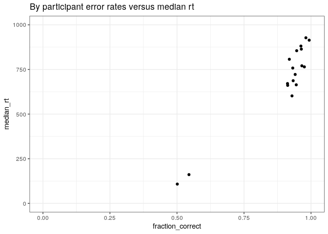
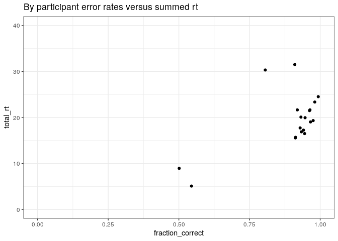
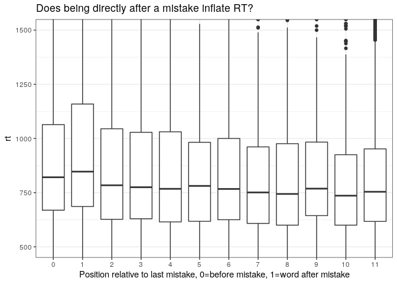
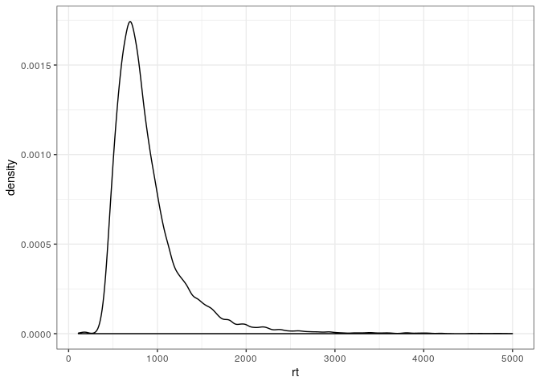

Provo Maze Pilot
================

A pilot for using Maze on Provo.

# Experiment overview

Materials are taken from the Provo corpus. The corpus contains 55
paragraphs each consisting of 1-4 sentences, about 50 words per
paragraph. There are 134 sentences total, with 2689 words total. For
this experiment, each participant sees a randomly selected 25 of the
paragraphs, split into 5 blocks of 5. These are preceded by a practice
block of 8 practice sentences.

I had intended to recruit 30 subjects, but stopped pushing HITs after 20
subjects worth had started because I was afraid results weren’t writing;
turned out that participants where slower to start/finish the experiment
than I thought.

These were all presented using the Maze paradigm, with participants
having to redo mistakes (ie, if they press the button for the wrong
answer, an error message is displayed and they must press the
other/correct key to continue with the
sentence).

# Data prep

<!-- Something screwed up with group number on critical items (looks fine? for practice, def not otherwise). Looks like either in pushing the items, or in recording the results the groups for the ones that were pushed are just the first digit (not sure how that happened). I should try to trouble-shoot this, but for this it means we can't use that to join and have to use other sources of information. -->

19 subjects remaining after non-native, non-resident exclusion

# Overall RT, errors

How many words did each participant see?

    ## # A tibble: 19 x 2
    ##    subject     n
    ##    <fct>   <int>
    ##  1 1        1324
    ##  2 2        1309
    ##  3 3        1338
    ##  4 4        1298
    ##  5 5        1328
    ##  6 6        1291
    ##  7 7        1335
    ##  8 8        1299
    ##  9 9        1302
    ## 10 10       1318
    ## 11 11       1288
    ## 12 12       1335
    ## 13 13       1297
    ## 14 14       1304
    ## 15 15       1314
    ## 16 16       1297
    ## 17 17       1271
    ## 18 18       1312
    ## 19 19       1335

<!-- --><!-- -->

Each participant saw roughly 1300 words. All but two participants were
attentive. Total reading time is the sum of recorded reading times in
minutes, but does not include time to read instructions, do
demographics, take pauses or correct mistakes. It thus should be taken
as a lower bound on how long this took (but reading instructions, etc
can reasonably be estimated to take no more than a couple minutes). Task
was estimated to take 20 minutes, looks like that was about right, but
given variance, we should pay fair wage for 25 or 30 minutes.

Would be an interesting question to look into how to get more of the
sample from the attentive end and not the inattentive (in ORC pilot,
qualitatively same distribution but the inattentive clump was much
bigger). Could also be task effects, maybe this was less frustrating,
easier to do “correctly”??

# Error rate

Label who’s attentive v not for future sorting.

Of attentive participants, what after mistake data can we trust? As a
rough proxy, we’ll consider it trustworthy if it had the same RT profile
as elsewhere. (This may not be the best proxy for reliability.)

<!-- -->

    ## # A tibble: 12 x 3
    ##    after_mistake_fct mean_rt median_rt
    ##    <fct>               <dbl>     <dbl>
    ##  1 0                    943.      821 
    ##  2 1                    991.      847 
    ##  3 2                    900.      784 
    ##  4 3                    893.      775 
    ##  5 4                    885.      768.
    ##  6 5                    865.      781 
    ##  7 6                    862.      767 
    ##  8 7                    844.      751 
    ##  9 8                    854.      744 
    ## 10 9                    884.      768.
    ## 11 10                   834.      736 
    ## 12 11                   846.      754

It looks like the word after a mistake is higher, but after that it’s
fine. For the after mistake, the 11 category is really 11+ and contains
words from farther along as well.

# Relevant analysis

The critical analysis here is whether RT reflects known gross RT
effects, namely longer, less frequent, more surprising words reading
more slowly.

For this pilot, we operationalize all of these in easy to calculate
ways.

  - frequency is log10 of the number of occurances over 10^9 words in
    text (as calculated for the python wordfreq package). So,coefficient
    represents how RT changes per going up a factor of 10 in word
    frequency.
  - length is length in letters. Coefficient represents change in RT
    from increasing length by one letter.
  - surprisal is determined by the Gulordava lstm model and represented
    in bits of surprisal. Coefficient represents how RT changes when
    expectation of the word is halved (i.e. going up one bit of
    surprisal).

All of these variables were centered, to make for a more interpretable
intercept, but have their original scales.

While these do correlate with each other somewhat, we’d like to see them
all acting independently at once.

Data exclusions: Words where errors were made are excluded along with
words immediately after errors. All other after mistake data is
included.

In order to have reasonable analyses using RT as the dependent measure
(untransformed), we want to do light exclusions so that outliers don’t
have too much pull. Here we exclude \<100 ms (which is unreasonably
short if you’re doing any processing at all) and \>5000 ms (which
excludes things where someone paused to do somehthing else, but doesn’t
exclude any of the main curve of data). These two exclusions together
exclude 50 data points, which isn’t very many.

Data points are also implicitly excluded if we don’t have frequency and
surprisal values for them (formula implicitly excluded NAs). Among other
things, this excludes the first word of every sentence.

<!-- -->

We do the models first with lm without hierarchical structure, and then
repeat with appropriate mixed effects in brms.

    ## 
    ## Call:
    ## lm(formula = rt ~ freq_cent + surp_cent + word_len_cent, data = data_correct)
    ## 
    ## Residuals:
    ##     Min      1Q  Median      3Q     Max 
    ## -1305.1  -222.3   -86.4   101.6  4188.9 
    ## 
    ## Coefficients:
    ##               Estimate Std. Error t value Pr(>|t|)    
    ## (Intercept)   889.9208     2.9360 303.104  < 2e-16 ***
    ## freq_cent     -12.1333     4.3936  -2.762  0.00576 ** 
    ## surp_cent      22.0212     0.8135  27.069  < 2e-16 ***
    ## word_len_cent   5.4416     1.8864   2.885  0.00392 ** 
    ## ---
    ## Signif. codes:  0 '***' 0.001 '**' 0.01 '*' 0.05 '.' 0.1 ' ' 1
    ## 
    ## Residual standard error: 385.8 on 17309 degrees of freedom
    ##   (1321 observations deleted due to missingness)
    ## Multiple R-squared:  0.1053, Adjusted R-squared:  0.1052 
    ## F-statistic: 679.4 on 3 and 17309 DF,  p-value: < 2.2e-16

    ## 
    ## Call:
    ## lm(formula = rt ~ freq_cent * surp_cent * word_len_cent, data = data_correct)
    ## 
    ## Residuals:
    ##     Min      1Q  Median      3Q     Max 
    ## -1160.7  -221.3   -84.0   103.2  4172.4 
    ## 
    ## Coefficients:
    ##                                   Estimate Std. Error t value Pr(>|t|)    
    ## (Intercept)                       908.1885     4.3301 209.738  < 2e-16 ***
    ## freq_cent                          -1.6707     4.7916  -0.349   0.7273    
    ## surp_cent                          22.1059     0.9895  22.341  < 2e-16 ***
    ## word_len_cent                       5.3031     2.2139   2.395   0.0166 *  
    ## freq_cent:surp_cent                 1.6001     0.7269   2.201   0.0277 *  
    ## freq_cent:word_len_cent            -0.2429     1.4047  -0.173   0.8627    
    ## surp_cent:word_len_cent            -1.8252     0.4573  -3.991 6.61e-05 ***
    ## freq_cent:surp_cent:word_len_cent  -0.9575     0.2015  -4.753 2.02e-06 ***
    ## ---
    ## Signif. codes:  0 '***' 0.001 '**' 0.01 '*' 0.05 '.' 0.1 ' ' 1
    ## 
    ## Residual standard error: 385.2 on 17305 degrees of freedom
    ##   (1321 observations deleted due to missingness)
    ## Multiple R-squared:  0.1086, Adjusted R-squared:  0.1083 
    ## F-statistic: 301.3 on 7 and 17305 DF,  p-value: < 2.2e-16

Structure wise, we want to nest by subject (some could be more or less
sensitive to any of this stuff), and word\_num nested within Text\_ID.
Unclear if Text\_ID is really a natural category, but words within the
same passage have the same topic (which might contribute to
difficulty?). Of course, individual words may have lots of unmeasured
properties such as errors in the surprisal/etc or properties of their
distractor.

    ##  Family: gaussian 
    ##   Links: mu = identity; sigma = identity 
    ## Formula: rt ~ freq_cent + surp_cent + word_len_cent + (freq_cent + surp_cent + word_len_cent | subject) + (freq_cent + surp_cent + word_len_cent | Text_ID_fct/word_num_fct) 
    ##    Data: data_correct (Number of observations: 17313) 
    ## Samples: 4 chains, each with iter = 2000; warmup = 1000; thin = 1;
    ##          total post-warmup samples = 4000
    ## 
    ## Group-Level Effects: 
    ## ~subject (Number of levels: 17) 
    ##                              Estimate Est.Error l-95% CI u-95% CI Rhat
    ## sd(Intercept)                  195.27     36.31   137.86   279.63 1.01
    ## sd(freq_cent)                   31.71      7.45    19.88    48.81 1.00
    ## sd(surp_cent)                    9.76      1.92     6.69    14.05 1.00
    ## sd(word_len_cent)                2.91      2.15     0.12     8.11 1.00
    ## cor(Intercept,freq_cent)        -0.28      0.22    -0.67     0.18 1.00
    ## cor(Intercept,surp_cent)         0.60      0.17     0.20     0.85 1.00
    ## cor(freq_cent,surp_cent)         0.36      0.22    -0.09     0.73 1.00
    ## cor(Intercept,word_len_cent)    -0.16      0.40    -0.83     0.68 1.00
    ## cor(freq_cent,word_len_cent)     0.03      0.42    -0.77     0.80 1.00
    ## cor(surp_cent,word_len_cent)    -0.08      0.40    -0.79     0.71 1.00
    ##                              Bulk_ESS Tail_ESS
    ## sd(Intercept)                    1305     2036
    ## sd(freq_cent)                    1912     2356
    ## sd(surp_cent)                    2017     2111
    ## sd(word_len_cent)                1717     2465
    ## cor(Intercept,freq_cent)         2469     2340
    ## cor(Intercept,surp_cent)         2396     2807
    ## cor(freq_cent,surp_cent)         2722     3121
    ## cor(Intercept,word_len_cent)     7043     2891
    ## cor(freq_cent,word_len_cent)     5684     2852
    ## cor(surp_cent,word_len_cent)     6036     3537
    ## 
    ## ~Text_ID_fct (Number of levels: 55) 
    ##                              Estimate Est.Error l-95% CI u-95% CI Rhat
    ## sd(Intercept)                   34.16      5.52    24.24    45.82 1.00
    ## sd(freq_cent)                    5.60      4.44     0.21    16.42 1.00
    ## sd(surp_cent)                    4.56      1.59     1.21     7.73 1.00
    ## sd(word_len_cent)                2.78      2.08     0.12     7.78 1.00
    ## cor(Intercept,freq_cent)         0.04      0.42    -0.76     0.80 1.00
    ## cor(Intercept,surp_cent)         0.39      0.25    -0.17     0.80 1.00
    ## cor(freq_cent,surp_cent)         0.27      0.45    -0.70     0.92 1.01
    ## cor(Intercept,word_len_cent)     0.05      0.41    -0.75     0.80 1.00
    ## cor(freq_cent,word_len_cent)     0.16      0.47    -0.75     0.90 1.00
    ## cor(surp_cent,word_len_cent)    -0.12      0.44    -0.85     0.75 1.00
    ##                              Bulk_ESS Tail_ESS
    ## sd(Intercept)                    1711     2618
    ## sd(freq_cent)                    1211     1865
    ## sd(surp_cent)                     653      879
    ## sd(word_len_cent)                1244     1708
    ## cor(Intercept,freq_cent)         5164     2999
    ## cor(Intercept,surp_cent)         2538     2553
    ## cor(freq_cent,surp_cent)          590     1632
    ## cor(Intercept,word_len_cent)     5352     2830
    ## cor(freq_cent,word_len_cent)     2445     2862
    ## cor(surp_cent,word_len_cent)     3445     3080
    ## 
    ## ~Text_ID_fct:word_num_fct (Number of levels: 2551) 
    ##                              Estimate Est.Error l-95% CI u-95% CI Rhat
    ## sd(Intercept)                   96.82      4.95    87.14   106.45 1.00
    ## sd(freq_cent)                   30.32     13.62     4.18    55.78 1.01
    ## sd(surp_cent)                   15.16      1.64    12.14    18.56 1.00
    ## sd(word_len_cent)               14.04      4.00     6.69    22.42 1.01
    ## cor(Intercept,freq_cent)        -0.25      0.25    -0.76     0.22 1.00
    ## cor(Intercept,surp_cent)         0.88      0.06     0.74     0.98 1.01
    ## cor(freq_cent,surp_cent)         0.12      0.33    -0.62     0.63 1.01
    ## cor(Intercept,word_len_cent)    -0.67      0.15    -0.93    -0.35 1.00
    ## cor(freq_cent,word_len_cent)     0.48      0.31    -0.28     0.90 1.01
    ## cor(surp_cent,word_len_cent)    -0.59      0.25    -0.94    -0.02 1.01
    ##                              Bulk_ESS Tail_ESS
    ## sd(Intercept)                     565     1402
    ## sd(freq_cent)                     209      497
    ## sd(surp_cent)                     503      875
    ## sd(word_len_cent)                 357      936
    ## cor(Intercept,freq_cent)         1097     1580
    ## cor(Intercept,surp_cent)          247     1000
    ## cor(freq_cent,surp_cent)          406     1397
    ## cor(Intercept,word_len_cent)      641     1430
    ## cor(freq_cent,word_len_cent)      345     1201
    ## cor(surp_cent,word_len_cent)      310      956
    ## 
    ## Population-Level Effects: 
    ##               Estimate Est.Error l-95% CI u-95% CI Rhat Bulk_ESS Tail_ESS
    ## Intercept       897.66     50.55   795.59  1000.06 1.00      588     1095
    ## freq_cent       -17.61      9.69   -36.27     1.87 1.00     1831     2125
    ## surp_cent        22.61      2.70    17.32    27.83 1.00     1393     2350
    ## word_len_cent     7.27      2.39     2.61    12.08 1.00     4653     3455
    ## 
    ## Family Specific Parameters: 
    ##       Estimate Est.Error l-95% CI u-95% CI Rhat Bulk_ESS Tail_ESS
    ## sigma   321.52      1.87   317.82   325.40 1.00     5156     2849
    ## 
    ## Samples were drawn using sampling(NUTS). For each parameter, Eff.Sample 
    ## is a crude measure of effective sample size, and Rhat is the potential 
    ## scale reduction factor on split chains (at convergence, Rhat = 1).

    ##  Family: gaussian 
    ##   Links: mu = identity; sigma = identity 
    ## Formula: rt ~ freq_cent * surp_cent * word_len_cent + (freq_cent * surp_cent * word_len_cent | subject) + (freq_cent * surp_cent * word_len_cent | Text_ID_fct/word_num_fct) 
    ##    Data: data_correct (Number of observations: 17313) 
    ## Samples: 4 chains, each with iter = 2000; warmup = 1000; thin = 1;
    ##          total post-warmup samples = 4000
    ## 
    ## Group-Level Effects: 
    ## ~subject (Number of levels: 17) 
    ##                                                                Estimate
    ## sd(Intercept)                                                    182.09
    ## sd(freq_cent)                                                     32.15
    ## sd(surp_cent)                                                      9.46
    ## sd(word_len_cent)                                                  4.68
    ## sd(freq_cent:surp_cent)                                            1.85
    ## sd(freq_cent:word_len_cent)                                        4.54
    ## sd(surp_cent:word_len_cent)                                        0.57
    ## sd(freq_cent:surp_cent:word_len_cent)                              0.59
    ## cor(Intercept,freq_cent)                                          -0.24
    ## cor(Intercept,surp_cent)                                           0.49
    ## cor(freq_cent,surp_cent)                                           0.33
    ## cor(Intercept,word_len_cent)                                      -0.24
    ## cor(freq_cent,word_len_cent)                                       0.04
    ## cor(surp_cent,word_len_cent)                                      -0.15
    ## cor(Intercept,freq_cent:surp_cent)                                 0.31
    ## cor(freq_cent,freq_cent:surp_cent)                                 0.24
    ## cor(surp_cent,freq_cent:surp_cent)                                 0.47
    ## cor(word_len_cent,freq_cent:surp_cent)                            -0.20
    ## cor(Intercept,freq_cent:word_len_cent)                            -0.27
    ## cor(freq_cent,freq_cent:word_len_cent)                             0.12
    ## cor(surp_cent,freq_cent:word_len_cent)                            -0.11
    ## cor(word_len_cent,freq_cent:word_len_cent)                         0.20
    ## cor(freq_cent:surp_cent,freq_cent:word_len_cent)                  -0.12
    ## cor(Intercept,surp_cent:word_len_cent)                            -0.19
    ## cor(freq_cent,surp_cent:word_len_cent)                            -0.03
    ## cor(surp_cent,surp_cent:word_len_cent)                            -0.11
    ## cor(word_len_cent,surp_cent:word_len_cent)                         0.08
    ## cor(freq_cent:surp_cent,surp_cent:word_len_cent)                  -0.03
    ## cor(freq_cent:word_len_cent,surp_cent:word_len_cent)               0.15
    ## cor(Intercept,freq_cent:surp_cent:word_len_cent)                  -0.33
    ## cor(freq_cent,freq_cent:surp_cent:word_len_cent)                  -0.11
    ## cor(surp_cent,freq_cent:surp_cent:word_len_cent)                  -0.17
    ## cor(word_len_cent,freq_cent:surp_cent:word_len_cent)               0.16
    ## cor(freq_cent:surp_cent,freq_cent:surp_cent:word_len_cent)        -0.33
    ## cor(freq_cent:word_len_cent,freq_cent:surp_cent:word_len_cent)     0.16
    ## cor(surp_cent:word_len_cent,freq_cent:surp_cent:word_len_cent)     0.25
    ##                                                                Est.Error
    ## sd(Intercept)                                                      33.83
    ## sd(freq_cent)                                                       7.49
    ## sd(surp_cent)                                                       1.84
    ## sd(word_len_cent)                                                   2.67
    ## sd(freq_cent:surp_cent)                                             0.72
    ## sd(freq_cent:word_len_cent)                                         1.93
    ## sd(surp_cent:word_len_cent)                                         0.41
    ## sd(freq_cent:surp_cent:word_len_cent)                               0.25
    ## cor(Intercept,freq_cent)                                            0.21
    ## cor(Intercept,surp_cent)                                            0.17
    ## cor(freq_cent,surp_cent)                                            0.20
    ## cor(Intercept,word_len_cent)                                        0.28
    ## cor(freq_cent,word_len_cent)                                        0.29
    ## cor(surp_cent,word_len_cent)                                        0.29
    ## cor(Intercept,freq_cent:surp_cent)                                  0.26
    ## cor(freq_cent,freq_cent:surp_cent)                                  0.26
    ## cor(surp_cent,freq_cent:surp_cent)                                  0.24
    ## cor(word_len_cent,freq_cent:surp_cent)                              0.31
    ## cor(Intercept,freq_cent:word_len_cent)                              0.25
    ## cor(freq_cent,freq_cent:word_len_cent)                              0.27
    ## cor(surp_cent,freq_cent:word_len_cent)                              0.26
    ## cor(word_len_cent,freq_cent:word_len_cent)                          0.31
    ## cor(freq_cent:surp_cent,freq_cent:word_len_cent)                    0.30
    ## cor(Intercept,surp_cent:word_len_cent)                              0.31
    ## cor(freq_cent,surp_cent:word_len_cent)                              0.31
    ## cor(surp_cent,surp_cent:word_len_cent)                              0.32
    ## cor(word_len_cent,surp_cent:word_len_cent)                          0.33
    ## cor(freq_cent:surp_cent,surp_cent:word_len_cent)                    0.32
    ## cor(freq_cent:word_len_cent,surp_cent:word_len_cent)                0.32
    ## cor(Intercept,freq_cent:surp_cent:word_len_cent)                    0.25
    ## cor(freq_cent,freq_cent:surp_cent:word_len_cent)                    0.28
    ## cor(surp_cent,freq_cent:surp_cent:word_len_cent)                    0.26
    ## cor(word_len_cent,freq_cent:surp_cent:word_len_cent)                0.31
    ## cor(freq_cent:surp_cent,freq_cent:surp_cent:word_len_cent)          0.29
    ## cor(freq_cent:word_len_cent,freq_cent:surp_cent:word_len_cent)      0.29
    ## cor(surp_cent:word_len_cent,freq_cent:surp_cent:word_len_cent)      0.34
    ##                                                                l-95% CI
    ## sd(Intercept)                                                    128.94
    ## sd(freq_cent)                                                     20.37
    ## sd(surp_cent)                                                      6.53
    ## sd(word_len_cent)                                                  0.40
    ## sd(freq_cent:surp_cent)                                            0.47
    ## sd(freq_cent:word_len_cent)                                        0.75
    ## sd(surp_cent:word_len_cent)                                        0.03
    ## sd(freq_cent:surp_cent:word_len_cent)                              0.14
    ## cor(Intercept,freq_cent)                                          -0.61
    ## cor(Intercept,surp_cent)                                           0.12
    ## cor(freq_cent,surp_cent)                                          -0.11
    ## cor(Intercept,word_len_cent)                                      -0.71
    ## cor(freq_cent,word_len_cent)                                      -0.54
    ## cor(surp_cent,word_len_cent)                                      -0.67
    ## cor(Intercept,freq_cent:surp_cent)                                -0.25
    ## cor(freq_cent,freq_cent:surp_cent)                                -0.30
    ## cor(surp_cent,freq_cent:surp_cent)                                -0.08
    ## cor(word_len_cent,freq_cent:surp_cent)                            -0.74
    ## cor(Intercept,freq_cent:word_len_cent)                            -0.72
    ## cor(freq_cent,freq_cent:word_len_cent)                            -0.43
    ## cor(surp_cent,freq_cent:word_len_cent)                            -0.60
    ## cor(word_len_cent,freq_cent:word_len_cent)                        -0.45
    ## cor(freq_cent:surp_cent,freq_cent:word_len_cent)                  -0.66
    ## cor(Intercept,surp_cent:word_len_cent)                            -0.73
    ## cor(freq_cent,surp_cent:word_len_cent)                            -0.62
    ## cor(surp_cent,surp_cent:word_len_cent)                            -0.68
    ## cor(word_len_cent,surp_cent:word_len_cent)                        -0.56
    ## cor(freq_cent:surp_cent,surp_cent:word_len_cent)                  -0.63
    ## cor(freq_cent:word_len_cent,surp_cent:word_len_cent)              -0.51
    ## cor(Intercept,freq_cent:surp_cent:word_len_cent)                  -0.75
    ## cor(freq_cent,freq_cent:surp_cent:word_len_cent)                  -0.62
    ## cor(surp_cent,freq_cent:surp_cent:word_len_cent)                  -0.65
    ## cor(word_len_cent,freq_cent:surp_cent:word_len_cent)              -0.47
    ## cor(freq_cent:surp_cent,freq_cent:surp_cent:word_len_cent)        -0.80
    ## cor(freq_cent:word_len_cent,freq_cent:surp_cent:word_len_cent)    -0.45
    ## cor(surp_cent:word_len_cent,freq_cent:surp_cent:word_len_cent)    -0.46
    ##                                                                u-95% CI
    ## sd(Intercept)                                                    261.58
    ## sd(freq_cent)                                                     49.30
    ## sd(surp_cent)                                                     13.70
    ## sd(word_len_cent)                                                 10.67
    ## sd(freq_cent:surp_cent)                                            3.37
    ## sd(freq_cent:word_len_cent)                                        8.71
    ## sd(surp_cent:word_len_cent)                                        1.52
    ## sd(freq_cent:surp_cent:word_len_cent)                              1.16
    ## cor(Intercept,freq_cent)                                           0.17
    ## cor(Intercept,surp_cent)                                           0.78
    ## cor(freq_cent,surp_cent)                                           0.68
    ## cor(Intercept,word_len_cent)                                       0.37
    ## cor(freq_cent,word_len_cent)                                       0.59
    ## cor(surp_cent,word_len_cent)                                       0.41
    ## cor(Intercept,freq_cent:surp_cent)                                 0.75
    ## cor(freq_cent,freq_cent:surp_cent)                                 0.70
    ## cor(surp_cent,freq_cent:surp_cent)                                 0.84
    ## cor(word_len_cent,freq_cent:surp_cent)                             0.44
    ## cor(Intercept,freq_cent:word_len_cent)                             0.26
    ## cor(freq_cent,freq_cent:word_len_cent)                             0.60
    ## cor(surp_cent,freq_cent:word_len_cent)                             0.41
    ## cor(word_len_cent,freq_cent:word_len_cent)                         0.74
    ## cor(freq_cent:surp_cent,freq_cent:word_len_cent)                   0.49
    ## cor(Intercept,surp_cent:word_len_cent)                             0.48
    ## cor(freq_cent,surp_cent:word_len_cent)                             0.57
    ## cor(surp_cent,surp_cent:word_len_cent)                             0.52
    ## cor(word_len_cent,surp_cent:word_len_cent)                         0.69
    ## cor(freq_cent:surp_cent,surp_cent:word_len_cent)                   0.57
    ## cor(freq_cent:word_len_cent,surp_cent:word_len_cent)               0.72
    ## cor(Intercept,freq_cent:surp_cent:word_len_cent)                   0.21
    ## cor(freq_cent,freq_cent:surp_cent:word_len_cent)                   0.44
    ## cor(surp_cent,freq_cent:surp_cent:word_len_cent)                   0.36
    ## cor(word_len_cent,freq_cent:surp_cent:word_len_cent)               0.72
    ## cor(freq_cent:surp_cent,freq_cent:surp_cent:word_len_cent)         0.30
    ## cor(freq_cent:word_len_cent,freq_cent:surp_cent:word_len_cent)     0.71
    ## cor(surp_cent:word_len_cent,freq_cent:surp_cent:word_len_cent)     0.80
    ##                                                                Rhat
    ## sd(Intercept)                                                  1.00
    ## sd(freq_cent)                                                  1.00
    ## sd(surp_cent)                                                  1.00
    ## sd(word_len_cent)                                              1.00
    ## sd(freq_cent:surp_cent)                                        1.00
    ## sd(freq_cent:word_len_cent)                                    1.00
    ## sd(surp_cent:word_len_cent)                                    1.00
    ## sd(freq_cent:surp_cent:word_len_cent)                          1.00
    ## cor(Intercept,freq_cent)                                       1.00
    ## cor(Intercept,surp_cent)                                       1.00
    ## cor(freq_cent,surp_cent)                                       1.00
    ## cor(Intercept,word_len_cent)                                   1.00
    ## cor(freq_cent,word_len_cent)                                   1.00
    ## cor(surp_cent,word_len_cent)                                   1.00
    ## cor(Intercept,freq_cent:surp_cent)                             1.00
    ## cor(freq_cent,freq_cent:surp_cent)                             1.00
    ## cor(surp_cent,freq_cent:surp_cent)                             1.00
    ## cor(word_len_cent,freq_cent:surp_cent)                         1.00
    ## cor(Intercept,freq_cent:word_len_cent)                         1.00
    ## cor(freq_cent,freq_cent:word_len_cent)                         1.00
    ## cor(surp_cent,freq_cent:word_len_cent)                         1.00
    ## cor(word_len_cent,freq_cent:word_len_cent)                     1.00
    ## cor(freq_cent:surp_cent,freq_cent:word_len_cent)               1.00
    ## cor(Intercept,surp_cent:word_len_cent)                         1.00
    ## cor(freq_cent,surp_cent:word_len_cent)                         1.00
    ## cor(surp_cent,surp_cent:word_len_cent)                         1.00
    ## cor(word_len_cent,surp_cent:word_len_cent)                     1.00
    ## cor(freq_cent:surp_cent,surp_cent:word_len_cent)               1.00
    ## cor(freq_cent:word_len_cent,surp_cent:word_len_cent)           1.00
    ## cor(Intercept,freq_cent:surp_cent:word_len_cent)               1.00
    ## cor(freq_cent,freq_cent:surp_cent:word_len_cent)               1.00
    ## cor(surp_cent,freq_cent:surp_cent:word_len_cent)               1.00
    ## cor(word_len_cent,freq_cent:surp_cent:word_len_cent)           1.00
    ## cor(freq_cent:surp_cent,freq_cent:surp_cent:word_len_cent)     1.00
    ## cor(freq_cent:word_len_cent,freq_cent:surp_cent:word_len_cent) 1.00
    ## cor(surp_cent:word_len_cent,freq_cent:surp_cent:word_len_cent) 1.00
    ##                                                                Bulk_ESS
    ## sd(Intercept)                                                      1166
    ## sd(freq_cent)                                                      2152
    ## sd(surp_cent)                                                      1948
    ## sd(word_len_cent)                                                  1553
    ## sd(freq_cent:surp_cent)                                            1752
    ## sd(freq_cent:word_len_cent)                                        1168
    ## sd(surp_cent:word_len_cent)                                        1646
    ## sd(freq_cent:surp_cent:word_len_cent)                              1699
    ## cor(Intercept,freq_cent)                                           2364
    ## cor(Intercept,surp_cent)                                           2217
    ## cor(freq_cent,surp_cent)                                           2203
    ## cor(Intercept,word_len_cent)                                       4758
    ## cor(freq_cent,word_len_cent)                                       5923
    ## cor(surp_cent,word_len_cent)                                       5173
    ## cor(Intercept,freq_cent:surp_cent)                                 3877
    ## cor(freq_cent,freq_cent:surp_cent)                                 4571
    ## cor(surp_cent,freq_cent:surp_cent)                                 3986
    ## cor(word_len_cent,freq_cent:surp_cent)                             3328
    ## cor(Intercept,freq_cent:word_len_cent)                             4479
    ## cor(freq_cent,freq_cent:word_len_cent)                             4096
    ## cor(surp_cent,freq_cent:word_len_cent)                             4330
    ## cor(word_len_cent,freq_cent:word_len_cent)                         2531
    ## cor(freq_cent:surp_cent,freq_cent:word_len_cent)                   2792
    ## cor(Intercept,surp_cent:word_len_cent)                             5311
    ## cor(freq_cent,surp_cent:word_len_cent)                             5961
    ## cor(surp_cent,surp_cent:word_len_cent)                             5376
    ## cor(word_len_cent,surp_cent:word_len_cent)                         3562
    ## cor(freq_cent:surp_cent,surp_cent:word_len_cent)                   4501
    ## cor(freq_cent:word_len_cent,surp_cent:word_len_cent)               3709
    ## cor(Intercept,freq_cent:surp_cent:word_len_cent)                   4611
    ## cor(freq_cent,freq_cent:surp_cent:word_len_cent)                   4803
    ## cor(surp_cent,freq_cent:surp_cent:word_len_cent)                   4215
    ## cor(word_len_cent,freq_cent:surp_cent:word_len_cent)               2470
    ## cor(freq_cent:surp_cent,freq_cent:surp_cent:word_len_cent)         2651
    ## cor(freq_cent:word_len_cent,freq_cent:surp_cent:word_len_cent)     3158
    ## cor(surp_cent:word_len_cent,freq_cent:surp_cent:word_len_cent)     1916
    ##                                                                Tail_ESS
    ## sd(Intercept)                                                      1702
    ## sd(freq_cent)                                                      2735
    ## sd(surp_cent)                                                      2575
    ## sd(word_len_cent)                                                  1869
    ## sd(freq_cent:surp_cent)                                            1436
    ## sd(freq_cent:word_len_cent)                                         654
    ## sd(surp_cent:word_len_cent)                                        1703
    ## sd(freq_cent:surp_cent:word_len_cent)                              1603
    ## cor(Intercept,freq_cent)                                           2715
    ## cor(Intercept,surp_cent)                                           2297
    ## cor(freq_cent,surp_cent)                                           2618
    ## cor(Intercept,word_len_cent)                                       2756
    ## cor(freq_cent,word_len_cent)                                       2948
    ## cor(surp_cent,word_len_cent)                                       2989
    ## cor(Intercept,freq_cent:surp_cent)                                 3203
    ## cor(freq_cent,freq_cent:surp_cent)                                 3267
    ## cor(surp_cent,freq_cent:surp_cent)                                 2782
    ## cor(word_len_cent,freq_cent:surp_cent)                             3456
    ## cor(Intercept,freq_cent:word_len_cent)                             2798
    ## cor(freq_cent,freq_cent:word_len_cent)                             2357
    ## cor(surp_cent,freq_cent:word_len_cent)                             3198
    ## cor(word_len_cent,freq_cent:word_len_cent)                         2988
    ## cor(freq_cent:surp_cent,freq_cent:word_len_cent)                   2885
    ## cor(Intercept,surp_cent:word_len_cent)                             2814
    ## cor(freq_cent,surp_cent:word_len_cent)                             2912
    ## cor(surp_cent,surp_cent:word_len_cent)                             3176
    ## cor(word_len_cent,surp_cent:word_len_cent)                         2998
    ## cor(freq_cent:surp_cent,surp_cent:word_len_cent)                   3350
    ## cor(freq_cent:word_len_cent,surp_cent:word_len_cent)               3194
    ## cor(Intercept,freq_cent:surp_cent:word_len_cent)                   2832
    ## cor(freq_cent,freq_cent:surp_cent:word_len_cent)                   3081
    ## cor(surp_cent,freq_cent:surp_cent:word_len_cent)                   3192
    ## cor(word_len_cent,freq_cent:surp_cent:word_len_cent)               2962
    ## cor(freq_cent:surp_cent,freq_cent:surp_cent:word_len_cent)         3335
    ## cor(freq_cent:word_len_cent,freq_cent:surp_cent:word_len_cent)     3294
    ## cor(surp_cent:word_len_cent,freq_cent:surp_cent:word_len_cent)     3184
    ## 
    ## ~Text_ID_fct (Number of levels: 55) 
    ##                                                                Estimate
    ## sd(Intercept)                                                     35.33
    ## sd(freq_cent)                                                      4.66
    ## sd(surp_cent)                                                      4.38
    ## sd(word_len_cent)                                                  2.76
    ## sd(freq_cent:surp_cent)                                            1.05
    ## sd(freq_cent:word_len_cent)                                        2.93
    ## sd(surp_cent:word_len_cent)                                        0.66
    ## sd(freq_cent:surp_cent:word_len_cent)                              0.37
    ## cor(Intercept,freq_cent)                                          -0.03
    ## cor(Intercept,surp_cent)                                           0.22
    ## cor(freq_cent,surp_cent)                                           0.14
    ## cor(Intercept,word_len_cent)                                       0.05
    ## cor(freq_cent,word_len_cent)                                       0.07
    ## cor(surp_cent,word_len_cent)                                      -0.08
    ## cor(Intercept,freq_cent:surp_cent)                                 0.05
    ## cor(freq_cent,freq_cent:surp_cent)                                 0.01
    ## cor(surp_cent,freq_cent:surp_cent)                                -0.16
    ## cor(word_len_cent,freq_cent:surp_cent)                            -0.07
    ## cor(Intercept,freq_cent:word_len_cent)                             0.29
    ## cor(freq_cent,freq_cent:word_len_cent)                            -0.02
    ## cor(surp_cent,freq_cent:word_len_cent)                            -0.17
    ## cor(word_len_cent,freq_cent:word_len_cent)                         0.00
    ## cor(freq_cent:surp_cent,freq_cent:word_len_cent)                   0.01
    ## cor(Intercept,surp_cent:word_len_cent)                            -0.01
    ## cor(freq_cent,surp_cent:word_len_cent)                            -0.01
    ## cor(surp_cent,surp_cent:word_len_cent)                             0.19
    ## cor(word_len_cent,surp_cent:word_len_cent)                         0.04
    ## cor(freq_cent:surp_cent,surp_cent:word_len_cent)                   0.04
    ## cor(freq_cent:word_len_cent,surp_cent:word_len_cent)               0.01
    ## cor(Intercept,freq_cent:surp_cent:word_len_cent)                  -0.09
    ## cor(freq_cent,freq_cent:surp_cent:word_len_cent)                  -0.04
    ## cor(surp_cent,freq_cent:surp_cent:word_len_cent)                   0.10
    ## cor(word_len_cent,freq_cent:surp_cent:word_len_cent)               0.05
    ## cor(freq_cent:surp_cent,freq_cent:surp_cent:word_len_cent)         0.01
    ## cor(freq_cent:word_len_cent,freq_cent:surp_cent:word_len_cent)     0.02
    ## cor(surp_cent:word_len_cent,freq_cent:surp_cent:word_len_cent)     0.01
    ##                                                                Est.Error
    ## sd(Intercept)                                                       6.40
    ## sd(freq_cent)                                                       3.52
    ## sd(surp_cent)                                                       1.67
    ## sd(word_len_cent)                                                   2.01
    ## sd(freq_cent:surp_cent)                                             0.74
    ## sd(freq_cent:word_len_cent)                                         1.88
    ## sd(surp_cent:word_len_cent)                                         0.45
    ## sd(freq_cent:surp_cent:word_len_cent)                               0.26
    ## cor(Intercept,freq_cent)                                            0.33
    ## cor(Intercept,surp_cent)                                            0.24
    ## cor(freq_cent,surp_cent)                                            0.34
    ## cor(Intercept,word_len_cent)                                        0.32
    ## cor(freq_cent,word_len_cent)                                        0.34
    ## cor(surp_cent,word_len_cent)                                        0.33
    ## cor(Intercept,freq_cent:surp_cent)                                  0.31
    ## cor(freq_cent,freq_cent:surp_cent)                                  0.33
    ## cor(surp_cent,freq_cent:surp_cent)                                  0.34
    ## cor(word_len_cent,freq_cent:surp_cent)                              0.33
    ## cor(Intercept,freq_cent:word_len_cent)                              0.32
    ## cor(freq_cent,freq_cent:word_len_cent)                              0.33
    ## cor(surp_cent,freq_cent:word_len_cent)                              0.32
    ## cor(word_len_cent,freq_cent:word_len_cent)                          0.33
    ## cor(freq_cent:surp_cent,freq_cent:word_len_cent)                    0.33
    ## cor(Intercept,surp_cent:word_len_cent)                              0.31
    ## cor(freq_cent,surp_cent:word_len_cent)                              0.34
    ## cor(surp_cent,surp_cent:word_len_cent)                              0.33
    ## cor(word_len_cent,surp_cent:word_len_cent)                          0.33
    ## cor(freq_cent:surp_cent,surp_cent:word_len_cent)                    0.34
    ## cor(freq_cent:word_len_cent,surp_cent:word_len_cent)                0.33
    ## cor(Intercept,freq_cent:surp_cent:word_len_cent)                    0.33
    ## cor(freq_cent,freq_cent:surp_cent:word_len_cent)                    0.33
    ## cor(surp_cent,freq_cent:surp_cent:word_len_cent)                    0.34
    ## cor(word_len_cent,freq_cent:surp_cent:word_len_cent)                0.34
    ## cor(freq_cent:surp_cent,freq_cent:surp_cent:word_len_cent)          0.34
    ## cor(freq_cent:word_len_cent,freq_cent:surp_cent:word_len_cent)      0.33
    ## cor(surp_cent:word_len_cent,freq_cent:surp_cent:word_len_cent)      0.33
    ##                                                                l-95% CI
    ## sd(Intercept)                                                     23.64
    ## sd(freq_cent)                                                      0.21
    ## sd(surp_cent)                                                      0.52
    ## sd(word_len_cent)                                                  0.13
    ## sd(freq_cent:surp_cent)                                            0.04
    ## sd(freq_cent:word_len_cent)                                        0.10
    ## sd(surp_cent:word_len_cent)                                        0.03
    ## sd(freq_cent:surp_cent:word_len_cent)                              0.01
    ## cor(Intercept,freq_cent)                                          -0.65
    ## cor(Intercept,surp_cent)                                          -0.32
    ## cor(freq_cent,surp_cent)                                          -0.56
    ## cor(Intercept,word_len_cent)                                      -0.56
    ## cor(freq_cent,word_len_cent)                                      -0.60
    ## cor(surp_cent,word_len_cent)                                      -0.68
    ## cor(Intercept,freq_cent:surp_cent)                                -0.59
    ## cor(freq_cent,freq_cent:surp_cent)                                -0.60
    ## cor(surp_cent,freq_cent:surp_cent)                                -0.75
    ## cor(word_len_cent,freq_cent:surp_cent)                            -0.68
    ## cor(Intercept,freq_cent:word_len_cent)                            -0.43
    ## cor(freq_cent,freq_cent:word_len_cent)                            -0.64
    ## cor(surp_cent,freq_cent:word_len_cent)                            -0.71
    ## cor(word_len_cent,freq_cent:word_len_cent)                        -0.63
    ## cor(freq_cent:surp_cent,freq_cent:word_len_cent)                  -0.62
    ## cor(Intercept,surp_cent:word_len_cent)                            -0.60
    ## cor(freq_cent,surp_cent:word_len_cent)                            -0.65
    ## cor(surp_cent,surp_cent:word_len_cent)                            -0.51
    ## cor(word_len_cent,surp_cent:word_len_cent)                        -0.62
    ## cor(freq_cent:surp_cent,surp_cent:word_len_cent)                  -0.62
    ## cor(freq_cent:word_len_cent,surp_cent:word_len_cent)              -0.64
    ## cor(Intercept,freq_cent:surp_cent:word_len_cent)                  -0.67
    ## cor(freq_cent,freq_cent:surp_cent:word_len_cent)                  -0.66
    ## cor(surp_cent,freq_cent:surp_cent:word_len_cent)                  -0.58
    ## cor(word_len_cent,freq_cent:surp_cent:word_len_cent)              -0.63
    ## cor(freq_cent:surp_cent,freq_cent:surp_cent:word_len_cent)        -0.63
    ## cor(freq_cent:word_len_cent,freq_cent:surp_cent:word_len_cent)    -0.62
    ## cor(surp_cent:word_len_cent,freq_cent:surp_cent:word_len_cent)    -0.61
    ##                                                                u-95% CI
    ## sd(Intercept)                                                     48.53
    ## sd(freq_cent)                                                     12.96
    ## sd(surp_cent)                                                      7.43
    ## sd(word_len_cent)                                                  7.54
    ## sd(freq_cent:surp_cent)                                            2.76
    ## sd(freq_cent:word_len_cent)                                        6.93
    ## sd(surp_cent:word_len_cent)                                        1.64
    ## sd(freq_cent:surp_cent:word_len_cent)                              0.95
    ## cor(Intercept,freq_cent)                                           0.60
    ## cor(Intercept,surp_cent)                                           0.65
    ## cor(freq_cent,surp_cent)                                           0.71
    ## cor(Intercept,word_len_cent)                                       0.65
    ## cor(freq_cent,word_len_cent)                                       0.68
    ## cor(surp_cent,word_len_cent)                                       0.57
    ## cor(Intercept,freq_cent:surp_cent)                                 0.63
    ## cor(freq_cent,freq_cent:surp_cent)                                 0.63
    ## cor(surp_cent,freq_cent:surp_cent)                                 0.52
    ## cor(word_len_cent,freq_cent:surp_cent)                             0.58
    ## cor(Intercept,freq_cent:word_len_cent)                             0.77
    ## cor(freq_cent,freq_cent:word_len_cent)                             0.62
    ## cor(surp_cent,freq_cent:word_len_cent)                             0.53
    ## cor(word_len_cent,freq_cent:word_len_cent)                         0.63
    ## cor(freq_cent:surp_cent,freq_cent:word_len_cent)                   0.63
    ## cor(Intercept,surp_cent:word_len_cent)                             0.60
    ## cor(freq_cent,surp_cent:word_len_cent)                             0.64
    ## cor(surp_cent,surp_cent:word_len_cent)                             0.76
    ## cor(word_len_cent,surp_cent:word_len_cent)                         0.63
    ## cor(freq_cent:surp_cent,surp_cent:word_len_cent)                   0.67
    ## cor(freq_cent:word_len_cent,surp_cent:word_len_cent)               0.63
    ## cor(Intercept,freq_cent:surp_cent:word_len_cent)                   0.57
    ## cor(freq_cent,freq_cent:surp_cent:word_len_cent)                   0.61
    ## cor(surp_cent,freq_cent:surp_cent:word_len_cent)                   0.69
    ## cor(word_len_cent,freq_cent:surp_cent:word_len_cent)               0.66
    ## cor(freq_cent:surp_cent,freq_cent:surp_cent:word_len_cent)         0.65
    ## cor(freq_cent:word_len_cent,freq_cent:surp_cent:word_len_cent)     0.64
    ## cor(surp_cent:word_len_cent,freq_cent:surp_cent:word_len_cent)     0.64
    ##                                                                Rhat
    ## sd(Intercept)                                                  1.00
    ## sd(freq_cent)                                                  1.00
    ## sd(surp_cent)                                                  1.01
    ## sd(word_len_cent)                                              1.00
    ## sd(freq_cent:surp_cent)                                        1.00
    ## sd(freq_cent:word_len_cent)                                    1.00
    ## sd(surp_cent:word_len_cent)                                    1.00
    ## sd(freq_cent:surp_cent:word_len_cent)                          1.00
    ## cor(Intercept,freq_cent)                                       1.00
    ## cor(Intercept,surp_cent)                                       1.00
    ## cor(freq_cent,surp_cent)                                       1.00
    ## cor(Intercept,word_len_cent)                                   1.00
    ## cor(freq_cent,word_len_cent)                                   1.00
    ## cor(surp_cent,word_len_cent)                                   1.00
    ## cor(Intercept,freq_cent:surp_cent)                             1.00
    ## cor(freq_cent,freq_cent:surp_cent)                             1.00
    ## cor(surp_cent,freq_cent:surp_cent)                             1.00
    ## cor(word_len_cent,freq_cent:surp_cent)                         1.00
    ## cor(Intercept,freq_cent:word_len_cent)                         1.00
    ## cor(freq_cent,freq_cent:word_len_cent)                         1.00
    ## cor(surp_cent,freq_cent:word_len_cent)                         1.00
    ## cor(word_len_cent,freq_cent:word_len_cent)                     1.00
    ## cor(freq_cent:surp_cent,freq_cent:word_len_cent)               1.00
    ## cor(Intercept,surp_cent:word_len_cent)                         1.00
    ## cor(freq_cent,surp_cent:word_len_cent)                         1.00
    ## cor(surp_cent,surp_cent:word_len_cent)                         1.00
    ## cor(word_len_cent,surp_cent:word_len_cent)                     1.00
    ## cor(freq_cent:surp_cent,surp_cent:word_len_cent)               1.00
    ## cor(freq_cent:word_len_cent,surp_cent:word_len_cent)           1.00
    ## cor(Intercept,freq_cent:surp_cent:word_len_cent)               1.00
    ## cor(freq_cent,freq_cent:surp_cent:word_len_cent)               1.00
    ## cor(surp_cent,freq_cent:surp_cent:word_len_cent)               1.00
    ## cor(word_len_cent,freq_cent:surp_cent:word_len_cent)           1.00
    ## cor(freq_cent:surp_cent,freq_cent:surp_cent:word_len_cent)     1.00
    ## cor(freq_cent:word_len_cent,freq_cent:surp_cent:word_len_cent) 1.00
    ## cor(surp_cent:word_len_cent,freq_cent:surp_cent:word_len_cent) 1.00
    ##                                                                Bulk_ESS
    ## sd(Intercept)                                                      1587
    ## sd(freq_cent)                                                      2047
    ## sd(surp_cent)                                                       438
    ## sd(word_len_cent)                                                  1396
    ## sd(freq_cent:surp_cent)                                            1664
    ## sd(freq_cent:word_len_cent)                                         922
    ## sd(surp_cent:word_len_cent)                                        1255
    ## sd(freq_cent:surp_cent:word_len_cent)                              1007
    ## cor(Intercept,freq_cent)                                           5564
    ## cor(Intercept,surp_cent)                                           1929
    ## cor(freq_cent,surp_cent)                                            957
    ## cor(Intercept,word_len_cent)                                       5160
    ## cor(freq_cent,word_len_cent)                                       3627
    ## cor(surp_cent,word_len_cent)                                       3261
    ## cor(Intercept,freq_cent:surp_cent)                                 4788
    ## cor(freq_cent,freq_cent:surp_cent)                                 3239
    ## cor(surp_cent,freq_cent:surp_cent)                                 3251
    ## cor(word_len_cent,freq_cent:surp_cent)                             3563
    ## cor(Intercept,freq_cent:word_len_cent)                             2250
    ## cor(freq_cent,freq_cent:word_len_cent)                             2284
    ## cor(surp_cent,freq_cent:word_len_cent)                             2595
    ## cor(word_len_cent,freq_cent:word_len_cent)                         2967
    ## cor(freq_cent:surp_cent,freq_cent:word_len_cent)                   2893
    ## cor(Intercept,surp_cent:word_len_cent)                             5074
    ## cor(freq_cent,surp_cent:word_len_cent)                             2293
    ## cor(surp_cent,surp_cent:word_len_cent)                             2816
    ## cor(word_len_cent,surp_cent:word_len_cent)                         3408
    ## cor(freq_cent:surp_cent,surp_cent:word_len_cent)                   3694
    ## cor(freq_cent:word_len_cent,surp_cent:word_len_cent)               3643
    ## cor(Intercept,freq_cent:surp_cent:word_len_cent)                   3850
    ## cor(freq_cent,freq_cent:surp_cent:word_len_cent)                   2981
    ## cor(surp_cent,freq_cent:surp_cent:word_len_cent)                   3366
    ## cor(word_len_cent,freq_cent:surp_cent:word_len_cent)               2829
    ## cor(freq_cent:surp_cent,freq_cent:surp_cent:word_len_cent)         2385
    ## cor(freq_cent:word_len_cent,freq_cent:surp_cent:word_len_cent)     2891
    ## cor(surp_cent:word_len_cent,freq_cent:surp_cent:word_len_cent)     2868
    ##                                                                Tail_ESS
    ## sd(Intercept)                                                      2372
    ## sd(freq_cent)                                                      2643
    ## sd(surp_cent)                                                       239
    ## sd(word_len_cent)                                                  2213
    ## sd(freq_cent:surp_cent)                                            2241
    ## sd(freq_cent:word_len_cent)                                        1408
    ## sd(surp_cent:word_len_cent)                                        1924
    ## sd(freq_cent:surp_cent:word_len_cent)                              1967
    ## cor(Intercept,freq_cent)                                           2783
    ## cor(Intercept,surp_cent)                                           1819
    ## cor(freq_cent,surp_cent)                                           1993
    ## cor(Intercept,word_len_cent)                                       3057
    ## cor(freq_cent,word_len_cent)                                       3206
    ## cor(surp_cent,word_len_cent)                                       3081
    ## cor(Intercept,freq_cent:surp_cent)                                 3098
    ## cor(freq_cent,freq_cent:surp_cent)                                 3151
    ## cor(surp_cent,freq_cent:surp_cent)                                 3048
    ## cor(word_len_cent,freq_cent:surp_cent)                             3162
    ## cor(Intercept,freq_cent:word_len_cent)                             2964
    ## cor(freq_cent,freq_cent:word_len_cent)                             2998
    ## cor(surp_cent,freq_cent:word_len_cent)                             3080
    ## cor(word_len_cent,freq_cent:word_len_cent)                         2972
    ## cor(freq_cent:surp_cent,freq_cent:word_len_cent)                   2729
    ## cor(Intercept,surp_cent:word_len_cent)                             3004
    ## cor(freq_cent,surp_cent:word_len_cent)                             2824
    ## cor(surp_cent,surp_cent:word_len_cent)                             2916
    ## cor(word_len_cent,surp_cent:word_len_cent)                         3066
    ## cor(freq_cent:surp_cent,surp_cent:word_len_cent)                   3672
    ## cor(freq_cent:word_len_cent,surp_cent:word_len_cent)               3379
    ## cor(Intercept,freq_cent:surp_cent:word_len_cent)                   3030
    ## cor(freq_cent,freq_cent:surp_cent:word_len_cent)                   2932
    ## cor(surp_cent,freq_cent:surp_cent:word_len_cent)                   3132
    ## cor(word_len_cent,freq_cent:surp_cent:word_len_cent)               3367
    ## cor(freq_cent:surp_cent,freq_cent:surp_cent:word_len_cent)         3306
    ## cor(freq_cent:word_len_cent,freq_cent:surp_cent:word_len_cent)     3101
    ## cor(surp_cent:word_len_cent,freq_cent:surp_cent:word_len_cent)     3532
    ## 
    ## ~Text_ID_fct:word_num_fct (Number of levels: 2551) 
    ##                                                                Estimate
    ## sd(Intercept)                                                    107.46
    ## sd(freq_cent)                                                     18.04
    ## sd(surp_cent)                                                     13.82
    ## sd(word_len_cent)                                                 10.50
    ## sd(freq_cent:surp_cent)                                            3.18
    ## sd(freq_cent:word_len_cent)                                        4.18
    ## sd(surp_cent:word_len_cent)                                        1.30
    ## sd(freq_cent:surp_cent:word_len_cent)                              0.54
    ## cor(Intercept,freq_cent)                                          -0.07
    ## cor(Intercept,surp_cent)                                           0.85
    ## cor(freq_cent,surp_cent)                                           0.11
    ## cor(Intercept,word_len_cent)                                      -0.54
    ## cor(freq_cent,word_len_cent)                                       0.18
    ## cor(surp_cent,word_len_cent)                                      -0.52
    ## cor(Intercept,freq_cent:surp_cent)                                 0.44
    ## cor(freq_cent,freq_cent:surp_cent)                                 0.06
    ## cor(surp_cent,freq_cent:surp_cent)                                 0.25
    ## cor(word_len_cent,freq_cent:surp_cent)                            -0.32
    ## cor(Intercept,freq_cent:word_len_cent)                             0.30
    ## cor(freq_cent,freq_cent:word_len_cent)                            -0.08
    ## cor(surp_cent,freq_cent:word_len_cent)                             0.13
    ## cor(word_len_cent,freq_cent:word_len_cent)                        -0.07
    ## cor(freq_cent:surp_cent,freq_cent:word_len_cent)                   0.03
    ## cor(Intercept,surp_cent:word_len_cent)                            -0.36
    ## cor(freq_cent,surp_cent:word_len_cent)                            -0.07
    ## cor(surp_cent,surp_cent:word_len_cent)                            -0.33
    ## cor(word_len_cent,surp_cent:word_len_cent)                         0.25
    ## cor(freq_cent:surp_cent,surp_cent:word_len_cent)                   0.04
    ## cor(freq_cent:word_len_cent,surp_cent:word_len_cent)               0.02
    ## cor(Intercept,freq_cent:surp_cent:word_len_cent)                  -0.11
    ## cor(freq_cent,freq_cent:surp_cent:word_len_cent)                  -0.02
    ## cor(surp_cent,freq_cent:surp_cent:word_len_cent)                   0.06
    ## cor(word_len_cent,freq_cent:surp_cent:word_len_cent)               0.15
    ## cor(freq_cent:surp_cent,freq_cent:surp_cent:word_len_cent)        -0.13
    ## cor(freq_cent:word_len_cent,freq_cent:surp_cent:word_len_cent)    -0.04
    ## cor(surp_cent:word_len_cent,freq_cent:surp_cent:word_len_cent)     0.07
    ##                                                                Est.Error
    ## sd(Intercept)                                                       6.03
    ## sd(freq_cent)                                                      11.78
    ## sd(surp_cent)                                                       1.50
    ## sd(word_len_cent)                                                   4.01
    ## sd(freq_cent:surp_cent)                                             1.62
    ## sd(freq_cent:word_len_cent)                                         2.79
    ## sd(surp_cent:word_len_cent)                                         0.80
    ## sd(freq_cent:surp_cent:word_len_cent)                               0.40
    ## cor(Intercept,freq_cent)                                            0.28
    ## cor(Intercept,surp_cent)                                            0.07
    ## cor(freq_cent,surp_cent)                                            0.31
    ## cor(Intercept,word_len_cent)                                        0.19
    ## cor(freq_cent,word_len_cent)                                        0.33
    ## cor(surp_cent,word_len_cent)                                        0.22
    ## cor(Intercept,freq_cent:surp_cent)                                  0.26
    ## cor(freq_cent,freq_cent:surp_cent)                                  0.33
    ## cor(surp_cent,freq_cent:surp_cent)                                  0.26
    ## cor(word_len_cent,freq_cent:surp_cent)                              0.30
    ## cor(Intercept,freq_cent:word_len_cent)                              0.31
    ## cor(freq_cent,freq_cent:word_len_cent)                              0.33
    ## cor(surp_cent,freq_cent:word_len_cent)                              0.30
    ## cor(word_len_cent,freq_cent:word_len_cent)                          0.32
    ## cor(freq_cent:surp_cent,freq_cent:word_len_cent)                    0.32
    ## cor(Intercept,surp_cent:word_len_cent)                              0.31
    ## cor(freq_cent,surp_cent:word_len_cent)                              0.34
    ## cor(surp_cent,surp_cent:word_len_cent)                              0.30
    ## cor(word_len_cent,surp_cent:word_len_cent)                          0.32
    ## cor(freq_cent:surp_cent,surp_cent:word_len_cent)                    0.33
    ## cor(freq_cent:word_len_cent,surp_cent:word_len_cent)                0.33
    ## cor(Intercept,freq_cent:surp_cent:word_len_cent)                    0.31
    ## cor(freq_cent,freq_cent:surp_cent:word_len_cent)                    0.33
    ## cor(surp_cent,freq_cent:surp_cent:word_len_cent)                    0.32
    ## cor(word_len_cent,freq_cent:surp_cent:word_len_cent)                0.33
    ## cor(freq_cent:surp_cent,freq_cent:surp_cent:word_len_cent)          0.33
    ## cor(freq_cent:word_len_cent,freq_cent:surp_cent:word_len_cent)      0.34
    ## cor(surp_cent:word_len_cent,freq_cent:surp_cent:word_len_cent)      0.34
    ##                                                                l-95% CI
    ## sd(Intercept)                                                     95.10
    ## sd(freq_cent)                                                      1.01
    ## sd(surp_cent)                                                     11.04
    ## sd(word_len_cent)                                                  2.46
    ## sd(freq_cent:surp_cent)                                            0.35
    ## sd(freq_cent:word_len_cent)                                        0.21
    ## sd(surp_cent:word_len_cent)                                        0.07
    ## sd(freq_cent:surp_cent:word_len_cent)                              0.02
    ## cor(Intercept,freq_cent)                                          -0.62
    ## cor(Intercept,surp_cent)                                           0.69
    ## cor(freq_cent,surp_cent)                                          -0.53
    ## cor(Intercept,word_len_cent)                                      -0.83
    ## cor(freq_cent,word_len_cent)                                      -0.50
    ## cor(surp_cent,word_len_cent)                                      -0.85
    ## cor(Intercept,freq_cent:surp_cent)                                -0.21
    ## cor(freq_cent,freq_cent:surp_cent)                                -0.59
    ## cor(surp_cent,freq_cent:surp_cent)                                -0.32
    ## cor(word_len_cent,freq_cent:surp_cent)                            -0.79
    ## cor(Intercept,freq_cent:word_len_cent)                            -0.40
    ## cor(freq_cent,freq_cent:word_len_cent)                            -0.68
    ## cor(surp_cent,freq_cent:word_len_cent)                            -0.51
    ## cor(word_len_cent,freq_cent:word_len_cent)                        -0.66
    ## cor(freq_cent:surp_cent,freq_cent:word_len_cent)                  -0.58
    ## cor(Intercept,surp_cent:word_len_cent)                            -0.82
    ## cor(freq_cent,surp_cent:word_len_cent)                            -0.68
    ## cor(surp_cent,surp_cent:word_len_cent)                            -0.80
    ## cor(word_len_cent,surp_cent:word_len_cent)                        -0.45
    ## cor(freq_cent:surp_cent,surp_cent:word_len_cent)                  -0.58
    ## cor(freq_cent:word_len_cent,surp_cent:word_len_cent)              -0.62
    ## cor(Intercept,freq_cent:surp_cent:word_len_cent)                  -0.68
    ## cor(freq_cent,freq_cent:surp_cent:word_len_cent)                  -0.63
    ## cor(surp_cent,freq_cent:surp_cent:word_len_cent)                  -0.58
    ## cor(word_len_cent,freq_cent:surp_cent:word_len_cent)              -0.54
    ## cor(freq_cent:surp_cent,freq_cent:surp_cent:word_len_cent)        -0.72
    ## cor(freq_cent:word_len_cent,freq_cent:surp_cent:word_len_cent)    -0.67
    ## cor(surp_cent:word_len_cent,freq_cent:surp_cent:word_len_cent)    -0.58
    ##                                                                u-95% CI
    ## sd(Intercept)                                                    118.65
    ## sd(freq_cent)                                                     42.50
    ## sd(surp_cent)                                                     16.82
    ## sd(word_len_cent)                                                 18.18
    ## sd(freq_cent:surp_cent)                                            6.37
    ## sd(freq_cent:word_len_cent)                                       10.15
    ## sd(surp_cent:word_len_cent)                                        2.98
    ## sd(freq_cent:surp_cent:word_len_cent)                              1.48
    ## cor(Intercept,freq_cent)                                           0.48
    ## cor(Intercept,surp_cent)                                           0.96
    ## cor(freq_cent,surp_cent)                                           0.66
    ## cor(Intercept,word_len_cent)                                      -0.08
    ## cor(freq_cent,word_len_cent)                                       0.74
    ## cor(surp_cent,word_len_cent)                                       0.02
    ## cor(Intercept,freq_cent:surp_cent)                                 0.80
    ## cor(freq_cent,freq_cent:surp_cent)                                 0.66
    ## cor(surp_cent,freq_cent:surp_cent)                                 0.71
    ## cor(word_len_cent,freq_cent:surp_cent)                             0.35
    ## cor(Intercept,freq_cent:word_len_cent)                             0.78
    ## cor(freq_cent,freq_cent:word_len_cent)                             0.57
    ## cor(surp_cent,freq_cent:word_len_cent)                             0.68
    ## cor(word_len_cent,freq_cent:word_len_cent)                         0.55
    ## cor(freq_cent:surp_cent,freq_cent:word_len_cent)                   0.64
    ## cor(Intercept,surp_cent:word_len_cent)                             0.34
    ## cor(freq_cent,surp_cent:word_len_cent)                             0.59
    ## cor(surp_cent,surp_cent:word_len_cent)                             0.34
    ## cor(word_len_cent,surp_cent:word_len_cent)                         0.78
    ## cor(freq_cent:surp_cent,surp_cent:word_len_cent)                   0.65
    ## cor(freq_cent:word_len_cent,surp_cent:word_len_cent)               0.63
    ## cor(Intercept,freq_cent:surp_cent:word_len_cent)                   0.54
    ## cor(freq_cent,freq_cent:surp_cent:word_len_cent)                   0.62
    ## cor(surp_cent,freq_cent:surp_cent:word_len_cent)                   0.64
    ## cor(word_len_cent,freq_cent:surp_cent:word_len_cent)               0.74
    ## cor(freq_cent:surp_cent,freq_cent:surp_cent:word_len_cent)         0.53
    ## cor(freq_cent:word_len_cent,freq_cent:surp_cent:word_len_cent)     0.60
    ## cor(surp_cent:word_len_cent,freq_cent:surp_cent:word_len_cent)     0.68
    ##                                                                Rhat
    ## sd(Intercept)                                                  1.00
    ## sd(freq_cent)                                                  1.01
    ## sd(surp_cent)                                                  1.00
    ## sd(word_len_cent)                                              1.00
    ## sd(freq_cent:surp_cent)                                        1.01
    ## sd(freq_cent:word_len_cent)                                    1.01
    ## sd(surp_cent:word_len_cent)                                    1.01
    ## sd(freq_cent:surp_cent:word_len_cent)                          1.01
    ## cor(Intercept,freq_cent)                                       1.00
    ## cor(Intercept,surp_cent)                                       1.00
    ## cor(freq_cent,surp_cent)                                       1.00
    ## cor(Intercept,word_len_cent)                                   1.00
    ## cor(freq_cent,word_len_cent)                                   1.00
    ## cor(surp_cent,word_len_cent)                                   1.00
    ## cor(Intercept,freq_cent:surp_cent)                             1.00
    ## cor(freq_cent,freq_cent:surp_cent)                             1.01
    ## cor(surp_cent,freq_cent:surp_cent)                             1.00
    ## cor(word_len_cent,freq_cent:surp_cent)                         1.00
    ## cor(Intercept,freq_cent:word_len_cent)                         1.00
    ## cor(freq_cent,freq_cent:word_len_cent)                         1.00
    ## cor(surp_cent,freq_cent:word_len_cent)                         1.00
    ## cor(word_len_cent,freq_cent:word_len_cent)                     1.00
    ## cor(freq_cent:surp_cent,freq_cent:word_len_cent)               1.00
    ## cor(Intercept,surp_cent:word_len_cent)                         1.00
    ## cor(freq_cent,surp_cent:word_len_cent)                         1.00
    ## cor(surp_cent,surp_cent:word_len_cent)                         1.00
    ## cor(word_len_cent,surp_cent:word_len_cent)                     1.00
    ## cor(freq_cent:surp_cent,surp_cent:word_len_cent)               1.00
    ## cor(freq_cent:word_len_cent,surp_cent:word_len_cent)           1.00
    ## cor(Intercept,freq_cent:surp_cent:word_len_cent)               1.00
    ## cor(freq_cent,freq_cent:surp_cent:word_len_cent)               1.00
    ## cor(surp_cent,freq_cent:surp_cent:word_len_cent)               1.00
    ## cor(word_len_cent,freq_cent:surp_cent:word_len_cent)           1.00
    ## cor(freq_cent:surp_cent,freq_cent:surp_cent:word_len_cent)     1.00
    ## cor(freq_cent:word_len_cent,freq_cent:surp_cent:word_len_cent) 1.00
    ## cor(surp_cent:word_len_cent,freq_cent:surp_cent:word_len_cent) 1.00
    ##                                                                Bulk_ESS
    ## sd(Intercept)                                                       951
    ## sd(freq_cent)                                                       430
    ## sd(surp_cent)                                                       774
    ## sd(word_len_cent)                                                   490
    ## sd(freq_cent:surp_cent)                                             366
    ## sd(freq_cent:word_len_cent)                                         390
    ## sd(surp_cent:word_len_cent)                                         455
    ## sd(freq_cent:surp_cent:word_len_cent)                               486
    ## cor(Intercept,freq_cent)                                           1812
    ## cor(Intercept,surp_cent)                                            594
    ## cor(freq_cent,surp_cent)                                            503
    ## cor(Intercept,word_len_cent)                                       1481
    ## cor(freq_cent,word_len_cent)                                       1112
    ## cor(surp_cent,word_len_cent)                                       1037
    ## cor(Intercept,freq_cent:surp_cent)                                  988
    ## cor(freq_cent,freq_cent:surp_cent)                                  554
    ## cor(surp_cent,freq_cent:surp_cent)                                 1501
    ## cor(word_len_cent,freq_cent:surp_cent)                             1023
    ## cor(Intercept,freq_cent:word_len_cent)                             1361
    ## cor(freq_cent,freq_cent:word_len_cent)                             1187
    ## cor(surp_cent,freq_cent:word_len_cent)                             1799
    ## cor(word_len_cent,freq_cent:word_len_cent)                         1940
    ## cor(freq_cent:surp_cent,freq_cent:word_len_cent)                   2641
    ## cor(Intercept,surp_cent:word_len_cent)                              986
    ## cor(freq_cent,surp_cent:word_len_cent)                             1256
    ## cor(surp_cent,surp_cent:word_len_cent)                             1273
    ## cor(word_len_cent,surp_cent:word_len_cent)                         1659
    ## cor(freq_cent:surp_cent,surp_cent:word_len_cent)                   2767
    ## cor(freq_cent:word_len_cent,surp_cent:word_len_cent)               2506
    ## cor(Intercept,freq_cent:surp_cent:word_len_cent)                   2915
    ## cor(freq_cent,freq_cent:surp_cent:word_len_cent)                   2095
    ## cor(surp_cent,freq_cent:surp_cent:word_len_cent)                   2261
    ## cor(word_len_cent,freq_cent:surp_cent:word_len_cent)               1661
    ## cor(freq_cent:surp_cent,freq_cent:surp_cent:word_len_cent)         1659
    ## cor(freq_cent:word_len_cent,freq_cent:surp_cent:word_len_cent)     2090
    ## cor(surp_cent:word_len_cent,freq_cent:surp_cent:word_len_cent)     2160
    ##                                                                Tail_ESS
    ## sd(Intercept)                                                      1748
    ## sd(freq_cent)                                                       986
    ## sd(surp_cent)                                                      1384
    ## sd(word_len_cent)                                                   815
    ## sd(freq_cent:surp_cent)                                             830
    ## sd(freq_cent:word_len_cent)                                        1076
    ## sd(surp_cent:word_len_cent)                                        1014
    ## sd(freq_cent:surp_cent:word_len_cent)                              1174
    ## cor(Intercept,freq_cent)                                           2433
    ## cor(Intercept,surp_cent)                                           1159
    ## cor(freq_cent,surp_cent)                                           1046
    ## cor(Intercept,word_len_cent)                                       1839
    ## cor(freq_cent,word_len_cent)                                       1716
    ## cor(surp_cent,word_len_cent)                                       1716
    ## cor(Intercept,freq_cent:surp_cent)                                 1372
    ## cor(freq_cent,freq_cent:surp_cent)                                 1525
    ## cor(surp_cent,freq_cent:surp_cent)                                 2284
    ## cor(word_len_cent,freq_cent:surp_cent)                             2405
    ## cor(Intercept,freq_cent:word_len_cent)                             2729
    ## cor(freq_cent,freq_cent:word_len_cent)                             1892
    ## cor(surp_cent,freq_cent:word_len_cent)                             2161
    ## cor(word_len_cent,freq_cent:word_len_cent)                         2113
    ## cor(freq_cent:surp_cent,freq_cent:word_len_cent)                   3205
    ## cor(Intercept,surp_cent:word_len_cent)                             2087
    ## cor(freq_cent,surp_cent:word_len_cent)                             1789
    ## cor(surp_cent,surp_cent:word_len_cent)                             2070
    ## cor(word_len_cent,surp_cent:word_len_cent)                         2561
    ## cor(freq_cent:surp_cent,surp_cent:word_len_cent)                   3134
    ## cor(freq_cent:word_len_cent,surp_cent:word_len_cent)               2710
    ## cor(Intercept,freq_cent:surp_cent:word_len_cent)                   2840
    ## cor(freq_cent,freq_cent:surp_cent:word_len_cent)                   2547
    ## cor(surp_cent,freq_cent:surp_cent:word_len_cent)                   3068
    ## cor(word_len_cent,freq_cent:surp_cent:word_len_cent)               2692
    ## cor(freq_cent:surp_cent,freq_cent:surp_cent:word_len_cent)         2284
    ## cor(freq_cent:word_len_cent,freq_cent:surp_cent:word_len_cent)     2583
    ## cor(surp_cent:word_len_cent,freq_cent:surp_cent:word_len_cent)     3230
    ## 
    ## Population-Level Effects: 
    ##                                   Estimate Est.Error l-95% CI u-95% CI
    ## Intercept                           913.32     44.34   826.10   999.95
    ## freq_cent                            -4.90      9.76   -24.77    14.35
    ## surp_cent                            20.90      2.72    15.53    26.27
    ## word_len_cent                         6.07      2.88     0.22    11.59
    ## freq_cent:surp_cent                   1.72      1.08    -0.37     3.84
    ## freq_cent:word_len_cent              -0.23      2.05    -4.31     3.93
    ## surp_cent:word_len_cent              -1.73      0.61    -2.95    -0.54
    ## freq_cent:surp_cent:word_len_cent    -1.24      0.32    -1.88    -0.61
    ##                                   Rhat Bulk_ESS Tail_ESS
    ## Intercept                         1.00      526      941
    ## freq_cent                         1.00     1558     2531
    ## surp_cent                         1.00     1287     2354
    ## word_len_cent                     1.00     3659     3143
    ## freq_cent:surp_cent               1.00     2649     2856
    ## freq_cent:word_len_cent           1.00     2955     2814
    ## surp_cent:word_len_cent           1.00     3211     3058
    ## freq_cent:surp_cent:word_len_cent 1.00     3096     3080
    ## 
    ## Family Specific Parameters: 
    ##       Estimate Est.Error l-95% CI u-95% CI Rhat Bulk_ESS Tail_ESS
    ## sigma   320.44      1.85   316.89   324.21 1.00     4922     2991
    ## 
    ## Samples were drawn using sampling(NUTS). For each parameter, Eff.Sample 
    ## is a crude measure of effective sample size, and Rhat is the potential 
    ## scale reduction factor on split chains (at convergence, Rhat = 1).

    ## # A tibble: 4 x 5
    ##   term            estimate  lower   upper pval_equiv
    ##   <chr>              <dbl>  <dbl>   <dbl>      <dbl>
    ## 1 b_freq_cent       -17.6  -36.3     1.87      0.074
    ## 2 b_Intercept       898.   796.   1000.        0    
    ## 3 b_surp_cent        22.6   17.3    27.8       0    
    ## 4 b_word_len_cent     7.27   2.61   12.1       0.001

    ## # A tibble: 8 x 5
    ##   term                                estimate   lower    upper pval_equiv
    ##   <chr>                                  <dbl>   <dbl>    <dbl>      <dbl>
    ## 1 b_freq_cent                           -4.90  -24.8     14.3        0.61 
    ## 2 b_freq_cent:surp_cent                  1.72   -0.369    3.84       0.11 
    ## 3 b_freq_cent:surp_cent:word_len_cent   -1.24   -1.88    -0.607      0    
    ## 4 b_freq_cent:word_len_cent             -0.234  -4.31     3.93       0.91 
    ## 5 b_Intercept                          913.    826.    1000.         0    
    ## 6 b_surp_cent                           20.9    15.5     26.3        0    
    ## 7 b_surp_cent:word_len_cent             -1.73   -2.95    -0.542      0.005
    ## 8 b_word_len_cent                        6.07    0.224   11.6        0.042

In general, there’s reasonable agreement among the models. The intercept
is somewhere around 900 ms, each additional bit of surprisal add about
20 ms. Frequency has a negative coefficient (although there’s a lot of
uncertainty about what the magnitude is), length has a positive effect
of about 5 ms per character (although this isn’t significant when
interaction terms are present, and shows up in surprisal/length and
three way interactions).

# Future TODOs, questions

  - What is the right way to determine how much margin to leave after a
    mistake?

  - TODO: use the error patterns to identify points of improvement for
    the auto-generation task.

  - Should there be interaction terms?

  - What other models of surprisal or frequency should I be testing?

  - Should I try non-linear models of RT?
